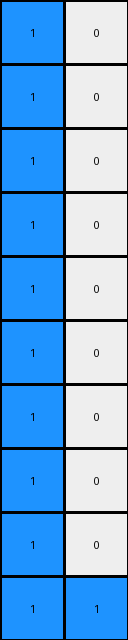
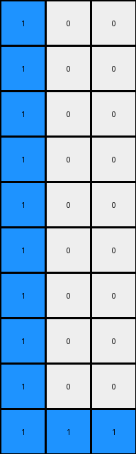
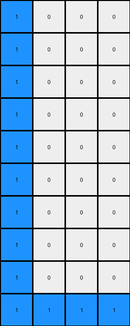

# a3df8b1e • 015 • refine_dreamer

---

Previous Code:
```python
"""
1. **Find the Blue Pixel:** Scan the input grid to find the location (row and column) of the single blue (1) pixel.
2. **Center the Cross:** Use the row and column of the blue pixel found in step 1 as the center coordinates for a cross pattern in the output grid.
3. **Create the Cross:** In the output grid, change the color of the pixels in the same row and column as the located blue pixel to blue(1), forming a cross. All other pixels should remain white(0).
"""

import numpy as np

def find_blue_pixel(grid):
    # Find the coordinates of the blue pixel (value 1).
    for r_idx, row in enumerate(grid):
        for c_idx, pixel in enumerate(row):
            if pixel == 1:
                return r_idx, c_idx
    return None  # Should not happen in valid cases, as a blue pixel is expected

def transform(input_grid):
    # Initialize output_grid as a copy of the input grid, then convert to all white.
    output_grid = np.zeros_like(input_grid)

    # Find the blue pixel's location.
    blue_pixel_location = find_blue_pixel(input_grid)

    if blue_pixel_location:
      center_row, center_col = blue_pixel_location

      # Create the cross pattern.
      for r_idx in range(output_grid.shape[0]):
          output_grid[r_idx, center_col] = 1  # Vertical line of the cross.
      for c_idx in range(output_grid.shape[1]):
          output_grid[center_row, c_idx] = 1  # Horizontal line of the cross.
    return output_grid
```

Train Set Results:

## Example 1:

Input:
```
0 0
0 0
0 0
0 0
0 0
0 0
0 0
0 0
0 0
1 0
```
Expected Output:
```
0 1
1 0
0 1
1 0
0 1
1 0
0 1
1 0
0 1
1 0
```
Transformed Output:
```
1 0
1 0
1 0
1 0
1 0
1 0
1 0
1 0
1 0
1 1
```

match: False
pixels_off: 11
size_correct: True
color_palette_correct: True
correct_pixel_counts: False

## Example 2:

Input:
```
0 0 0
0 0 0
0 0 0
0 0 0
0 0 0
0 0 0
0 0 0
0 0 0
0 0 0
1 0 0
```
Expected Output:
```
0 1 0
1 0 0
0 1 0
0 0 1
0 1 0
1 0 0
0 1 0
0 0 1
0 1 0
1 0 0
```
Transformed Output:
```
1 0 0
1 0 0
1 0 0
1 0 0
1 0 0
1 0 0
1 0 0
1 0 0
1 0 0
1 1 1
```

match: False
pixels_off: 16
size_correct: True
color_palette_correct: True
correct_pixel_counts: False

## Example 3:

Input:
```
0 0 0 0
0 0 0 0
0 0 0 0
0 0 0 0
0 0 0 0
0 0 0 0
0 0 0 0
0 0 0 0
0 0 0 0
1 0 0 0
```
Expected Output:
```
0 0 0 1
0 0 1 0
0 1 0 0
1 0 0 0
0 1 0 0
0 0 1 0
0 0 0 1
0 0 1 0
0 1 0 0
1 0 0 0
```
Transformed Output:
```
1 0 0 0
1 0 0 0
1 0 0 0
1 0 0 0
1 0 0 0
1 0 0 0
1 0 0 0
1 0 0 0
1 0 0 0
1 1 1 1
```

match: False
pixels_off: 19
size_correct: True
color_palette_correct: True
correct_pixel_counts: False
**INSTRUCTIONS**

The code above was generated based on observations from the first training
example

we have tested the transform function on each of the task example inputs and
compared with the expected output

review each of the examples provided and the results and consider how the
natural language program should be updated to accommodate this new knowledge

respond with the following deliverables:

- general assessment of the information provided and strategy for resolving the
  errors
- gather metrics about each of the examples and results - use code_execution to
  develop accurate reports on your assumptions
- a YAML block documenting facts - Focus on identifying objects, their properties, and the actions performed on them.
- a natural language program - Be as clear and concise as possible, providing a complete description of the transformation rule.


your responses should be considered as information in a report - not a
conversation
