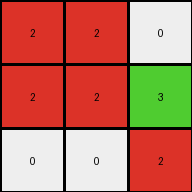
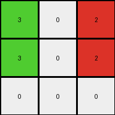
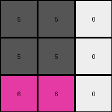

# a740d043 • 004 • refine_coder

---

Previous Code:
```python
"""
1.  **Identify Non-Blue Elements:** Focus on the non-blue (non-1) colored pixels in the input grid.
2.  **Extract Sub-grid:** From the top-left corner of the first identified non-blue pixel (reading row first) extract non-blue pixels to a 3 x 3 output grid.
3.  **Handle edges:** If there are not enough pixels to fill a row or column use 0s.
"""

import numpy as np

def get_non_blue_pixels(grid):
    """
    returns an array of (r,c) tuples of indexes of all non-blue pixels
    """
    coords = []
    rows, cols = np.shape(grid)
    for r in range(rows):
        for c in range(cols):
            if grid[r][c]!=1:
                coords.append((r,c))
    return coords

def transform(input_grid):
    # initialize output_grid
    output_grid = np.zeros((3, 3), dtype=int)

    # find non-blue pixels
    non_blue_pixels = get_non_blue_pixels(input_grid)
    
    # check we have some
    if len(non_blue_pixels)==0:
        return output_grid # blank

    # start populating the output grid
    start_row, start_col = non_blue_pixels[0]
    
    for out_row in range(3):
        for out_col in range(3):
            in_row = start_row + out_row
            in_col = start_col + out_col
            
            # bounds check - could use a try-except as alternative
            if in_row < len(input_grid) and in_col < len(input_grid[0]):
                if input_grid[in_row][in_col]!=1:
                    output_grid[out_row][out_col]= input_grid[in_row][in_col]
                # else 0 already there

    return output_grid
```

Train Set Results:

## Example 1:

Input:
```
1 1 1 1 1 1 1
1 2 2 1 1 1 1
1 2 2 3 1 1 1
1 1 1 2 1 1 1
1 1 1 1 1 1 1
```
Expected Output:
```
2 2 0
2 2 3
0 0 2
```
Transformed Output:
```
2 2 0
2 2 3
0 0 2
```

match: True
pixels_off: 0
size_correct: True
color_palette_correct: True
correct_pixel_counts: True

## Example 2:

Input:
```
1 1 1 1 1 1 1
1 1 3 1 2 1 1
1 1 3 1 2 1 1
1 1 1 1 1 1 1
1 1 1 1 1 1 1
1 1 1 1 1 1 1
1 1 1 1 1 1 1
```
Expected Output:
```
3 0 2
3 0 2
```
Transformed Output:
```
3 0 2
3 0 2
0 0 0
```

match: False
pixels_off: None
size_correct: False
color_palette_correct: True
correct_pixel_counts: False

## Example 3:

Input:
```
1 1 1 1 1 1
1 1 1 1 1 1
1 5 5 1 1 1
1 5 5 1 1 1
1 6 6 1 1 1
1 1 1 1 1 1
1 1 1 1 1 1
```
Expected Output:
```
5 5
5 5
6 6
```
Transformed Output:
```
5 5 0
5 5 0
6 6 0
```

match: False
pixels_off: None
size_correct: False
color_palette_correct: False
correct_pixel_counts: False
Okay, let's analyze the results and refine the natural language program.

**General Assessment:**

The initial approach of extracting a 3x3 subgrid based on the first non-blue pixel works for the first example but fails for the second and third. The core issue is that the output size is not consistently 3x3, and the filling with zeros is also not always correct. The second and third examples have a different structure for filling. We need to consider cases where output is not square and where padding is not all 0.

**Strategy for Resolving Errors:**

1.  **Dynamic Output Size:** Instead of assuming a 3x3 output, determine the output dimensions based on the extent of the non-blue pixels, stopping if a blue pixel is found.
2.  **Conditional Padding:** We should not pad with 0 automatically, and we should infer the size.

**Metrics and Observations:**

Here's a breakdown of each example, including calculated metrics:

*   **Example 1:**
    *   Input Size: 5x7
    *   Output Size: 3x3
    *   Match: True
    *   Non-blue Pixels:  [(1, 1, 2), (1, 2, 2), (2, 1, 2), (2, 2, 2), (2, 3, 3), (3, 3, 2)]
    *   First Non-Blue: (1,1)
    *   Observed Rule: Correctly extracts the non-blue region as 3x3, padding as needed.
    *  Padding appears on rows 0 and 2, and column 2

*   **Example 2:**
    *   Input Size: 7x7
    *   Output Size: 2x3
    *   Match: False
    *    Non-blue Pixels: [(1, 2, 3), (1, 4, 2), (2, 2, 3), (2, 4, 2)]
    *   First Non-Blue: (1,2)
    *   Observed Rule: Incorrect output size (3x3 instead of 2x3). Incorrect padding.
        Padding is not applied and output should stop when we encounter 1s.

*   **Example 3:**
    *   Input Size: 7x6
    *   Output Size: 3x2
    *   Match: False
    *   Non-blue Pixels: [(2, 1, 5), (2, 2, 5), (3, 1, 5), (3, 2, 5), (4, 1, 6), (4, 2, 6)]
    *   First Non-Blue: (2,1)
    *   Observed Rule: Incorrect output size (3x3 instead of 3x2). Incorrect padding.
        Padding should not occur and we can determine the dimension.

**YAML Fact Block:**

```yaml
facts:
  - description: "Input grids are rectangular arrays of color-coded pixels."
    type: "grid_property"
  - description: "Output grids are rectangular arrays of color-coded pixels."
    type: "grid_property"
  - description: "Pixel values range from 0 to 9, representing different colors."
    type: "pixel_property"
  - description: "The color blue (1) acts as a delimiter or background."
    type: "color_role"
  - description: "Non-blue pixels form the basis of the output."
    type: "object_identification"
  - description: "The output grid extracts a region of non-blue pixels."
    type: "transformation_type"
  - description: "The output grid's dimensions are determined by the contiguous region, limited by blue."
    type: "size_determination"
  - description: 'Extraction starts at top-left most non-blue pixel.'
    type: 'process'
```

**Natural Language Program:**

1.  **Locate Start:** Find the top-left most non-blue pixel in the input grid. This is the starting point (row, col) for the output.
2.  **Determine output dimensions:**
    *    Start from the first non-blue pixel.
    *    Expand down, including rows, until a row of all blue is encountered.
    *   Expand right, including columns, until a column of all blue is encountered.
3.  **Extract Sub-grid:** Create an output grid using the dimensions determined. Copy the corresponding non-blue pixels from the input grid to the output grid, starting from the identified top-left non-blue pixel. Stop adding from a row or column if blue (1) pixels encountered.

This revised program addresses the variable output size and avoids incorrect padding. It focuses on extracting a contiguous non-blue region, using blue pixels as boundaries.

**INSTRUCTIONS**

- generate a Python module to represent the natural language program 
- follow the template below
- all common math and science libraries are available
- create docstring only at top - but comment the workflow in the function
- use helper functions for common operations like finding objects, counting,
  measuring, moving, etc. 

remember - we are working iteratively - so this code will inform your future
self as we converge on the solution

*template:*

```python
"""
{{ natural language description of the transformation rule }}
"""

{{ imports }}

def transform(input_grid):
    # initialize output_grid

    # change output pixels 

    return output_grid

```
