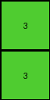

# a740d043 • 005 • refine_dreamer

---


Previous Code:
```python
"""
1.  **Locate Start:** Find the top-left most non-blue pixel in the input grid. This is the starting point (row, col) for the output.
2.  **Determine output dimensions:**
    *    Start from the first non-blue pixel.
    *    Expand down, including rows, until a row of all blue is encountered.
    *   Expand right, including columns, until a column of all blue is encountered.
3.  **Extract Sub-grid:** Create an output grid using the dimensions determined. Copy the corresponding non-blue pixels from the input grid to the output grid, starting from the identified top-left non-blue pixel. Stop adding from a row or column if blue (1) pixels encountered.
"""

import numpy as np

def get_top_left_non_blue_pixel(grid):
    """
    Returns the (row, col) tuple of the top-left most non-blue pixel.
    Returns None if no non-blue pixels are found.
    """
    rows, cols = np.shape(grid)
    for r in range(rows):
        for c in range(cols):
            if grid[r][c] != 1:
                return (r, c)
    return None

def determine_output_dimensions(input_grid, start_row, start_col):
    """
    Determines the dimensions of the output grid based on the extent of
    non-blue pixels, stopping at blue pixels (1).
    """
    max_rows, max_cols = np.shape(input_grid)
    out_rows = 0
    out_cols = 0

    # Determine output rows
    for r in range(start_row, max_rows):
        if all(input_grid[r, start_col:] == 1):
            break
        out_rows += 1
    
    # Determine output cols
    for c in range(start_col, max_cols):
       if all(input_grid[start_row:, c] == 1):
            break
       out_cols+=1

    return out_rows, out_cols

def transform(input_grid):
    """
    Transforms the input grid by extracting a contiguous region of non-blue
    pixels, using blue pixels as boundaries.
    """
    # Find the starting point (top-left non-blue pixel)
    start_coords = get_top_left_non_blue_pixel(input_grid)
    if start_coords is None:
        return np.array([])  # Return an empty array if no non-blue pixels

    start_row, start_col = start_coords

    # Determine output dimensions
    out_rows, out_cols = determine_output_dimensions(input_grid, start_row, start_col)
   

    # Create the output grid
    output_grid = np.zeros((out_rows, out_cols), dtype=int)

    # Copy the relevant pixels
    for r in range(out_rows):
        for c in range(out_cols):
            output_grid[r, c] = input_grid[start_row + r, start_col + c]

    return output_grid
```

Train Set Results:

## Example 1:

Input:
```
1 1 1 1 1 1 1
1 2 2 1 1 1 1
1 2 2 3 1 1 1
1 1 1 2 1 1 1
1 1 1 1 1 1 1
```
Expected Output:
```
2 2 0
2 2 3
0 0 2
```
Transformed Output:
```
2 2 1
2 2 3
1 1 2
```

match: False
pixels_off: 3
size_correct: True
color_palette_correct: False
correct_pixel_counts: False

## Example 2:

Input:
```
1 1 1 1 1 1 1
1 1 3 1 2 1 1
1 1 3 1 2 1 1
1 1 1 1 1 1 1
1 1 1 1 1 1 1
1 1 1 1 1 1 1
1 1 1 1 1 1 1
```
Expected Output:
```
3 0 2
3 0 2
```
Transformed Output:
```
3
3
```

match: False
pixels_off: None
size_correct: False
color_palette_correct: True
correct_pixel_counts: False

## Example 3:

Input:
```
1 1 1 1 1 1
1 1 1 1 1 1
1 5 5 1 1 1
1 5 5 1 1 1
1 6 6 1 1 1
1 1 1 1 1 1
1 1 1 1 1 1
```
Expected Output:
```
5 5
5 5
6 6
```
Transformed Output:
```
5 5
5 5
6 6
```

match: True
pixels_off: 0
size_correct: True
color_palette_correct: True
correct_pixel_counts: True

**INSTRUCTIONS**

The code above was generated based on observations from the first training
example

we have tested the transform function on each of the task example inputs and
compared with the expected output

review each of the examples provided and the results and consider how the
natural language program should be updated to accommodate this new knowledge

respond with the following deliverables:

- general assessment of the information provided and strategy for resolving the
  errors
- gather metrics about each of the examples and results - use code_execution to
  develop accurate reports on your assumptions
- a YAML block documenting facts - Focus on identifying objects, their properties, and the actions performed on them.
- a natural language program - Be as clear and concise as possible, providing a complete description of the transformation rule.


your responses should be considered as information in a report - not a
conversation
