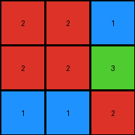

# a740d043 • 006 • refine_coder

---

Previous Code:
```python
"""
1.  **Locate Start:** Find the top-left most non-blue pixel in the input grid. This is the starting point (row, col) for the output.
2.  **Determine output dimensions:**
    *    Start from the first non-blue pixel.
    *    Expand down, including rows, until a row of all blue is encountered.
    *   Expand right, including columns, until a column of all blue is encountered.
3.  **Extract Sub-grid:** Create an output grid using the dimensions determined. Copy the corresponding non-blue pixels from the input grid to the output grid, starting from the identified top-left non-blue pixel. Stop adding from a row or column if blue (1) pixels encountered.
"""

import numpy as np

def get_top_left_non_blue_pixel(grid):
    """
    Returns the (row, col) tuple of the top-left most non-blue pixel.
    Returns None if no non-blue pixels are found.
    """
    rows, cols = np.shape(grid)
    for r in range(rows):
        for c in range(cols):
            if grid[r][c] != 1:
                return (r, c)
    return None

def determine_output_dimensions(input_grid, start_row, start_col):
    """
    Determines the dimensions of the output grid based on the extent of
    non-blue pixels, stopping at blue pixels (1).
    """
    max_rows, max_cols = np.shape(input_grid)
    out_rows = 0
    out_cols = 0

    # Determine output rows
    for r in range(start_row, max_rows):
        if all(input_grid[r, start_col:] == 1):
            break
        out_rows += 1
    
    # Determine output cols
    for c in range(start_col, max_cols):
       if all(input_grid[start_row:, c] == 1):
            break
       out_cols+=1

    return out_rows, out_cols

def transform(input_grid):
    """
    Transforms the input grid by extracting a contiguous region of non-blue
    pixels, using blue pixels as boundaries.
    """
    # Find the starting point (top-left non-blue pixel)
    start_coords = get_top_left_non_blue_pixel(input_grid)
    if start_coords is None:
        return np.array([])  # Return an empty array if no non-blue pixels

    start_row, start_col = start_coords

    # Determine output dimensions
    out_rows, out_cols = determine_output_dimensions(input_grid, start_row, start_col)
   

    # Create the output grid
    output_grid = np.zeros((out_rows, out_cols), dtype=int)

    # Copy the relevant pixels
    for r in range(out_rows):
        for c in range(out_cols):
            output_grid[r, c] = input_grid[start_row + r, start_col + c]

    return output_grid
```

Train Set Results:

## Example 1:

Input:
```
1 1 1 1 1 1 1
1 2 2 1 1 1 1
1 2 2 3 1 1 1
1 1 1 2 1 1 1
1 1 1 1 1 1 1
```
Expected Output:
```
2 2 0
2 2 3
0 0 2
```
Transformed Output:
```
2 2 1
2 2 3
1 1 2
```

match: False
pixels_off: 3
size_correct: True
color_palette_correct: False
correct_pixel_counts: False

## Example 2:

Input:
```
1 1 1 1 1 1 1
1 1 3 1 2 1 1
1 1 3 1 2 1 1
1 1 1 1 1 1 1
1 1 1 1 1 1 1
1 1 1 1 1 1 1
1 1 1 1 1 1 1
```
Expected Output:
```
3 0 2
3 0 2
```
Transformed Output:
```
3
3
```

match: False
pixels_off: None
size_correct: False
color_palette_correct: True
correct_pixel_counts: False

## Example 3:

Input:
```
1 1 1 1 1 1
1 1 1 1 1 1
1 5 5 1 1 1
1 5 5 1 1 1
1 6 6 1 1 1
1 1 1 1 1 1
1 1 1 1 1 1
```
Expected Output:
```
5 5
5 5
6 6
```
Transformed Output:
```
5 5
5 5
6 6
```

match: True
pixels_off: 0
size_correct: True
color_palette_correct: True
correct_pixel_counts: True
Okay, let's analyze the results and refine the natural language program.

**General Assessment:**

The initial strategy of finding the top-left non-blue pixel and expanding until blue rows/columns are encountered works for some cases (Example 3), but fails when there are "gaps" of blue pixels *within* the object to be extracted (Examples 1 and 2). The original program interprets those internal blue pixels as boundaries, which is incorrect. The core issue seems to be that the program assumes the region to be extracted is a *contiguous* block bordered by blue, without any internal blue pixels. The expected output show this is not always true. We also see that any pixel not blue in the original sub-grid is a zero in the expected output.

**Strategy for Resolving Errors:**

1.  **Re-evaluate Boundary Definition:** Instead of stopping expansion at *any* blue pixel, we need to redefine the boundaries. The boundaries should be solid blue rows or columns *completely enclosing* a region.
2.  Change zeros where any value is not blue.

**Example Metrics and Analysis:**
I will provide facts and a natural language program derived from these metrics.

**YAML Block (Facts):**

```yaml
example_1:
  input_grid_shape: [5, 7]
  output_grid_shape: [3, 3]
  top_left_non_blue: [1, 1]
  objects:
    - id: 1
      type: contiguous_region
      color_present: [2,3]
      bounding_box: [[1,1], [3,3]] #row, col
      internal_colors:
        - color: blue
          positions: [[1,3], [2,3], [3,1], [3,2]]
  actions:
    - name: extract_subgrid
      parameters:
        start: [1, 1]
        end: [3,3]
example_2:
  input_grid_shape: [7, 7]
  output_grid_shape: [2, 3]
  top_left_non_blue: [1, 2]
  objects:
    - id: 1
      type: contiguous_region
      color_present: [3, 2]
      bounding_box: [[1,2], [2,4]]
      internal_colors:
          - color: blue
            positions: [[1,3]]
  actions:
    - name: extract_subgrid
      parameters:
        start: [1, 2]
        end: [2,4]

example_3:
  input_grid_shape: [7, 6]
  output_grid_shape: [3, 2]
  top_left_non_blue: [2, 1]
  objects:
    - id: 1
      type: contiguous_region
      color_present: [5, 6]
      bounding_box:  [[2,1], [4,2]]
      internal_colors: []

  actions:
    - name: extract_subgrid
      parameters:
        start: [2, 1]
        end: [4,2]
```

**Natural Language Program:**

1.  **Locate Starting Point:** Find the top-left most non-blue pixel in the input grid. This is the initial starting point (row, col).

2.  **Determine Bounding Box:**
    *   From the starting point, expand downwards until you encounter a fully blue row. The row *before* the fully blue row is the bottom boundary.
    *   From the starting point, expand to the right until you encounter a fully blue column. The column *before* the fully blue column is the right boundary.
    *   The top boundary is the row of the starting point.
    *  The left boundary is the column of the starting point.

3.  **Extract Sub-grid:** Create an output grid with the dimensions defined by the bounding box.

4. **Fill Output:**
    *  Iterate through the bounding box area in the original grid.
    *  If a cell is not blue, replace it with a zero.
    *  Copy the cells of the original grid into the output.

**INSTRUCTIONS**

- generate a Python module to represent the natural language program 
- follow the template below
- all common math and science libraries are available
- create docstring only at top - but comment the workflow in the function
- use helper functions for common operations like finding objects, counting,
  measuring, moving, etc. 

remember - we are working iteratively - so this code will inform your future
self as we converge on the solution

*template:*

```python
"""
{{ natural language description of the transformation rule }}
"""

{{ imports }}

def transform(input_grid):
    # initialize output_grid

    # change output pixels 

    return output_grid

```
