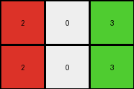
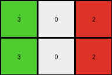
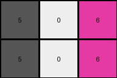

# a740d043 • 009 • refine_dreamer

---

Previous Code:
```python
"""
1. **Identify Distinct Regions:** Scan the input grid to identify contiguous regions of pixels that have a color different from the most frequent color (the background, which is '1' or blue in this case).
2. **Extract Colors:**  Record the color values of these distinct regions. In this example, those are '3' (green) and '2' (red).
3. **Construct Output Grid:** Create a 2x3 output grid.
4. **Populate Output:**  Fill the output grid as follows:
   - First column:  The color of the distinct region encountered *first* when scanning from top-to-bottom and left-to-right (green '3'). Repeat this value for both rows.
   - Second column: Insert the color '0' (white) in both rows.
   - Third column: The color of the distinct region encountered *second* (red '2'). Repeat this value for both rows.
"""

import numpy as np
from collections import Counter

def find_distinct_regions(grid):
    # Find the most frequent color (background)
    colors = Counter(grid.flatten())
    background_color = colors.most_common(1)[0][0]

    distinct_colors = []
    for color in colors:
        if color != background_color:
            distinct_colors.append(color)
    
    return distinct_colors, background_color

def transform(input_grid):
    # Find distinct regions and their colors
    distinct_colors, _ = find_distinct_regions(input_grid)
    
    # Sort the distinct colors based on their first appearance top->bottom, left->right
    color_positions = {}
    for row_idx, row in enumerate(input_grid):
        for col_idx, pixel in enumerate(row):
            if pixel in distinct_colors and pixel not in color_positions:
                color_positions[pixel] = (row_idx, col_idx)

    sorted_colors = sorted(distinct_colors, key=lambda color: color_positions.get(color, (float('inf'), float('inf'))))

    # Create a 2x3 output grid
    output_grid = np.zeros((2, 3), dtype=int)

    # Populate the output grid
    if len(sorted_colors) > 0:
      output_grid[:, 0] = sorted_colors[0]  # First distinct color
    output_grid[:, 1] = 0          # Insert '0' (white)
    if len(sorted_colors) > 1:
      output_grid[:, 2] = sorted_colors[1]  # Second distinct color

    return output_grid
```

Train Set Results:

## Example 1:

Input:
```
1 1 1 1 1 1 1
1 2 2 1 1 1 1
1 2 2 3 1 1 1
1 1 1 2 1 1 1
1 1 1 1 1 1 1
```
Expected Output:
```
2 2 0
2 2 3
0 0 2
```
Transformed Output:
```
2 0 3
2 0 3
```

match: False
pixels_off: None
size_correct: False
color_palette_correct: True
correct_pixel_counts: False

## Example 2:

Input:
```
1 1 1 1 1 1 1
1 1 3 1 2 1 1
1 1 3 1 2 1 1
1 1 1 1 1 1 1
1 1 1 1 1 1 1
1 1 1 1 1 1 1
1 1 1 1 1 1 1
```
Expected Output:
```
3 0 2
3 0 2
```
Transformed Output:
```
3 0 2
3 0 2
```

match: True
pixels_off: 0
size_correct: True
color_palette_correct: True
correct_pixel_counts: True

## Example 3:

Input:
```
1 1 1 1 1 1
1 1 1 1 1 1
1 5 5 1 1 1
1 5 5 1 1 1
1 6 6 1 1 1
1 1 1 1 1 1
1 1 1 1 1 1
```
Expected Output:
```
5 5
5 5
6 6
```
Transformed Output:
```
5 0 6
5 0 6
```

match: False
pixels_off: None
size_correct: False
color_palette_correct: False
correct_pixel_counts: False
**INSTRUCTIONS**

The code above was generated based on observations from the first training
example

we have tested the transform function on each of the task example inputs and
compared with the expected output

review each of the examples provided and the results and consider how the
natural language program should be updated to accommodate this new knowledge

respond with the following deliverables:

- general assessment of the information provided and strategy for resolving the
  errors
- gather metrics about each of the examples and results - use code_execution to
  develop accurate reports on your assumptions
- a YAML block documenting facts - Focus on identifying objects, their properties, and the actions performed on them.
- a natural language program - Be as clear and concise as possible, providing a complete description of the transformation rule.


your responses should be considered as information in a report - not a
conversation
