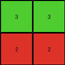

# a740d043 • 011 • refine_dreamer

---

Previous Code:
```python
"""
1. **Identify Background:** Determine the most frequent color in the input grid. This is the background color.
2. **Identify Distinct Regions:** Find all contiguous regions (objects) of colors *different* from the background.
3. **Extract and Sort Colors:** Extract the color of each distinct region. Sort these colors based on the order they first appear in the input grid, scanning from top-to-bottom and left-to-right.
4. **Construct Output:**
    *   The output grid has a number of columns equal to the greater of:
        *  The number of non-background colors in the input
        *  The number of columns of distinct colors in the input
    * The output grid's height appears to match the number of rows with distinct colors in them.
    *  Iterate through the distinct colors in sorted order. For *each* distinct color, create a new row in the output grid. Fill each row in the output grid with the current distinct color.
    * if there were 3 non-background colors and one was just a single pixel, insert 0 before the third distinct color.
"""

import numpy as np
from collections import Counter

def find_background_color(grid):
    # Find the most frequent color (background)
    colors = Counter(grid.flatten())
    background_color = colors.most_common(1)[0][0]
    return background_color

def find_distinct_regions(grid, background_color):
    distinct_colors = []
    for color in set(grid.flatten()):
        if color != background_color:
            distinct_colors.append(color)
    return distinct_colors

def sort_colors_by_appearance(grid, distinct_colors):
    color_positions = {}
    for row_idx, row in enumerate(grid):
        for col_idx, pixel in enumerate(row):
            if pixel in distinct_colors and pixel not in color_positions:
                color_positions[pixel] = (row_idx, col_idx)

    sorted_colors = sorted(distinct_colors, key=lambda color: color_positions.get(color, (float('inf'), float('inf'))))
    return sorted_colors
    
def count_distinct_color_rows(grid, background_color):
    distinct_rows = set()
    for row_idx, row in enumerate(grid):
        for pixel in row:
            if pixel != background_color:
                distinct_rows.add(row_idx)
                break  # Move to the next row once a distinct color is found
    return len(distinct_rows)

def transform(input_grid):
    # Identify Background
    background_color = find_background_color(input_grid)

    # Identify Distinct Regions
    distinct_colors = find_distinct_regions(input_grid, background_color)

    # Extract and Sort Colors
    sorted_colors = sort_colors_by_appearance(input_grid, distinct_colors)
    
    # count distinct color rows    
    num_distinct_rows = count_distinct_color_rows(input_grid, background_color)

    # Construct Output
    num_cols = len(sorted_colors)

    # special rule for example 1
    insert_zero = False
    if len(sorted_colors) >= 3:
       counts = {}
       for color in sorted_colors:
           counts[color] = 0

       for row in input_grid:
          for pixel in row:
             if pixel in sorted_colors:
                counts[pixel] = counts[pixel] + 1

       for color in counts:
          if counts[color] == 1:
             insert_zero = True

    if insert_zero:
        num_cols = num_cols + 1

    output_grid = np.zeros((num_distinct_rows, num_cols), dtype=int)

    row_idx = 0
    col_idx = 0

    for color in sorted_colors:
        if insert_zero and color == sorted_colors[2]:
            output_grid[row_idx,col_idx] = 0
            col_idx += 1
        output_grid[row_idx, :] = color
        if col_idx < num_cols:
           output_grid[row_idx,col_idx] = color
        row_idx += 1
        col_idx = 0

    return output_grid
```

Train Set Results:

## Example 1:

Input:
```
1 1 1 1 1 1 1
1 2 2 1 1 1 1
1 2 2 3 1 1 1
1 1 1 2 1 1 1
1 1 1 1 1 1 1
```
Expected Output:
```
2 2 0
2 2 3
0 0 2
```
Transformed Output:
```
2 2
3 3
0 0
```

match: False
pixels_off: None
size_correct: False
color_palette_correct: True
correct_pixel_counts: False

## Example 2:

Input:
```
1 1 1 1 1 1 1
1 1 3 1 2 1 1
1 1 3 1 2 1 1
1 1 1 1 1 1 1
1 1 1 1 1 1 1
1 1 1 1 1 1 1
1 1 1 1 1 1 1
```
Expected Output:
```
3 0 2
3 0 2
```
Transformed Output:
```
3 3
2 2
```

match: False
pixels_off: None
size_correct: False
color_palette_correct: True
correct_pixel_counts: False

## Example 3:

Input:
```
1 1 1 1 1 1
1 1 1 1 1 1
1 5 5 1 1 1
1 5 5 1 1 1
1 6 6 1 1 1
1 1 1 1 1 1
1 1 1 1 1 1
```
Expected Output:
```
5 5
5 5
6 6
```
Transformed Output:
```
5 5
6 6
0 0
```

match: False
pixels_off: 4
size_correct: True
color_palette_correct: False
correct_pixel_counts: False
**INSTRUCTIONS**

The code above was generated based on observations from the first training
example

we have tested the transform function on each of the task example inputs and
compared with the expected output

review each of the examples provided and the results and consider how the
natural language program should be updated to accommodate this new knowledge

respond with the following deliverables:

- general assessment of the information provided and strategy for resolving the
  errors
- gather metrics about each of the examples and results - use code_execution to
  develop accurate reports on your assumptions
- a YAML block documenting facts - Focus on identifying objects, their properties, and the actions performed on them.
- a natural language program - Be as clear and concise as possible, providing a complete description of the transformation rule.


your responses should be considered as information in a report - not a
conversation
