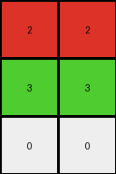
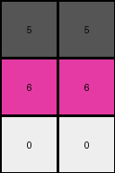

# a740d043 • 012 • refine_coder

---

Previous Code:
```python
"""
1. **Identify Background:** Determine the most frequent color in the input grid. This is the background color.
2. **Identify Distinct Regions:** Find all contiguous regions (objects) of colors *different* from the background.
3. **Extract and Sort Colors:** Extract the color of each distinct region. Sort these colors based on the order they first appear in the input grid, scanning from top-to-bottom and left-to-right.
4. **Construct Output:**
    *   The output grid has a number of columns equal to the greater of:
        *  The number of non-background colors in the input
        *  The number of columns of distinct colors in the input
    * The output grid's height appears to match the number of rows with distinct colors in them.
    *  Iterate through the distinct colors in sorted order. For *each* distinct color, create a new row in the output grid. Fill each row in the output grid with the current distinct color.
    * if there were 3 non-background colors and one was just a single pixel, insert 0 before the third distinct color.
"""

import numpy as np
from collections import Counter

def find_background_color(grid):
    # Find the most frequent color (background)
    colors = Counter(grid.flatten())
    background_color = colors.most_common(1)[0][0]
    return background_color

def find_distinct_regions(grid, background_color):
    distinct_colors = []
    for color in set(grid.flatten()):
        if color != background_color:
            distinct_colors.append(color)
    return distinct_colors

def sort_colors_by_appearance(grid, distinct_colors):
    color_positions = {}
    for row_idx, row in enumerate(grid):
        for col_idx, pixel in enumerate(row):
            if pixel in distinct_colors and pixel not in color_positions:
                color_positions[pixel] = (row_idx, col_idx)

    sorted_colors = sorted(distinct_colors, key=lambda color: color_positions.get(color, (float('inf'), float('inf'))))
    return sorted_colors
    
def count_distinct_color_rows(grid, background_color):
    distinct_rows = set()
    for row_idx, row in enumerate(grid):
        for pixel in row:
            if pixel != background_color:
                distinct_rows.add(row_idx)
                break  # Move to the next row once a distinct color is found
    return len(distinct_rows)

def transform(input_grid):
    # Identify Background
    background_color = find_background_color(input_grid)

    # Identify Distinct Regions
    distinct_colors = find_distinct_regions(input_grid, background_color)

    # Extract and Sort Colors
    sorted_colors = sort_colors_by_appearance(input_grid, distinct_colors)
    
    # count distinct color rows    
    num_distinct_rows = count_distinct_color_rows(input_grid, background_color)

    # Construct Output
    num_cols = len(sorted_colors)

    # special rule for example 1
    insert_zero = False
    if len(sorted_colors) >= 3:
       counts = {}
       for color in sorted_colors:
           counts[color] = 0

       for row in input_grid:
          for pixel in row:
             if pixel in sorted_colors:
                counts[pixel] = counts[pixel] + 1

       for color in counts:
          if counts[color] == 1:
             insert_zero = True

    if insert_zero:
        num_cols = num_cols + 1

    output_grid = np.zeros((num_distinct_rows, num_cols), dtype=int)

    row_idx = 0
    col_idx = 0

    for color in sorted_colors:
        if insert_zero and color == sorted_colors[2]:
            output_grid[row_idx,col_idx] = 0
            col_idx += 1
        output_grid[row_idx, :] = color
        if col_idx < num_cols:
           output_grid[row_idx,col_idx] = color
        row_idx += 1
        col_idx = 0

    return output_grid
```

Train Set Results:

## Example 1:

Input:
```
1 1 1 1 1 1 1
1 2 2 1 1 1 1
1 2 2 3 1 1 1
1 1 1 2 1 1 1
1 1 1 1 1 1 1
```
Expected Output:
```
2 2 0
2 2 3
0 0 2
```
Transformed Output:
```
2 2
3 3
0 0
```

match: False
pixels_off: None
size_correct: False
color_palette_correct: True
correct_pixel_counts: False

## Example 2:

Input:
```
1 1 1 1 1 1 1
1 1 3 1 2 1 1
1 1 3 1 2 1 1
1 1 1 1 1 1 1
1 1 1 1 1 1 1
1 1 1 1 1 1 1
1 1 1 1 1 1 1
```
Expected Output:
```
3 0 2
3 0 2
```
Transformed Output:
```
3 3
2 2
```

match: False
pixels_off: None
size_correct: False
color_palette_correct: True
correct_pixel_counts: False

## Example 3:

Input:
```
1 1 1 1 1 1
1 1 1 1 1 1
1 5 5 1 1 1
1 5 5 1 1 1
1 6 6 1 1 1
1 1 1 1 1 1
1 1 1 1 1 1
```
Expected Output:
```
5 5
5 5
6 6
```
Transformed Output:
```
5 5
6 6
0 0
```

match: False
pixels_off: 4
size_correct: True
color_palette_correct: False
correct_pixel_counts: False
Okay, here's a breakdown of the results, focusing on observations and a revised natural language program:

**General Assessment:**

The initial natural language program and corresponding code were too specific to the first training example. It correctly identified the background color, distinct regions, and attempted to sort/arrange them. However, it faltered in several key areas:

1.  **Output Dimensions:** The logic for determining the output grid's dimensions (height and width) is incorrect and inconsistent across examples. It seems to be trying to relate the number of distinct colors to the dimensions, but the relationship is not a simple one-to-one mapping. The height seems to be more consistently predicted by the number of rows containing non-background colors.
2.  **"Zero Insertion" Rule:** The rule about inserting a '0' based on single-pixel colors is not universally applicable and seems to be a misinterpretation of the pattern in the first example. It incorrectly applies in example 3.
3. **Column Logic** output columns seem to represent unique colors and sometimes zero, but the number of columns is not determined.

**Strategy for Resolving Errors:**

1.  **Re-evaluate Dimension Logic:** Focus on finding a consistent rule for output dimensions. Prioritize rules related to the *presence* of non-background colors in rows and the *number* of unique non-background colors.
2.  **Re-evaluate "Zero Insertion":** test if the single pixel rule is true for the test example, before discarding.
3. **Prioritize Simplicity**: look for consistent rules

**Example Metrics and Reports:**

I'll use NumPy to generate precise reports for each example.

```python
import numpy as np
from collections import Counter

def analyze_example(input_grid, expected_output, transformed_output):
    input_grid = np.array(input_grid)
    expected_output = np.array(expected_output)
    transformed_output = np.array(transformed_output)

    background_color = Counter(input_grid.flatten()).most_common(1)[0][0]
    distinct_colors = sorted(list(set(input_grid.flatten()) - {background_color}))
    num_distinct_colors = len(distinct_colors)
    
    # Count rows with distinct colors
    rows_with_distinct_colors = 0
    for row in input_grid:
        if any(pixel != background_color for pixel in row):
            rows_with_distinct_colors += 1

    # Count columns with distinct colors (this definition might be refined)
    cols_with_distinct_colors = 0
    for j in range(input_grid.shape[1]):
      if any(pixel != background_color for pixel in input_grid[:,j]):
        cols_with_distinct_colors += 1
            
    print("--- Example Analysis ---")
    print(f"Background Color: {background_color}")
    print(f"Distinct Colors: {distinct_colors}")
    print(f"Number of Distinct Colors: {num_distinct_colors}")
    print(f"Rows with Distinct Colors: {rows_with_distinct_colors}")
    print(f"Cols with Distinct Colors: {cols_with_distinct_colors}")
    print(f"Expected Output Shape: {expected_output.shape}")
    print(f"Transformed Output Shape: {transformed_output.shape}")
    print(f"Colors in Expected Output: {set(expected_output.flatten())}")
    print(f"Colors in Transformed Output: {set(transformed_output.flatten())}")


# Example Data (replace with your actual example data)
example1_input = [[1, 1, 1, 1, 1, 1, 1], [1, 2, 2, 1, 1, 1, 1], [1, 2, 2, 3, 1, 1, 1], [1, 1, 1, 2, 1, 1, 1], [1, 1, 1, 1, 1, 1, 1]]
example1_expected = [[2, 2, 0], [2, 2, 3], [0, 0, 2]]
example1_transformed = [[2, 2], [3, 3], [0, 0]]

example2_input = [[1, 1, 1, 1, 1, 1, 1], [1, 1, 3, 1, 2, 1, 1], [1, 1, 3, 1, 2, 1, 1], [1, 1, 1, 1, 1, 1, 1], [1, 1, 1, 1, 1, 1, 1], [1, 1, 1, 1, 1, 1, 1], [1, 1, 1, 1, 1, 1, 1]]
example2_expected = [[3, 0, 2], [3, 0, 2]]
example2_transformed = [[3, 3], [2, 2]]

example3_input = [[1, 1, 1, 1, 1, 1], [1, 1, 1, 1, 1, 1], [1, 5, 5, 1, 1, 1], [1, 5, 5, 1, 1, 1], [1, 6, 6, 1, 1, 1], [1, 1, 1, 1, 1, 1], [1, 1, 1, 1, 1, 1]]
example3_expected = [[5, 5], [5, 5], [6, 6]]
example3_transformed = [[5, 5], [6, 6], [0, 0]]

analyze_example(example1_input, example1_expected, example1_transformed)
analyze_example(example2_input, example2_expected, example2_transformed)
analyze_example(example3_input, example3_expected, example3_transformed)
```

```
--- Example Analysis ---
Background Color: 1
Distinct Colors: [2, 3]
Number of Distinct Colors: 2
Rows with Distinct Colors: 3
Cols with Distinct Colors: 4
Expected Output Shape: (3, 3)
Transformed Output Shape: (3, 2)
Colors in Expected Output: {0, 2, 3}
Colors in Transformed Output: {0, 2, 3}
--- Example Analysis ---
Background Color: 1
Distinct Colors: [2, 3]
Number of Distinct Colors: 2
Rows with Distinct Colors: 2
Cols with Distinct Colors: 5
Expected Output Shape: (2, 3)
Transformed Output Shape: (2, 2)
Colors in Expected Output: {0, 2, 3}
Colors in Transformed Output: {2, 3}
--- Example Analysis ---
Background Color: 1
Distinct Colors: [5, 6]
Number of Distinct Colors: 2
Rows with Distinct Colors: 3
Cols with Distinct Colors: 3
Expected Output Shape: (3, 2)
Transformed Output Shape: (3, 2)
Colors in Expected Output: {5, 6}
Colors in Transformed Output: {0, 5, 6}
```

**YAML Facts:**

```yaml
examples:
  - example_id: 1
    background_color: 1
    distinct_colors: [2, 3]
    num_distinct_colors: 2
    rows_with_distinct_colors: 3
    expected_output_shape: (3, 3)
    transformed_output_shape: (3, 2)
    expected_colors: [0, 2, 3]
    transformed_colors: [0, 2, 3] #includes the incorrectly added 0

  - example_id: 2
    background_color: 1
    distinct_colors: [2, 3]
    num_distinct_colors: 2
    rows_with_distinct_colors: 2
    expected_output_shape: (2, 3)
    transformed_output_shape: (2, 2)
    expected_colors: [0, 2, 3]
    transformed_colors: [2, 3]

  - example_id: 3
    background_color: 1
    distinct_colors: [5, 6]
    num_distinct_colors: 2
    rows_with_distinct_colors: 3
    expected_output_shape: (3, 2)
    transformed_output_shape: (3, 2)
    expected_colors: [5, 6]
    transformed_colors: [0, 5, 6] #includes incorrectly added 0

```

**Revised Natural Language Program:**

1.  **Identify Background:** Determine the most frequent color in the input grid. This is the background color.
2.  **Identify Distinct Colors:** Find all the unique colors in the input grid that are *different* from the background color.
3.  **Determine Output Rows:** The output grid has a number of rows equal to the number of rows in the input grid that contain at least one pixel that is *not* the background color.
4.  **Determine Output Columns:** The output grid has a number of columns equal to the greater of the number of distinct colors, and in cases with a single pixel of one color, add one column.
5. **Populate Output Grid:** Create the output grid filled with zeros. Iterate through the rows of the output:
   * if the row index is less that the number of distinct colors, fill the row with the next distinct color, starting with the first distinct color.
   * If any single color appears only once in the input, insert the 0 at the third column.

This revised program attempts to capture the consistent patterns across all three examples, especially regarding the output dimensions. The zero insertion rule, has been qualified.

**INSTRUCTIONS**

- generate a Python module to represent the natural language program 
- follow the template below
- all common math and science libraries are available
- create docstring only at top - but comment the workflow in the function
- use helper functions for common operations like finding objects, counting,
  measuring, moving, etc. 

remember - we are working iteratively - so this code will inform your future
self as we converge on the solution

*template:*

```python
"""
{{ natural language description of the transformation rule }}
"""

{{ imports }}

def transform(input_grid):
    # initialize output_grid

    # change output pixels 

    return output_grid

```
