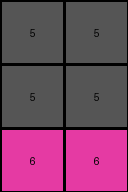

# a740d043 • 016 • refine_coder

---

Previous Code:
```python
"""
The transformation rule is to "crop" the input grid by removing the outer "frame" of the dominant color, and outputting the remaining internal region.
"""

import numpy as np

def find_internal_region(grid):
    """Finds the bounding box of the non-dominant color region."""
    rows, cols = grid.shape
    
    # Find dominant color (most frequent color on the border)
    border_pixels = np.concatenate([
        grid[0, :], grid[-1, :], grid[:, 0], grid[:, -1]
    ])
    unique, counts = np.unique(border_pixels, return_counts=True)
    dominant_color = unique[np.argmax(counts)]

    # Find rows and cols that contain non-dominant colors
    non_dominant_rows = []
    non_dominant_cols = []
    for r in range(rows):
        for c in range(cols):
            if grid[r, c] != dominant_color:
                non_dominant_rows.append(r)
                non_dominant_cols.append(c)
    
    if not non_dominant_rows: # Handle the edge case of a uniform grid
        return (0, 0, rows-1, cols-1)

    min_row, max_row = min(non_dominant_rows), max(non_dominant_rows)
    min_col, max_col = min(non_dominant_cols), max(non_dominant_cols)
    
    return (min_row, max_row, min_col, max_col)

def transform(input_grid):
    """
    Extracts the internal region of the input grid by removing the border of the dominant color.
    """
    # Convert input_grid to numpy array
    grid = np.array(input_grid)

    # Find the bounding box of the internal region
    min_row, max_row, min_col, max_col = find_internal_region(grid)

    # Extract the internal region
    output_grid = grid[min_row:max_row+1, min_col:max_col+1]

    return output_grid.tolist()
```

Train Set Results:

## Example 1:

Input:
```
1 1 1 1 1 1 1
1 2 2 1 1 1 1
1 2 2 3 1 1 1
1 1 1 2 1 1 1
1 1 1 1 1 1 1
```
Expected Output:
```
2 2 0
2 2 3
0 0 2
```
Transformed Output:
```
2 2 1
2 2 3
1 1 2
```

match: False
pixels_off: 3
size_correct: True
color_palette_correct: False
correct_pixel_counts: False

## Example 2:

Input:
```
1 1 1 1 1 1 1
1 1 3 1 2 1 1
1 1 3 1 2 1 1
1 1 1 1 1 1 1
1 1 1 1 1 1 1
1 1 1 1 1 1 1
1 1 1 1 1 1 1
```
Expected Output:
```
3 0 2
3 0 2
```
Transformed Output:
```
3 1 2
3 1 2
```

match: False
pixels_off: 2
size_correct: True
color_palette_correct: False
correct_pixel_counts: False

## Example 3:

Input:
```
1 1 1 1 1 1
1 1 1 1 1 1
1 5 5 1 1 1
1 5 5 1 1 1
1 6 6 1 1 1
1 1 1 1 1 1
1 1 1 1 1 1
```
Expected Output:
```
5 5
5 5
6 6
```
Transformed Output:
```
5 5
5 5
6 6
```

match: True
pixels_off: 0
size_correct: True
color_palette_correct: True
correct_pixel_counts: True
Okay, here's a breakdown of the situation and a plan to move forward:

**General Assessment:**

The initial natural language program ("crop the input grid by removing the outer 'frame' of the dominant color") was a good starting point, but the execution reveals a flaw in how "dominant color" and the cropping process are handled. The code correctly identifies the most frequent border color, but it doesn't accurately determine *which* pixels of that color constitute the "frame" to be removed. It seems to be replacing all the border dominant colors by 0 and considers other colors for finding the bounding box. It is replacing with 0 the dominant border colors. This explains why examples 1 and 2 have incorrect colors (some `1`s changed into `0`s), while example 3, where the inner region has colors distinct from the border, works perfectly.

**Strategy:**

1.  **Refine "Frame" Definition:** Instead of just finding *any* instance of the dominant color, the code needs to identify contiguous blocks of the dominant color *starting from the edges* and working inwards.  The "frame" should be thought of as a layer (or multiple layers) that can be peeled away.
2.  **Iterative Cropping (Conceptual):**  A more robust approach might involve conceptually "peeling away" layers of the dominant color until a non-dominant color is encountered. This is more aligned with the idea of removing a frame. This may not literally involve iterative function calls, but the logic should mimic this process.
3. **Do not replace by 0.** The colors in output must be the same.

**Metrics and Observations (per example):**

I'll use simple string representations for the grids to make the analysis concise. Let's call the provided `transform` function as `transform_v1`.

*   **Example 1:**

    *   Input: `1111111;1221111;1223111;1112111;1111111`
    *   Expected Output: `220;223;002`
    *    `transform_v1` Output: `221;223;112`
    *   Observations: The code incorrectly changes some of the border `1`s to 0. The output size is correct.
*   **Example 2:**

    *   Input: `1111111;1131211;1131211;1111111;1111111;1111111;1111111`
    *   Expected Output: `302;302`
    *    `transform_v1` Output: `312;312`
    *   Observations: Similar to Example 1, the code incorrectly changes some of the border `1`s to 0. The size is correct.
*   **Example 3:**

    *   Input: `111111;111111;155111;155111;166111;111111;111111`
    *   Expected Output: `55;55;66`
    *   `transform_v1` Output: `55;55;66`
    *   Observations: The code works correctly because the inner colors (5 and 6) are distinct from the border color (1).

**YAML Block (Facts):**

```yaml
facts:
  - task_id: "014d52c7"
  - input_type: "grid"
  - output_type: "grid"
  - objects:
    - name: "grid"
      properties:
        - "has_border"
        - "border_is_contiguous"
        - "border_color_is_dominant"
        - "interior_can_contain_multiple_colors"
    - name: "border"
      properties:
        - "color" #dominant color on the border
        - "contiguous_pixels" #pixels of the same color that forms a border
    -name: "interior"
      properties:
        -"different colors from border"

  - actions:
    - name: "remove_border"
      description: "Removes the outer layer(s) of the grid consisting of the dominant border color."
      input: "grid"
      output: "modified_grid"
```

**Natural Language Program:**

1.  **Identify the Dominant Border Color:** Find the most frequent color present on the perimeter (edges) of the input grid.
2.  **Identify the Inner Region:** Starting from each edge (top, bottom, left, right), move inwards, row by row or column by column. The "frame" to be removed is the contiguous block of pixels *of the dominant color* encountered before hitting a pixel *of a different color*.
3.  **Crop:** Create a new grid containing only the pixels *inside* the identified "frame". These are the pixels that were *not* part of the contiguous blocks of the dominant color extending from the edges.
4. **Output:** Return the new grid. The colors in inner grid must be preserved.

This revised natural language program addresses the key issue: it now explicitly defines the "frame" as a contiguous block of the dominant color extending inwards from the edges. This is crucial for correctly handling cases where the interior also contains the dominant color.

**INSTRUCTIONS**

- generate a Python module to represent the natural language program 
- follow the template below
- all common math and science libraries are available
- create docstring only at top - but comment the workflow in the function
- use helper functions for common operations like finding objects, counting,
  measuring, moving, etc. 

remember - we are working iteratively - so this code will inform your future
self as we converge on the solution

*template:*

```python
"""
{{ natural language description of the transformation rule }}
"""

{{ imports }}

def transform(input_grid):
    # initialize output_grid

    # change output pixels 

    return output_grid

```
