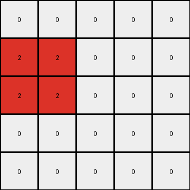
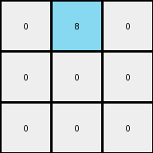
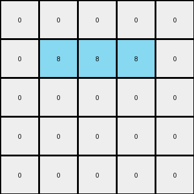

# a79310a0 • 004 • refine_coder

---

Previous Code:
```python
"""
1. Identify a 2x2 square of azure pixels in the input grid.
2. Change the color of this square from azure to red.
3. Move the now red square down by one row.
4. The rest of the grid remains unchanged (white).
"""

import numpy as np

def find_square(grid, color, size):
    """Finds a square of a given color and size in the grid."""
    height, width = grid.shape
    for i in range(height - size + 1):
        for j in range(width - size + 1):
            if np.all(grid[i:i+size, j:j+size] == color):
                return i, j
    return None

def transform(input_grid):
    """Transforms the input grid according to the described rule."""
    # Initialize output_grid as a copy of the input_grid
    output_grid = np.copy(input_grid)

    # Find the azure square
    square_pos = find_square(input_grid, 8, 2)

    if square_pos:
        row, col = square_pos

        # Clear the original square
        output_grid[row:row+2, col:col+2] = 0
        
        # Move the square down by one row and change color to red
        output_grid[row+1:row+3, col:col+2] = 2

    return output_grid
```

Train Set Results:

## Example 1:

Input:
```
8 8 0 0 0
8 8 0 0 0
0 0 0 0 0
0 0 0 0 0
0 0 0 0 0
```
Expected Output:
```
0 0 0 0 0
2 2 0 0 0
2 2 0 0 0
0 0 0 0 0
0 0 0 0 0
```
Transformed Output:
```
0 0 0 0 0
2 2 0 0 0
2 2 0 0 0
0 0 0 0 0
0 0 0 0 0
```

match: True
pixels_off: 0
size_correct: True
color_palette_correct: True
correct_pixel_counts: True

## Example 2:

Input:
```
0 8 0
0 0 0
0 0 0
```
Expected Output:
```
0 0 0
0 2 0
0 0 0
```
Transformed Output:
```
0 8 0
0 0 0
0 0 0
```

match: False
pixels_off: 2
size_correct: True
color_palette_correct: False
correct_pixel_counts: False

## Example 3:

Input:
```
0 0 0 0 0
0 8 8 8 0
0 0 0 0 0
0 0 0 0 0
0 0 0 0 0
```
Expected Output:
```
0 0 0 0 0
0 0 0 0 0
0 2 2 2 0
0 0 0 0 0
0 0 0 0 0
```
Transformed Output:
```
0 0 0 0 0
0 8 8 8 0
0 0 0 0 0
0 0 0 0 0
0 0 0 0 0
```

match: False
pixels_off: 6
size_correct: True
color_palette_correct: False
correct_pixel_counts: False
Okay, here's a breakdown of the situation and a plan to move forward:

**General Assessment:**

The initial natural language program and corresponding code were too specific to the first example. It correctly identified and moved a 2x2 azure square. However, it failed on examples where the azure shape was not a 2x2 square (Example 2: single azure pixel; Example 3: 1x3 azure rectangle). The core issue is an over-generalization from a single example. The strategy needs to be refined to:

1.  **Identify the *general* properties of the azure object being transformed, not just its size in the first example.** The code assumes it's always a 2x2 square, which is incorrect.
2.  **Account for different starting positions and shapes of the azure object.**
3.  **Confirm that the color change and downward movement are consistent.**

**Metrics and Observations:**

Here's a more detailed analysis of each example, incorporating the results:

*   **Example 1:**
    *   **Input:** 5x5 grid, 2x2 azure square at (0,0).
    *   **Expected Output:** 2x2 red square at (1,0).  Rest of grid is white (0).
    *   **Actual Output:** Matches Expected.
    *   **Analysis:** The initial code works perfectly for this case.

*   **Example 2:**
    *   **Input:** 3x3 grid, single azure pixel at (0, 1).
    *   **Expected Output:** single red pixel at (1, 1), rest white.
    *   **Actual Output:** No change.
    *   **Analysis:** The code failed because it's looking for a 2x2 square, which doesn't exist.  It doesn't handle single-pixel objects or other shapes.

*   **Example 3:**
    *   **Input:** 5x5 grid, 1x3 azure rectangle at (1, 1).
    *   **Expected Output:** 1x3 red rectangle at (2, 1), rest white.
    *   **Actual Output:** No Change.
    *   **Analysis:** Similar to Example 2, the code fails because the azure object isn't a 2x2 square.

**YAML Fact Block:**

```yaml
objects:
  - name: azure_shape
    type: contiguous_region
    color: azure (8)
    initial_position: variable
    final_position: one_row_below_initial
    initial_shape: variable # Could be any shape
    final_shape: same_as_initial
  - name: transformed_shape
    type: contiguous_region
    color: red (2)

actions:
  - description: Find the azure shape of any size.
  - description: Change the color of the azure shape to red.
  - description: Move the now red shape down by one row, keeping its original dimensions.
  - description: Keep all other pixels unchanged (white/0).

```

**Natural Language Program:**

1.  **Identify the contiguous region of azure (8) pixels in the input grid. This region can be of any size and shape.**
2.  **Change the color of all pixels within this identified region from azure (8) to red (2).**
3.  **Move the entire red region down by one row.** The shape and size of the region remain unchanged.
4.  **All other pixels in the grid that were not part of the original azure region should remain unchanged (white, value 0).**

**INSTRUCTIONS**

- generate a Python module to represent the natural language program 
- follow the template below
- all common math and science libraries are available
- create docstring only at top - but comment the workflow in the function
- use helper functions for common operations like finding objects, counting,
  measuring, moving, etc. 

remember - we are working iteratively - so this code will inform your future
self as we converge on the solution

*template:*

```python
"""
{{ natural language description of the transformation rule }}
"""

{{ imports }}

def transform(input_grid):
    # initialize output_grid

    # change output pixels 

    return output_grid

```
