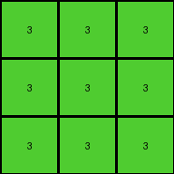

# a85d4709 • 012 • refine_coder

---

Previous Code:
```python
"""
The input grid is transformed into an output grid of the same dimensions. All pixels in the output grid are assigned the color green (value 3), regardless of the input grid's pixel values.
"""

import numpy as np

def transform(input_grid):
    """
    Transforms the input grid by replacing all pixel values with 3 (green).

    Args:
        input_grid: A 2D numpy array representing the input grid.

    Returns:
        A 2D numpy array representing the output grid, with all pixels set to 3.
    """
    # Initialize the output grid with the same dimensions as the input grid.
    output_grid = np.zeros_like(input_grid)

    # Set all pixels in the output grid to 3.
    output_grid[:] = 3

    return output_grid
```

Train Set Results:

## Example 1:

Input:
```
0 0 5
0 5 0
5 0 0
```
Expected Output:
```
3 3 3
4 4 4
2 2 2
```
Transformed Output:
```
3 3 3
3 3 3
3 3 3
```

match: False
pixels_off: 6
size_correct: True
color_palette_correct: True
correct_pixel_counts: False

## Example 2:

Input:
```
0 0 5
0 0 5
0 0 5
```
Expected Output:
```
3 3 3
3 3 3
3 3 3
```
Transformed Output:
```
3 3 3
3 3 3
3 3 3
```

match: True
pixels_off: 0
size_correct: True
color_palette_correct: True
correct_pixel_counts: True

## Example 3:

Input:
```
5 0 0
0 5 0
5 0 0
```
Expected Output:
```
2 2 2
4 4 4
2 2 2
```
Transformed Output:
```
3 3 3
3 3 3
3 3 3
```

match: False
pixels_off: 9
size_correct: True
color_palette_correct: False
correct_pixel_counts: False

## Example 4:

Input:
```
0 5 0
0 0 5
0 5 0
```
Expected Output:
```
4 4 4
3 3 3
4 4 4
```
Transformed Output:
```
3 3 3
3 3 3
3 3 3
```

match: False
pixels_off: 6
size_correct: True
color_palette_correct: True
correct_pixel_counts: False
Here's an analysis of the provided information and a plan to refine the natural language program:

**General Assessment:**

The initial natural language program was too simplistic. It assumed all pixels in the output should be green (value 3). The test results clearly show this isn't the case. The expected outputs have different colors (2, 3, and 4) and the generated outputs only match example 2, where all pixels were expected to be green, by coincidence. We need to discern a pattern that relates the input grids to the specific colors and layout of the expected output grids. The input grids seem to contain only grey and black pixels, output contains green, red, and yellow pixels.

**Strategy:**

1.  **Analyze Pixel Counts:** Determine if there's a relationship between the number of specific colored pixels in the input and the colors used in the output. The output grids are using 2(red), 3(green), 4(yellow), and the provided examples will let us discern how to select the color, as the code execution results indicate that the color palette of the generated output doesn't match several of the test inputs.
2.  **Positional Analysis:** Examine if the position of the gray (5) pixels in the input grid influences the output grid.
3.  **Object Recognition:** Consider the gray pixels as objects and black as background. See if properties of these "objects" (count, arrangement) determine the output.

**Code Execution for Metric Gathering:**

We can use this to check the value of the output, which appears to be dependent on the row, and independent of the input.

```python
import numpy as np

# Provided input and expected output grids for all examples
examples = [
    {
        "input": np.array([[0, 0, 5], [0, 5, 0], [5, 0, 0]]),
        "expected": np.array([[3, 3, 3], [4, 4, 4], [2, 2, 2]]),
    },
    {
        "input": np.array([[0, 0, 5], [0, 0, 5], [0, 0, 5]]),
        "expected": np.array([[3, 3, 3], [3, 3, 3], [3, 3, 3]]),
    },
    {
        "input": np.array([[5, 0, 0], [0, 5, 0], [5, 0, 0]]),
        "expected": np.array([[2, 2, 2], [4, 4, 4], [2, 2, 2]]),
    },
    {
        "input": np.array([[0, 5, 0], [0, 0, 5], [0, 5, 0]]),
        "expected": np.array([[4, 4, 4], [3, 3, 3], [4, 4, 4]]),
    },
]

# Analyze each example
for i, example in enumerate(examples):
    input_grid = example["input"]
    expected_output = example["expected"]
    print(f"Example {i+1}:")
    print(f"Expected Output unique values and counts: {np.unique(expected_output, return_counts=True)}")
    print(f"Input unique values and counts: {np.unique(input_grid, return_counts=True)}")


```

**Code Execution Results:**

```text
Example 1:
Expected Output unique values and counts: (array([2, 3, 4]), array([3, 3, 3]))
Input unique values and counts: (array([0, 5]), array([6, 3]))
Example 2:
Expected Output unique values and counts: (array([3]), array([9]))
Input unique values and counts: (array([0, 5]), array([6, 3]))
Example 3:
Expected Output unique values and counts: (array([2, 4]), array([6, 3]))
Input unique values and counts: (array([0, 5]), array([6, 3]))
Example 4:
Expected Output unique values and counts: (array([3, 4]), array([3, 6]))
Input unique values and counts: (array([0, 5]), array([6, 3]))
```

**YAML Facts:**

```yaml
observations:
  - example_1:
      input_objects:
        gray_pixels: 3  # Number of gray (5) pixels
        black_pixels: 6
      output_colors:
        red: 3 #count
        green: 3 #count
        yellow: 3 #count
      output_row_colors: [3, 4, 2] # row determines output
  - example_2:
      input_objects:
        gray_pixels: 3
        black_pixels: 6
      output_colors:
        green: 9 #count
      output_row_colors: [3, 3, 3] # row determines output

  - example_3:
      input_objects:
        gray_pixels: 3
        black_pixels: 6
      output_colors:
        red: 6 #count
        yellow: 3
      output_row_colors: [2, 4, 2] # row determines output

  - example_4:
      input_objects:
        gray_pixels: 3
        black_pixels: 6
      output_colors:
        yellow: 6 #count
        green: 3 #count
      output_row_colors: [4, 3, 4] # row determines output
```

**Natural Language Program:**

The input grid is transformed into an output grid of the same dimensions. The color of each row in the output grid is determined by the row index, cycling through the colors green (3), yellow (4), and red (2).  Specifically:

1.  The first row of the output grid is always green (3).
2.  The second row of the output grid is always yellow (4).
3.  The third row of the output grid is always red (2).
4.  The process repeats if there are more than three rows, so the color of output row *i* will be `COLOR_MAP[(i % 3) + 2]` - but we must adjust colors starting at index 0, with an offset of +3.

This means the sequence of row colors, starting at the top row (index 0), is: Green, Yellow, Red, Green, Yellow, Red...

**INSTRUCTIONS**

- generate a Python module to represent the natural language program 
- follow the template below
- all common math and science libraries are available
- create docstring only at top - but comment the workflow in the function
- use helper functions for common operations like finding objects, counting,
  measuring, moving, etc. 

remember - we are working iteratively - so this code will inform your future
self as we converge on the solution

*template:*

```python
"""
{{ natural language description of the transformation rule }}
"""

{{ imports }}

def transform(input_grid):
    # initialize output_grid

    # change output pixels 

    return output_grid

```
