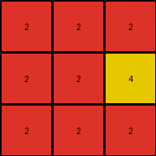

# a85d4709 • 015 • refine_dreamer

---

Previous Code:
```python
"""
Transforms a 3x3 input grid of gray (5) and white (0) pixels to an output grid of red (2) and yellow (4) pixels. 
Gray pixels on the middle row become yellow, while gray pixels on the top/bottom rows and all white pixels become red.
"""

import numpy as np

def transform(input_grid):
    """
    Transforms the input grid according to the specified rules.
    """
    output_grid = np.zeros_like(input_grid)  # Initialize output grid

    for i in range(input_grid.shape[0]):
        for j in range(input_grid.shape[1]):
            if input_grid[i, j] == 5:  # Gray pixel
                if i == 1:  # Middle row
                    output_grid[i, j] = 4  # Yellow
                else:  # Top or bottom row
                    output_grid[i, j] = 2  # Red
            elif input_grid[i, j] == 0:  # White pixel
                output_grid[i, j] = 2  # Red

    return output_grid
```

Train Set Results:

## Example 1:

Input:
```
0 0 5
0 5 0
5 0 0
```
Expected Output:
```
3 3 3
4 4 4
2 2 2
```
Transformed Output:
```
2 2 2
2 4 2
2 2 2
```

match: False
pixels_off: 5
size_correct: True
color_palette_correct: True
correct_pixel_counts: False

## Example 2:

Input:
```
0 0 5
0 0 5
0 0 5
```
Expected Output:
```
3 3 3
3 3 3
3 3 3
```
Transformed Output:
```
2 2 2
2 2 4
2 2 2
```

match: False
pixels_off: 9
size_correct: True
color_palette_correct: False
correct_pixel_counts: False

## Example 3:

Input:
```
5 0 0
0 5 0
5 0 0
```
Expected Output:
```
2 2 2
4 4 4
2 2 2
```
Transformed Output:
```
2 2 2
2 4 2
2 2 2
```

match: False
pixels_off: 2
size_correct: True
color_palette_correct: True
correct_pixel_counts: False

## Example 4:

Input:
```
0 5 0
0 0 5
0 5 0
```
Expected Output:
```
4 4 4
3 3 3
4 4 4
```
Transformed Output:
```
2 2 2
2 2 4
2 2 2
```

match: False
pixels_off: 9
size_correct: True
color_palette_correct: False
correct_pixel_counts: False
**INSTRUCTIONS**

The code above was generated based on observations from the first training
example

we have tested the transform function on each of the task example inputs and
compared with the expected output

review each of the examples provided and the results and consider how the
natural language program should be updated to accommodate this new knowledge

respond with the following deliverables:

- general assessment of the information provided and strategy for resolving the
  errors
- gather metrics about each of the examples and results - use code_execution to
  develop accurate reports on your assumptions
- a YAML block documenting facts - Focus on identifying objects, their properties, and the actions performed on them.
- a natural language program - Be as clear and concise as possible, providing a complete description of the transformation rule.


your responses should be considered as information in a report - not a
conversation
