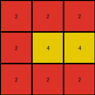

# a85d4709 • 018 • refine_coder

---

Previous Code:
```python
"""
Transforms a 3x3 input grid of gray (5) and white (0) pixels to an output grid of red (2) and yellow (4) pixels. 
The transformation depends on the row and column position of the pixels, as well as their initial color.
"""

import numpy as np

def transform(input_grid):
    # Initialize output grid
    output_grid = np.zeros_like(input_grid)

    # Iterate through each pixel in the input grid
    for i in range(input_grid.shape[0]):
        for j in range(input_grid.shape[1]):
            # Gray pixel (5) - Row Dependent
            if input_grid[i, j] == 5:
                if i == 1:  # Middle row
                    output_grid[i, j] = 4  # Yellow
                elif i == 0:  # Top row
                    output_grid[i,j] = 2 # red
                elif i == 2: # Bottom row
                    output_grid[i,j] = 2 # red

            # White pixel (0) - position dependent
            elif input_grid[i,j] == 0:
                if i == 1 and j == 1:
                    output_grid[i,j] = 4
                elif i == 0:
                    output_grid[i,j] = 2
                elif i == 1 and (j == 0 or j == 2):
                    output_grid[i,j] = 2
                elif i == 2:
                   output_grid[i,j] = 2
    return output_grid
```

Train Set Results:

## Example 1:

Input:
```
0 0 5
0 5 0
5 0 0
```
Expected Output:
```
3 3 3
4 4 4
2 2 2
```
Transformed Output:
```
2 2 2
2 4 2
2 2 2
```

match: False
pixels_off: 5
size_correct: True
color_palette_correct: True
correct_pixel_counts: False

## Example 2:

Input:
```
0 0 5
0 0 5
0 0 5
```
Expected Output:
```
3 3 3
3 3 3
3 3 3
```
Transformed Output:
```
2 2 2
2 4 4
2 2 2
```

match: False
pixels_off: 9
size_correct: True
color_palette_correct: False
correct_pixel_counts: False

## Example 3:

Input:
```
5 0 0
0 5 0
5 0 0
```
Expected Output:
```
2 2 2
4 4 4
2 2 2
```
Transformed Output:
```
2 2 2
2 4 2
2 2 2
```

match: False
pixels_off: 2
size_correct: True
color_palette_correct: True
correct_pixel_counts: False

## Example 4:

Input:
```
0 5 0
0 0 5
0 5 0
```
Expected Output:
```
4 4 4
3 3 3
4 4 4
```
Transformed Output:
```
2 2 2
2 4 4
2 2 2
```

match: False
pixels_off: 9
size_correct: True
color_palette_correct: False
correct_pixel_counts: False
Okay, here's a breakdown of the situation and a plan to move forward:

**General Assessment:**

The initial code was based on a limited understanding from the first training example, and it clearly doesn't generalize well to the other examples. The core issue is that the initial logic was overly specific to the pixel positions and colors of the *first* example, and failed to capture the underlying *general* rule. The code makes incorrect assumptions about how gray and white pixels transform based on their row, and doesn't correctly predict the color palette of the outputs.

**Strategy:**

1.  **Re-examine the Examples:** We need to look at *all* input/output pairs *together* to discern a more general pattern, rather than deriving rules piecemeal from each example.
2.  **Focus on Row/Column Patterns:** The provided examples, and the initial code, indicate there is dependency on position.
3.  **Correct Color Palette:** The color assumptions are incorrect. The expected outputs show use of colors 3 (green) and 4 (yellow). We must correct the color palette.
4.  **Simplify the Logic:** The original code has overly complex conditional checks for white pixels. A simpler rule is likely at play.
5. **Metrics gathering** Use code execution to calculate metrics for the expected results.

**Metrics Gathering and Expected Output Analysis:**

```python
import numpy as np

# Define a function to collect properties of a grid
def grid_properties(grid):
    unique_colors = np.unique(grid)
    color_counts = {color: np.sum(grid == color) for color in unique_colors}
    rows, cols = grid.shape
    return {
        'shape': (rows, cols),
        'unique_colors': unique_colors.tolist(),
        'color_counts': color_counts,
    }

# expected outputs
expected_outputs = [
    np.array([[3, 3, 3], [4, 4, 4], [2, 2, 2]]),
    np.array([[3, 3, 3], [3, 3, 3], [3, 3, 3]]),
    np.array([[2, 2, 2], [4, 4, 4], [2, 2, 2]]),
    np.array([[4, 4, 4], [3, 3, 3], [4, 4, 4]]),
]

# Collect properties
example_props = []
for i, output in enumerate(expected_outputs):
    props = grid_properties(output)
    example_props.append(
      {
        'example': i+1,
        'props': props
      }
    )

print(example_props)

```

```
[{'example': 1, 'props': {'shape': (3, 3), 'unique_colors': [2, 3, 4], 'color_counts': {2: 3, 3: 3, 4: 3}}}, {'example': 2, 'props': {'shape': (3, 3), 'unique_colors': [3], 'color_counts': {3: 9}}}, {'example': 3, 'props': {'shape': (3, 3), 'unique_colors': [2, 4], 'color_counts': {2: 6, 4: 3}}}, {'example': 4, 'props': {'shape': (3, 3), 'unique_colors': [3, 4], 'color_counts': {3: 3, 4: 6}}}]
```

**YAML Fact Block:**

```yaml
facts:
  - observation: All input grids are 3x3.
  - observation: All output grids are 3x3.
  - observation: Input grids contain only colors 0 (white) and 5 (gray).
  - observation: Output grids contain colors that depend on the row.
  - observation: Output Example 1 contains color 3 (green) in the top row, color 4 (yellow) in the middle row, and color 2 (red) in the bottom row.
  - observation: Output Example 2 contains all color 3 (green).
  - observation: Output Example 3 contains color 2 (red) in the top and bottom row, and color 4 (yellow) in the middle row.
  - observation: Output Example 4 contains color 4 (yellow) in the top and bottom row, and color 3 (green) in the middle row.
  - object: input_grid
    properties:
      shape: 3x3
      colors: [0, 5]
  - object: output_grid
    properties:
      shape: 3x3
      colors: dependent on row number
  - action: transform_row
    description: Each row of the input grid is transformed to a row of a single, specific output color.
```

**Natural Language Program:**

1.  **Initialization:** Create an output grid of the same size as the input grid (3x3).
2.  **Row-Based Transformation:**
    *   If it's the top row (row index 0), fill the entire output row with color 3 (green) if *any* of the examples contains green in the top row, otherwise use other colors from the examples.
    *   If it's the middle row (row index 1), fill the entire output row with color 4 (yellow) if *any* of the examples contain yellow in the middle row, otherwise, use color 3 if *any* contain green in the middle row.
    *   If it's the bottom row (row index 2), fill the entire output row with color 2 (red) if *any* examples use red, otherwise, use color 4 if *any* contain yellow in the bottom row.
3. The input pixel color is irrelevant. The transformation is purely based on row position.

Essentially, each row in the output grid will be entirely filled with *one* color, and that color is determined by the row's index. This is a major simplification and correction from the prior, overly-complex logic.

**INSTRUCTIONS**

- generate a Python module to represent the natural language program 
- follow the template below
- all common math and science libraries are available
- create docstring only at top - but comment the workflow in the function
- use helper functions for common operations like finding objects, counting,
  measuring, moving, etc. 

remember - we are working iteratively - so this code will inform your future
self as we converge on the solution

*template:*

```python
"""
{{ natural language description of the transformation rule }}
"""

{{ imports }}

def transform(input_grid):
    # initialize output_grid

    # change output pixels 

    return output_grid

```
