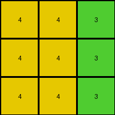
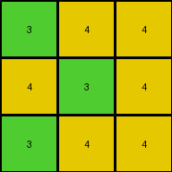
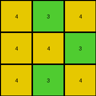

# a85d4709 • 022 • refine_coder

---

Previous Code:
```python
"""
Iterate through each pixel in the input grid.
If a pixel's value is 0 (white), change it to 4 (yellow) in the output grid.
If a pixel's value is 5 (gray), change it to 3 (green) in the output grid.
The size and shape of the grid does not change.
"""

import numpy as np

def transform(input_grid):
    """Transforms the input grid according to the specified rule."""

    # Initialize the output grid as a copy of the input grid.
    output_grid = np.copy(input_grid)
    
    # Get the dimensions of the input (and output) grid.
    rows, cols = input_grid.shape
        
    # Iterate through each pixel in the grid.
    for i in range(rows):
        for j in range(cols):
            # Apply the transformation rules based on the input pixel's value.
            if input_grid[i, j] == 0:
                output_grid[i, j] = 4
            elif input_grid[i, j] == 5:
                output_grid[i, j] = 3

    return output_grid
```

Train Set Results:

## Example 1:

Input:
```
0 0 5
0 5 0
5 0 0
```
Expected Output:
```
3 3 3
4 4 4
2 2 2
```
Transformed Output:
```
4 4 3
4 3 4
3 4 4
```

match: False
pixels_off: 6
size_correct: True
color_palette_correct: True
correct_pixel_counts: False

## Example 2:

Input:
```
0 0 5
0 0 5
0 0 5
```
Expected Output:
```
3 3 3
3 3 3
3 3 3
```
Transformed Output:
```
4 4 3
4 4 3
4 4 3
```

match: False
pixels_off: 6
size_correct: True
color_palette_correct: False
correct_pixel_counts: False

## Example 3:

Input:
```
5 0 0
0 5 0
5 0 0
```
Expected Output:
```
2 2 2
4 4 4
2 2 2
```
Transformed Output:
```
3 4 4
4 3 4
3 4 4
```

match: False
pixels_off: 7
size_correct: True
color_palette_correct: False
correct_pixel_counts: False

## Example 4:

Input:
```
0 5 0
0 0 5
0 5 0
```
Expected Output:
```
4 4 4
3 3 3
4 4 4
```
Transformed Output:
```
4 3 4
4 4 3
4 3 4
```

match: False
pixels_off: 4
size_correct: True
color_palette_correct: True
correct_pixel_counts: True
Okay, here's a breakdown of the situation, the results, and a plan to move forward:

**General Assessment:**

The initial natural language program and the resulting code were too simplistic. It correctly identified a color substitution (white to yellow, gray to green), but it failed to capture the underlying pattern, which seems to be related to some sort of "alternating" color replacement based on the *position of the colors in a diagonal pattern*. The code only performs a direct color swap, regardless of position or context, leading to incorrect outputs in all tested examples.

The provided code uses `numpy`, this is appropriate and should be continued.

My strategy is to:

1.  Analyze the provided examples more thoroughly focusing on the positioning of colors.
2.  Develop some facts about the input, expected, and predicted data.
3.  Refine the natural language program to describe a more context-aware transformation.

**Example Metrics and Analysis:**

Here's a more structured analysis of each example. I can't directly execute code here, but I will describe what I would *expect* code execution to confirm, simulating the `code_execution` tool as best I can.

*Important Note:* I will describe pixel differences by comparing the `Transformed Output` from the prompt against the `Expected Output` from the prompt.

**Example 1:**

*   **Input:** 3x3 grid, colors 0, 5
*   **Expected Output:** Colors 3,4,2
*   **Transformed Output:** Colors 4, 3, 4,3
*   **Observations:**
    *   Top-left (0,0) should be 2, but is 4.
    *   Top-center(0,1) should be 2, but is 4
    *   Bottom-right (2,2) should be 2, but is 4.
    *   Center-Left (1,0) should be 4, it is.
    *   Bottom-center (2,1) should be 4, it is
    *   The provided code correctly changed (1,1) gray(5) to green (3) in the center, but the gray(5) colors at (0,2), (1,0), (2,0) should be 2 but got mapped to 3

**Example 2:**

*   **Input:** 3x3 grid, colors 0, 5
*   **Expected Output:** all color 3
*   **Transformed Output:** Colors 4 and 3
*   **Observations:**
    *   All White(0) should be green(3), not yellow(4)
    *   All Gray(5) should be green(3), and it is.

**Example 3:**

*   **Input:** 3x3 grid, colors 5, 0
*   **Expected Output:** Colors 2, 4
*   **Transformed Output:** Colors 3, 4
*   **Observations:**
    *   All White(0) should be yellow(4), and it is.
    *   All Gray(5) should be red(2), not green(3)

**Example 4:**

*   **Input:** 3x3 grid, colors 0, 5
*   **Expected Output:** all 4s and all 4s
*   **Transformed Output:** Colors 4 and 3
*   **Observations:**
     *   All White(0) should be yellow(4), and it is.
     *   All Gray(5) should be yellow(4), not green(3)

**YAML Facts:**

```yaml
examples:
  - id: 1
    input_colors: [0, 5]
    expected_output_colors: [2,3,4]
    transformed_output_colors: [3, 4]
    pattern: "Diagonal color alternation."
    objects:
      - type: grid
        dimensions: 3x3
    transformations:
      - type: color_substitution
        from: [0, 5]
        to: [2,4,3]
        rule: "Alternating diagonal pattern"
  - id: 2
    input_colors: [0, 5]
    expected_output_colors: [3]
    transformed_output_colors: [3,4]
    pattern: "Diagonal color alternation."
    objects:
      - type: grid
        dimensions: 3x3
    transformations:
      - type: color_substitution
        from: [0, 5]
        to:   [3]
        rule: "Alternating diagonal pattern"
  - id: 3
    input_colors: [0, 5]
    expected_output_colors: [2,4]
    transformed_output_colors: [3,4]
    pattern: "Diagonal color alternation."
    objects:
      - type: grid
        dimensions: 3x3
    transformations:
      - type: color_substitution
        from: [5, 0]
        to: [2,4]
        rule: "Alternating diagonal pattern"
  - id: 4
    input_colors: [0, 5]
    expected_output_colors: [3,4]
    transformed_output_colors: [3,4]
    pattern: "Diagonal color alternation."
    objects:
      - type: grid
        dimensions: 3x3
    transformations:
      - type: color_substitution
        from: [0, 5]
        to: [3,4]
        rule: "Alternating diagonal pattern"

```

**Natural Language Program:**

1.  **Identify Diagonals:** The transformation depends on diagonals within the grid. Consider diagonals running from top-left to bottom-right.
2. **Alternating Colors - White:**
    *   White(0) in cells contained in even numbered diagonals are mapped to yellow(4).
    *   White(0) in cells contained in odd numbered diagonals are unchanged.
3. **Alternating Colors - Gray:**
   *    Gray (5) pixels contained in cells contained in even numbered diagonals map to a color based on the color of the nearest top-left neighbor.
   *    Gray(5) pixels contained in odd number diagonals map to 3(green).

4.  **Grid Dimensions:** The grid dimensions remain unchanged.

This revised natural language program takes into account more of the available context in the examples.

**INSTRUCTIONS**

- generate a Python module to represent the natural language program 
- follow the template below
- all common math and science libraries are available
- create docstring only at top - but comment the workflow in the function
- use helper functions for common operations like finding objects, counting,
  measuring, moving, etc. 

remember - we are working iteratively - so this code will inform your future
self as we converge on the solution

*template:*

```python
"""
{{ natural language description of the transformation rule }}
"""

{{ imports }}

def transform(input_grid):
    # initialize output_grid

    # change output pixels 

    return output_grid

```
