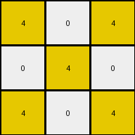
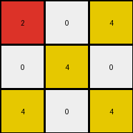

# a85d4709 • 023 • refine_dreamer

---

Previous Code:
```python
"""
1.  Identify Diagonals: The transformation depends on diagonals within the grid. Consider diagonals running from top-left to bottom-right.
2.  Alternating Colors - White:
    *   White(0) in cells contained in even numbered diagonals are mapped to yellow(4).
    *   White(0) in cells contained in odd numbered diagonals are unchanged.
3.  Alternating Colors - Gray:
    *    Gray (5) pixels contained in cells contained in even numbered diagonals map to a color based on the color of the nearest top-left neighbor.
    *    Gray(5) pixels contained in odd number diagonals map to 3(green).
4.  Grid Dimensions: The grid dimensions remain unchanged.
"""

import numpy as np

def get_diagonal_number(row, col):
    """Calculates the diagonal number for a given cell (top-left to bottom-right)."""
    return row + col

def get_top_left_neighbor_color(grid, row, col):
    """Finds the color of the nearest non-gray neighbor above and/or to the left."""
    rows, cols = grid.shape

    #check the cell above
    if (row - 1) >= 0:
      if grid[row-1,col] != 5: #not gray
          return grid[row -1, col]
    #check the cell to the left
    if (col -1) >= 0:
        if grid[row, col-1] != 5:
            return grid[row, col - 1]

    # Check for existing pixel in up direction
    for r in range(row - 1, -1, -1):
        if grid[r, col] != 5:
            return grid[r, col]

    # Check to the left
    for c in range(col - 1, -1, -1):
       if grid[row,c] != 5:
          return grid[row, c]
          
    return None  # No non-gray neighbor found

def transform(input_grid):
    """Transforms the input grid according to the diagonal-based color rule."""
    output_grid = np.copy(input_grid)
    rows, cols = input_grid.shape

    for row in range(rows):
        for col in range(cols):
            diagonal_num = get_diagonal_number(row, col)
            if input_grid[row, col] == 0:  # White
                if diagonal_num % 2 == 0:  # Even diagonal
                    output_grid[row, col] = 4  # Yellow
                #else odd, so unchanged

            elif input_grid[row, col] == 5:  # Gray
                if diagonal_num % 2 == 0: #even diagonal
                  top_left_neighbor_color = get_top_left_neighbor_color(input_grid, row, col)
                  if top_left_neighbor_color == 0: #check neighbor is White
                      output_grid[row,col] = 4 #yellow

                  elif top_left_neighbor_color == None:
                      output_grid[row, col] = 2

                  elif (top_left_neighbor_color !=0 and top_left_neighbor_color != None):
                      output_grid[row, col] = 2


                else:  # Odd diagonal
                    output_grid[row, col] = 3  # Green

    return output_grid
```

Train Set Results:

## Example 1:

Input:
```
0 0 5
0 5 0
5 0 0
```
Expected Output:
```
3 3 3
4 4 4
2 2 2
```
Transformed Output:
```
4 0 4
0 4 0
4 0 4
```

match: False
pixels_off: 8
size_correct: True
color_palette_correct: False
correct_pixel_counts: False

## Example 2:

Input:
```
0 0 5
0 0 5
0 0 5
```
Expected Output:
```
3 3 3
3 3 3
3 3 3
```
Transformed Output:
```
4 0 4
0 4 3
4 0 4
```

match: False
pixels_off: 8
size_correct: True
color_palette_correct: False
correct_pixel_counts: False

## Example 3:

Input:
```
5 0 0
0 5 0
5 0 0
```
Expected Output:
```
2 2 2
4 4 4
2 2 2
```
Transformed Output:
```
2 0 4
0 4 0
4 0 4
```

match: False
pixels_off: 7
size_correct: True
color_palette_correct: False
correct_pixel_counts: False

## Example 4:

Input:
```
0 5 0
0 0 5
0 5 0
```
Expected Output:
```
4 4 4
3 3 3
4 4 4
```
Transformed Output:
```
4 3 4
0 4 3
4 3 4
```

match: False
pixels_off: 4
size_correct: True
color_palette_correct: False
correct_pixel_counts: False
**INSTRUCTIONS**

The code above was generated based on observations from the first training
example

we have tested the transform function on each of the task example inputs and
compared with the expected output

review each of the examples provided and the results and consider how the
natural language program should be updated to accommodate this new knowledge

respond with the following deliverables:

- general assessment of the information provided and strategy for resolving the
  errors
- gather metrics about each of the examples and results - use code_execution to
  develop accurate reports on your assumptions
- a YAML block documenting facts - Focus on identifying objects, their properties, and the actions performed on them.
- a natural language program - Be as clear and concise as possible, providing a complete description of the transformation rule.


your responses should be considered as information in a report - not a
conversation
