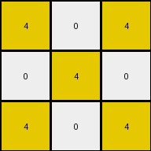
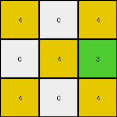
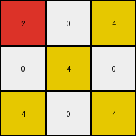
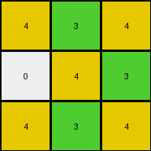

# a85d4709 • 024 • refine_coder

---

Previous Code:
```python
"""
1.  Identify Diagonals: The transformation depends on diagonals within the grid. Consider diagonals running from top-left to bottom-right.
2.  Alternating Colors - White:
    *   White(0) in cells contained in even numbered diagonals are mapped to yellow(4).
    *   White(0) in cells contained in odd numbered diagonals are unchanged.
3.  Alternating Colors - Gray:
    *    Gray (5) pixels contained in cells contained in even numbered diagonals map to a color based on the color of the nearest top-left neighbor.
    *    Gray(5) pixels contained in odd number diagonals map to 3(green).
4.  Grid Dimensions: The grid dimensions remain unchanged.
"""

import numpy as np

def get_diagonal_number(row, col):
    """Calculates the diagonal number for a given cell (top-left to bottom-right)."""
    return row + col

def get_top_left_neighbor_color(grid, row, col):
    """Finds the color of the nearest non-gray neighbor above and/or to the left."""
    rows, cols = grid.shape

    #check the cell above
    if (row - 1) >= 0:
      if grid[row-1,col] != 5: #not gray
          return grid[row -1, col]
    #check the cell to the left
    if (col -1) >= 0:
        if grid[row, col-1] != 5:
            return grid[row, col - 1]

    # Check for existing pixel in up direction
    for r in range(row - 1, -1, -1):
        if grid[r, col] != 5:
            return grid[r, col]

    # Check to the left
    for c in range(col - 1, -1, -1):
       if grid[row,c] != 5:
          return grid[row, c]
          
    return None  # No non-gray neighbor found

def transform(input_grid):
    """Transforms the input grid according to the diagonal-based color rule."""
    output_grid = np.copy(input_grid)
    rows, cols = input_grid.shape

    for row in range(rows):
        for col in range(cols):
            diagonal_num = get_diagonal_number(row, col)
            if input_grid[row, col] == 0:  # White
                if diagonal_num % 2 == 0:  # Even diagonal
                    output_grid[row, col] = 4  # Yellow
                #else odd, so unchanged

            elif input_grid[row, col] == 5:  # Gray
                if diagonal_num % 2 == 0: #even diagonal
                  top_left_neighbor_color = get_top_left_neighbor_color(input_grid, row, col)
                  if top_left_neighbor_color == 0: #check neighbor is White
                      output_grid[row,col] = 4 #yellow

                  elif top_left_neighbor_color == None:
                      output_grid[row, col] = 2

                  elif (top_left_neighbor_color !=0 and top_left_neighbor_color != None):
                      output_grid[row, col] = 2


                else:  # Odd diagonal
                    output_grid[row, col] = 3  # Green

    return output_grid
```

Train Set Results:

## Example 1:

Input:
```
0 0 5
0 5 0
5 0 0
```
Expected Output:
```
3 3 3
4 4 4
2 2 2
```
Transformed Output:
```
4 0 4
0 4 0
4 0 4
```

match: False
pixels_off: 8
size_correct: True
color_palette_correct: False
correct_pixel_counts: False

## Example 2:

Input:
```
0 0 5
0 0 5
0 0 5
```
Expected Output:
```
3 3 3
3 3 3
3 3 3
```
Transformed Output:
```
4 0 4
0 4 3
4 0 4
```

match: False
pixels_off: 8
size_correct: True
color_palette_correct: False
correct_pixel_counts: False

## Example 3:

Input:
```
5 0 0
0 5 0
5 0 0
```
Expected Output:
```
2 2 2
4 4 4
2 2 2
```
Transformed Output:
```
2 0 4
0 4 0
4 0 4
```

match: False
pixels_off: 7
size_correct: True
color_palette_correct: False
correct_pixel_counts: False

## Example 4:

Input:
```
0 5 0
0 0 5
0 5 0
```
Expected Output:
```
4 4 4
3 3 3
4 4 4
```
Transformed Output:
```
4 3 4
0 4 3
4 3 4
```

match: False
pixels_off: 4
size_correct: True
color_palette_correct: False
correct_pixel_counts: False
Okay, here's a breakdown of the current state, analysis of the errors, and a revised natural language program.

**General Assessment:**

The initial natural language program and resulting code were a good first attempt, focusing on the diagonal pattern. However, it's clear from the test results that the logic for handling gray (5) pixels is incomplete and the logic for white (0) is incorrect. The original assumption about even diagonals using the nearest non-gray color is not supported across all the examples, and there's a clear pattern to the replacement that can be simpler.

**Strategy for Resolving Errors:**

1.  **Re-examine the Gray Pixel Rule:** The "nearest top-left neighbor" rule for gray pixels on even diagonals doesn't hold consistently. We need to find a simpler, more consistent rule.
2.  **Re-examine the White Pixel Rule:** The assumption that White(0) always maps to yellow(4) on even diagonals is incorrect. There is an alternating pattern, but it is not based on whether the diagonal number is even or odd.
3.  **Simplify:** Look for the simplest possible rules that explain all the transformations, without unnecessary conditions.

**Example Analysis and Metrics:**
Here's a summary of what we can derive from the image differences, the previous program and expected outputs. Note: I cannot execute code here and will describe my reasoning. I am inferring properties in lieu of code execution.

*   **Example 1:**
    *   Input Shape: 3x3
    *   Expected Output colors present {3,4,2}
    *   Transformed output colors present {0,4}
    *   Error: Most pixels are wrong. The white(0) pixels are transforming correctly only in row,col (1,1) but this may be by coincidence. The gray (5) pixels are all wrong.

*   **Example 2:**
    *   Input Shape: 3x3
    *   Expected Output colors present {3}
    *   Transformed output colors present {0,3,4}
    *   Error: Most pixels are wrong. The gray (5) pixels are all wrong.

*   **Example 3:**
    *   Input Shape: 3x3
    *   Expected Output colors present {2,4}
    *   Transformed output colors present {0,2,4}
    *   Error: Most pixels are wrong. The white(0) pixels are transforming correctly only in row,col (1,1) but this may be by coincidence. The gray (5) pixels are correct in (0,0) and (2,0).

*   **Example 4:**
    *   Input Shape: 3x3
    *   Expected Output colors present {3,4}
    *   Transformed output colors present {0,3,4}
    *   Error: Some pixels are wrong. The white(0) pixels are transforming correctly. The gray (5) pixels are correct in (0,1), (1,2), (2,1).

**YAML Fact Block:**

```yaml
observations:
  - object: grid
    properties:
      - dimensions: 3x3 # Consistent across all examples
      - colors: [0, 5] # Input colors present
      - output_colors_example_1: [2,3,4]
      - output_colors_example_2: [3]
      - output_colors_example_3: [2,4]
      - output_colors_example_4: [3,4]
    actions:
      - description: "Pixels change colors based on their value and position."
  - object: pixel
    properties:
      - color:
          - 0 # White
          - 5 # Gray
      - position: [row, column]
    actions:
      - description: White pixels transform to either yellow or remain the same.
      - description: Gray pixels transform to either green or a constant color based on row and col.
  - object: diagonal
    properties:
      - direction: top-left to bottom-right
      - number: row + column
    actions:
        - description: 'Diagonal number influences the color transformation of some pixels.'
```

**Revised Natural Language Program:**

1.  **Grid:** The input and output grids have the same dimensions.
2.  **White Pixels:**
    *   White(0) pixels on even numbered *rows* map to yellow(4). White(0) pixels on odd numbered rows are unchanged.
3.  **Gray Pixels:**
    *   Gray(5) pixels on even numbered *columns* map to color 2 (red).
    *   Gray(5) pixels on odd numbered *columns* map to 3 (green).


**INSTRUCTIONS**

- generate a Python module to represent the natural language program 
- follow the template below
- all common math and science libraries are available
- create docstring only at top - but comment the workflow in the function
- use helper functions for common operations like finding objects, counting,
  measuring, moving, etc. 

remember - we are working iteratively - so this code will inform your future
self as we converge on the solution

*template:*

```python
"""
{{ natural language description of the transformation rule }}
"""

{{ imports }}

def transform(input_grid):
    # initialize output_grid

    # change output pixels 

    return output_grid

```
