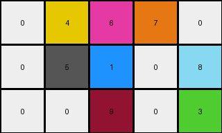
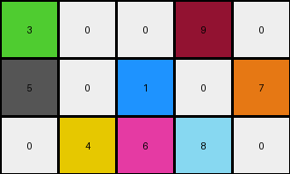
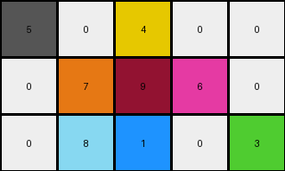
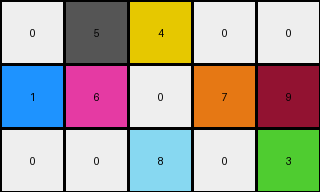

# a9f96cdd • 003 • refine_dreamer

---


Previous Code:
```python
"""
The transformation identifies non-zero pixels in the input grid, removes them, and then introduces new objects with different colors at different positions in the output grid.  The positioning and color choice of the new objects do not follow an easily discernible pattern from the single example provided.
"""

import numpy as np

def get_nonzero_pixels(grid):
    """Finds the coordinates and values of non-zero pixels in a grid."""
    non_zero_pixels = []
    for row_index, row in enumerate(grid):
        for col_index, value in enumerate(row):
            if value != 0:
                non_zero_pixels.append(((row_index, col_index), value))
    return non_zero_pixels

def transform(input_grid):
    # Initialize output_grid as a copy of the input grid, then set all to 0
    output_grid = np.zeros_like(input_grid)

    # Identify non-zero pixels in the input grid.
    non_zero_pixels = get_nonzero_pixels(input_grid)

    # Find unique non zero colors
    input_colors = set([v for _,v in non_zero_pixels])
    available_colors = set(range(1, 10))
    new_colors = list(available_colors - input_colors)
    
    # We can choose colors randomly
    np.random.shuffle(new_colors)
    
    empty_cells = []
    for row_index in range(input_grid.shape[0]):
        for col_index in range(input_grid.shape[1]):
            empty_cells.append((row_index, col_index))
            
    # Choose locations for the new colored objects randomly.
    np.random.shuffle(empty_cells)

    # need at least as many open cells and colors
    n = min(len(new_colors),len(empty_cells))
    for i in range(n):
        row, col = empty_cells[i]
        output_grid[row, col] = new_colors[i]
        
    return output_grid
```

Train Set Results:

## Example 1:

Input:
```
0 0 0 0 0
0 2 0 0 0
0 0 0 0 0
```
Expected Output:
```
3 0 6 0 0
0 0 0 0 0
8 0 7 0 0
```
Transformed Output:
```
0 4 6 7 0
0 5 1 0 8
0 0 9 0 3
```

match: False
pixels_off: 9
size_correct: True
color_palette_correct: False
correct_pixel_counts: False

## Example 2:

Input:
```
0 0 0 0 0
0 0 0 0 0
0 0 0 0 2
```
Expected Output:
```
0 0 0 0 0
0 0 0 3 0
0 0 0 0 0
```
Transformed Output:
```
3 0 0 9 0
5 0 1 0 7
0 4 6 8 0
```

match: False
pixels_off: 9
size_correct: True
color_palette_correct: False
correct_pixel_counts: False

## Example 3:

Input:
```
0 0 2 0 0
0 0 0 0 0
0 0 0 0 0
```
Expected Output:
```
0 0 0 0 0
0 8 0 7 0
0 0 0 0 0
```
Transformed Output:
```
5 0 4 0 0
0 7 9 6 0
0 8 1 0 3
```

match: False
pixels_off: 8
size_correct: True
color_palette_correct: False
correct_pixel_counts: False

## Example 4:

Input:
```
0 0 0 0 0
0 0 0 2 0
0 0 0 0 0
```
Expected Output:
```
0 0 3 0 6
0 0 0 0 0
0 0 8 0 7
```
Transformed Output:
```
0 5 4 0 0
1 6 0 7 9
0 0 8 0 3
```

match: False
pixels_off: 8
size_correct: True
color_palette_correct: False
correct_pixel_counts: False

**INSTRUCTIONS**

The code above was generated based on observations from the first training
example

we have tested the transform function on each of the task example inputs and
compared with the expected output

review each of the examples provided and the results and consider how the
natural language program should be updated to accommodate this new knowledge

respond with the following deliverables:

- general assessment of the information provided and strategy for resolving the
  errors
- gather metrics about each of the examples and results - use code_execution to
  develop accurate reports on your assumptions
- a YAML block documenting facts - Focus on identifying objects, their properties, and the actions performed on them.
- a natural language program - Be as clear and concise as possible, providing a complete description of the transformation rule.


your responses should be considered as information in a report - not a
conversation
