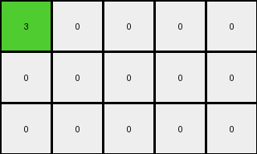
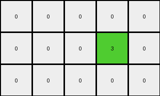
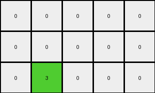
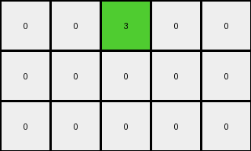

# a9f96cdd • 009 • refine_dreamer

---

Previous Code:
```python
"""
Locate the single non-zero pixel in the input grid. Change its color from 2 (red) to 3 (green). Move the pixel one position diagonally up and to the left. Construct the output grid with the moved and recolored pixel, and all other cells set to 0.
"""

import numpy as np

def find_non_zero_pixel(grid):
    # Find the coordinates of the non-zero pixel
    non_zero_indices = np.nonzero(grid)
    return list(zip(non_zero_indices[0], non_zero_indices[1]))[0]

def transform(input_grid):
    # Initialize output_grid as a copy of the input_grid
    output_grid = np.zeros_like(input_grid)

    # Find the non-zero pixel in the input grid
    input_pixel_coords = find_non_zero_pixel(input_grid)

    # Calculate the new coordinates for the pixel (one step up and one step left)
    output_pixel_coords = (input_pixel_coords[0] - 1, input_pixel_coords[1] - 1)

    # Change color and set output
    output_grid[output_pixel_coords[0], output_pixel_coords[1]] = 3

    return output_grid
```

Train Set Results:

## Example 1:

Input:
```
0 0 0 0 0
0 2 0 0 0
0 0 0 0 0
```
Expected Output:
```
3 0 6 0 0
0 0 0 0 0
8 0 7 0 0
```
Transformed Output:
```
3 0 0 0 0
0 0 0 0 0
0 0 0 0 0
```

match: False
pixels_off: 3
size_correct: True
color_palette_correct: True
correct_pixel_counts: False

## Example 2:

Input:
```
0 0 0 0 0
0 0 0 0 0
0 0 0 0 2
```
Expected Output:
```
0 0 0 0 0
0 0 0 3 0
0 0 0 0 0
```
Transformed Output:
```
0 0 0 0 0
0 0 0 3 0
0 0 0 0 0
```

match: True
pixels_off: 0
size_correct: True
color_palette_correct: True
correct_pixel_counts: True

## Example 3:

Input:
```
0 0 2 0 0
0 0 0 0 0
0 0 0 0 0
```
Expected Output:
```
0 0 0 0 0
0 8 0 7 0
0 0 0 0 0
```
Transformed Output:
```
0 0 0 0 0
0 0 0 0 0
0 3 0 0 0
```

match: False
pixels_off: 3
size_correct: True
color_palette_correct: False
correct_pixel_counts: False

## Example 4:

Input:
```
0 0 0 0 0
0 0 0 2 0
0 0 0 0 0
```
Expected Output:
```
0 0 3 0 6
0 0 0 0 0
0 0 8 0 7
```
Transformed Output:
```
0 0 3 0 0
0 0 0 0 0
0 0 0 0 0
```

match: False
pixels_off: 3
size_correct: True
color_palette_correct: True
correct_pixel_counts: False
**INSTRUCTIONS**

The code above was generated based on observations from the first training
example

we have tested the transform function on each of the task example inputs and
compared with the expected output

review each of the examples provided and the results and consider how the
natural language program should be updated to accommodate this new knowledge

respond with the following deliverables:

- general assessment of the information provided and strategy for resolving the
  errors
- gather metrics about each of the examples and results - use code_execution to
  develop accurate reports on your assumptions
- a YAML block documenting facts - Focus on identifying objects, their properties, and the actions performed on them.
- a natural language program - Be as clear and concise as possible, providing a complete description of the transformation rule.


your responses should be considered as information in a report - not a
conversation
