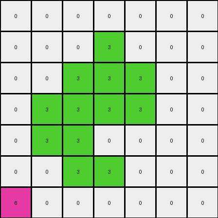

# aabf363d • 003 • refine_dreamer

---


Previous Code:
```python
"""
Identifies a contiguous shape of red pixels and a single yellow pixel in the input grid. Replaces the red shape with yellow pixels and removes the original yellow pixel.
"""

import numpy as np

def find_object(grid, color):
    # Find coordinates of all pixels of the specified color.
    coords = np.argwhere(grid == color)
    if len(coords) == 0:
        return None

    # Check connectivity - only consider directly adjacent pixels.
    visited = set()
    object_coords = []

    def dfs(row, col):
        if (row, col) in visited or not (0 <= row < grid.shape[0] and 0 <= col < grid.shape[1]) or grid[row, col] != color:
            return
        visited.add((row, col))
        object_coords.append((row, col))
        dfs(row + 1, col)
        dfs(row - 1, col)
        dfs(row, col + 1)
        dfs(row, col - 1)

    start_row, start_col = coords[0]
    dfs(start_row, start_col)
    return object_coords

def find_single_pixel(grid, color):
    coords = np.argwhere(grid == color)
    if len(coords) == 1:
      return coords[0]
    return None


def transform(input_grid):
    # Initialize output_grid as a copy of the input_grid.
    output_grid = np.copy(input_grid)

    # Find the red object.
    red_object_coords = find_object(input_grid, 2)

    # find single yellow pixel
    yellow_pixel_coord = find_single_pixel(input_grid, 4)

    # Change the color of the red object to yellow in the output_grid.
    if red_object_coords:
        for row, col in red_object_coords:
            output_grid[row, col] = 4

    if yellow_pixel_coord:
      output_grid[yellow_pixel_coord[0], yellow_pixel_coord[1]] = 0

    return output_grid
```

Train Set Results:

## Example 1:

Input:
```
0 0 0 0 0 0 0
0 2 2 2 0 0 0
0 0 2 0 0 0 0
0 2 2 2 2 0 0
0 0 2 2 2 0 0
0 0 0 2 0 0 0
4 0 0 0 0 0 0
```
Expected Output:
```
0 0 0 0 0 0 0
0 4 4 4 0 0 0
0 0 4 0 0 0 0
0 4 4 4 4 0 0
0 0 4 4 4 0 0
0 0 0 4 0 0 0
0 0 0 0 0 0 0
```
match: ERROR: The truth value of an array with more than one element is ambiguous. Use a.any() or a.all()
pixels_off: None
size_correct: None
color_palette_correct: None
correct_pixel_counts: None

## Example 2:

Input:
```
0 0 0 0 0 0 0
0 0 0 3 0 0 0
0 0 3 3 3 0 0
0 3 3 3 3 0 0
0 3 3 0 0 0 0
0 0 3 3 0 0 0
6 0 0 0 0 0 0
```
Expected Output:
```
0 0 0 0 0 0 0
0 0 0 6 0 0 0
0 0 6 6 6 0 0
0 6 6 6 6 0 0
0 6 6 0 0 0 0
0 0 6 6 0 0 0
0 0 0 0 0 0 0
```
Transformed Output:
```
0 0 0 0 0 0 0
0 0 0 3 0 0 0
0 0 3 3 3 0 0
0 3 3 3 3 0 0
0 3 3 0 0 0 0
0 0 3 3 0 0 0
6 0 0 0 0 0 0
```

match: False
pixels_off: 13
size_correct: True
color_palette_correct: False
correct_pixel_counts: False

**INSTRUCTIONS**

The code above was generated based on observations from the first training
example

we have tested the transform function on each of the task example inputs and
compared with the expected output

review each of the examples provided and the results and consider how the
natural language program should be updated to accommodate this new knowledge

respond with the following deliverables:

- general assessment of the information provided and strategy for resolving the
  errors
- gather metrics about each of the examples and results - use code_execution to
  develop accurate reports on your assumptions
- a YAML block documenting facts - Focus on identifying objects, their properties, and the actions performed on them.
- a natural language program - Be as clear and concise as possible, providing a complete description of the transformation rule.


your responses should be considered as information in a report - not a
conversation
