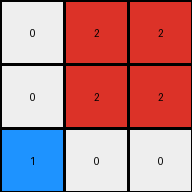
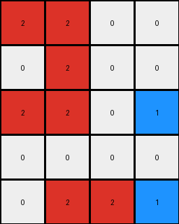

# aedd82e4 • 005 • refine_dreamer

---


Previous Code:
```python
"""
Identifies groups of contiguous red pixels and changes the color of the bottom-rightmost pixel in a group of three, or the right-most in a group of two, or two (bottom and right-most) on a diagonal to blue.
"""

import numpy as np

def find_red_groups(grid):
    """Finds groups of contiguous red pixels."""
    red_groups = []
    visited = np.zeros_like(grid, dtype=bool)
    rows, cols = grid.shape

    def is_valid(r, c):
        return 0 <= r < rows and 0 <= c < cols

    def dfs(r, c, current_group):
        if not is_valid(r, c) or visited[r, c] or grid[r, c] != 2:
            return
        visited[r, c] = True
        current_group.append((r, c))
        # Explore adjacent cells (up, down, left, right)
        dfs(r + 1, c, current_group)
        dfs(r - 1, c, current_group)
        dfs(r, c + 1, current_group)
        dfs(r, c - 1, current_group)

    for r in range(rows):
        for c in range(cols):
            if grid[r, c] == 2 and not visited[r, c]:
                current_group = []
                dfs(r, c, current_group)
                red_groups.append(current_group)
    return red_groups

def select_target_pixel(group):
    """Selects the target pixel(s) within a red group."""
    if len(group) == 0:
       return []

    group.sort(key=lambda x: (x[0], x[1]))  # Sort by row, then column

    targets = []

    # check for diagonal group and return bottom and right
    if len(group) > 1:
        is_diagonal = True
        for i in range(len(group) -1):
            if abs(group[i][0] - group[i+1][0]) == 1 and abs(group[i][1] - group[i+1][1]) == 1:
               pass
            else:
               is_diagonal = False
               break
        if is_diagonal:
            targets.append(group[-1])  #right-most
            bottom = -1
            for i in range(len(group)):
                if group[i][0] > bottom:
                    bottom_index = i
                    bottom = group[i][0]
            targets.append(group[bottom_index])  #bottom-most
            return targets
        
    # if one, two or three in group. return the right-most
    if len(group) <= 3:
       targets.append(group[-1]) #right-most
       return targets
    
    return targets
        

def transform(input_grid):
    # Initialize the output grid as a copy of the input grid.
    output_grid = np.copy(input_grid)

    # Find groups of contiguous red pixels.
    red_groups = find_red_groups(input_grid)

    # Select and change the target pixel(s) in each group.
    for group in red_groups:
        target_pixels = select_target_pixel(group)
        for target_pixel in target_pixels:
          if target_pixel:
            output_grid[target_pixel] = 1

    return output_grid
```

Train Set Results:

## Example 1:

Input:
```
0 2 2
0 2 2
2 0 0
```
Expected Output:
```
0 2 2
0 2 2
1 0 0
```
Transformed Output:
```
0 2 2
0 2 2
1 0 0
```

match: True
pixels_off: 0
size_correct: True
color_palette_correct: True
correct_pixel_counts: True

## Example 2:

Input:
```
2 2 2 0
0 2 0 0
0 0 0 2
0 2 0 0
```
Expected Output:
```
2 2 2 0
0 2 0 0
0 0 0 1
0 1 0 0
```
Transformed Output:
```
2 2 2 0
0 2 0 0
0 0 0 1
0 1 0 0
```

match: True
pixels_off: 0
size_correct: True
color_palette_correct: True
correct_pixel_counts: True

## Example 3:

Input:
```
2 2 0 0
0 2 0 0
2 2 0 2
0 0 0 0
0 2 2 2
```
Expected Output:
```
2 2 0 0
0 2 0 0
2 2 0 1
0 0 0 0
0 2 2 2
```
Transformed Output:
```
2 2 0 0
0 2 0 0
2 2 0 1
0 0 0 0
0 2 2 1
```

match: False
pixels_off: 1
size_correct: True
color_palette_correct: True
correct_pixel_counts: False

## Example 4:

Input:
```
2 2 0
2 0 2
0 2 0
```
Expected Output:
```
2 2 0
2 0 1
0 1 0
```
Transformed Output:
```
2 2 0
1 0 1
0 1 0
```

match: False
pixels_off: 1
size_correct: True
color_palette_correct: True
correct_pixel_counts: False

**INSTRUCTIONS**

The code above was generated based on observations from the first training
example

we have tested the transform function on each of the task example inputs and
compared with the expected output

review each of the examples provided and the results and consider how the
natural language program should be updated to accommodate this new knowledge

respond with the following deliverables:

- general assessment of the information provided and strategy for resolving the
  errors
- gather metrics about each of the examples and results - use code_execution to
  develop accurate reports on your assumptions
- a YAML block documenting facts - Focus on identifying objects, their properties, and the actions performed on them.
- a natural language program - Be as clear and concise as possible, providing a complete description of the transformation rule.


your responses should be considered as information in a report - not a
conversation
