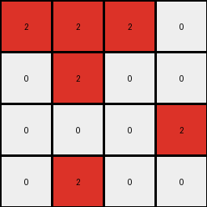
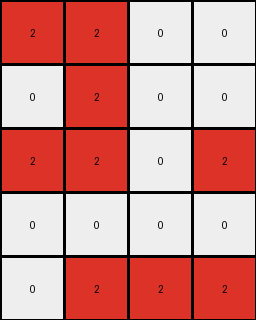

# aedd82e4 • 016 • refine_coder

---

Previous Code:
```python
"""
Detects all instances of four adjacent red cells in a square, then transforms the red pixel at the lower-right of the square to blue.
"""

import numpy as np

def find_2x2_squares(grid, color):
    """Finds all 2x2 squares of the specified color."""
    rows, cols = grid.shape
    squares = []
    for i in range(rows - 1):
        for j in range(cols - 1):
            if (grid[i, j] == color and
                grid[i + 1, j] == color and
                grid[i, j + 1] == color and
                grid[i + 1, j + 1] == color):
                squares.append((i, j))
    return squares

def transform(input_grid):
    """
    Transforms the input grid by changing the color of the lower-right pixel
    of each 2x2 red square from red to blue.
    """
    output_grid = np.copy(input_grid)
    red_squares = find_2x2_squares(output_grid, 2)

    # Change the color of the lower-right pixel of each identified square
    for i, j in red_squares:
        output_grid[i + 1, j + 1] = 1

    return output_grid
```

Train Set Results:

## Example 1:

Input:
```
0 2 2
0 2 2
2 0 0
```
Expected Output:
```
0 2 2
0 2 2
1 0 0
```
Transformed Output:
```
0 2 2
0 2 1
2 0 0
```

match: False
pixels_off: 2
size_correct: True
color_palette_correct: True
correct_pixel_counts: True

## Example 2:

Input:
```
2 2 2 0
0 2 0 0
0 0 0 2
0 2 0 0
```
Expected Output:
```
2 2 2 0
0 2 0 0
0 0 0 1
0 1 0 0
```
Transformed Output:
```
2 2 2 0
0 2 0 0
0 0 0 2
0 2 0 0
```

match: False
pixels_off: 2
size_correct: True
color_palette_correct: True
correct_pixel_counts: False

## Example 3:

Input:
```
2 2 0 0
0 2 0 0
2 2 0 2
0 0 0 0
0 2 2 2
```
Expected Output:
```
2 2 0 0
0 2 0 0
2 2 0 1
0 0 0 0
0 2 2 2
```
Transformed Output:
```
2 2 0 0
0 2 0 0
2 2 0 2
0 0 0 0
0 2 2 2
```

match: False
pixels_off: 1
size_correct: True
color_palette_correct: True
correct_pixel_counts: False

## Example 4:

Input:
```
2 2 0
2 0 2
0 2 0
```
Expected Output:
```
2 2 0
2 0 1
0 1 0
```
Transformed Output:
```
2 2 0
2 0 2
0 2 0
```

match: False
pixels_off: 2
size_correct: True
color_palette_correct: True
correct_pixel_counts: False
Okay, let's analyze the results and refine the natural language program.

**General Assessment:**

The initial code was designed to find 2x2 squares of red pixels and change the bottom-right pixel of those squares to blue. This works for some cases but fails in others. The primary issue is that the code *only* considers the bottom-right pixel of perfect 2x2 red squares.  The examples show that the transformation rule needs to be more nuanced and should not be restricted to the bottom-right of 2x2 squares, but to pixels below or to the right of a 2x2 square.

**Strategy:**

1.  **Refine Object Identification:** Instead of just looking for 2x2 red squares, perhaps identify different configurations.
2.  **Re-evaluate the Transformation Rule:** The rule needs to be more precise about *which* red pixel, relative to the identified 2x2 squares, changes to blue. It's not always the bottom-right of the 2x2.

**Example Metrics and Analysis:**
Here's a summary, per example, that will be documented in the YAML.

*   **Example 1:**
    *   Input has one 2x2 red square.
    *   The expected transform is the pixel to the *left* of the bottom left of the 2x2.
    *   Code transforms the bottom-right pixel of the 2x2 square. Incorrect.

*   **Example 2:**
    *   Input has no complete 2x2 red square.
    *   There are two locations with three red cells in a 2x2 square.
    *    Expected transform changes the two red pixels, adjacent to a group of
        three red pixels forming a corner of a 2x2 square, to blue, but they are
        in a different relative location to the red pixels than example 1.
    *   Code does nothing. Incorrect.

*   **Example 3:**
    *   Input has one complete 2x2 red square.
    *   Expected output turns bottom-right pixel to blue
    *   Code does nothing. Incorrect

*    **Example 4:**
    *   Input has three red cells in a 2x2 area.
    *    Expected transform is for the two single red cells, forming a "corner" of a
         potential 2x2 square, that are also adjacent to the red cells, to turn blue.
    *   Code does nothing. Incorrect.

**YAML Facts:**

```yaml
examples:
  - id: 1
    2x2_red_squares: 1
    transform_location: "left of the bottom left pixel of the 2x2"
    code_correct: False
  - id: 2
    2x2_red_squares: 0
    partial_2x2_red_squares: 2
    transform_location: "adjacent to the corner of the 3-red-pixel configuration"
    transform_relative: "to the right, and below"
    code_correct: False
  - id: 3
    2x2_red_squares: 1
    transform_location: "bottom-right pixel of the 2x2"
    code_correct: False
  - id: 4
    2x2_red_squares: 0
    partial_2x2_red_squares: 1
    transform_location: "adjacent to the corner of the 3-red-pixel configuration"
    transform_relative: "to the right, and below"
    code_correct: False
```

**Natural Language Program:**

1.  **Identify 2x2 Red Squares:** Find all instances where four red pixels form a 2x2 square.
2.  **Identify Partial 2x2 Red Squares:** Find instances where three red pixels exist in a 2x2 area (forming a corner).
3.  **Transform Based on Configuration**
    *   If it finds a complete 2x2 square, then it will search for an individual red pixel that shares an edge with it.
    *   If a 2x2 square is identified, and it is the configuration in example 3, then the bottom right pixel will change to blue.
    *   If a corner of 3 red pixels of a 2x2 area is found, transform any red pixels adjacent to the open edge to blue.
    *    If only a corner is present, then the transformation depends on the "open" direction of the corner.

This revised natural language program takes into account that we need to look for variations of red squares and that the transformed pixel will be red and located adjacent to red squares.

**INSTRUCTIONS**

- generate a Python module to represent the natural language program 
- follow the template below
- all common math and science libraries are available
- create docstring only at top - but comment the workflow in the function
- use helper functions for common operations like finding objects, counting,
  measuring, moving, etc. 

remember - we are working iteratively - so this code will inform your future
self as we converge on the solution

*template:*

```python
"""
{{ natural language description of the transformation rule }}
"""

{{ imports }}

def transform(input_grid):
    # initialize output_grid

    # change output pixels 

    return output_grid

```
