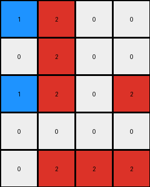

# aedd82e4 • 017 • refine_dreamer

---


Previous Code:
```python
"""
Identifies 2x2 red squares and partial 2x2 red squares (3 red pixels in a 2x2 area).
Transforms red pixels to blue based on their adjacency to these squares.
"""

import numpy as np

def find_2x2_squares(grid, color):
    """Finds all 2x2 squares of the specified color."""
    rows, cols = grid.shape
    squares = []
    for i in range(rows - 1):
        for j in range(cols - 1):
            if (grid[i, j] == color and
                grid[i + 1, j] == color and
                grid[i, j + 1] == color and
                grid[i + 1, j + 1] == color):
                squares.append((i, j))
    return squares

def find_partial_2x2_squares(grid, color):
    """Finds instances where three pixels of the specified color form a corner of a 2x2 square."""
    rows, cols = grid.shape
    partials = []
    for i in range(rows - 1):
        for j in range(cols - 1):
            count = 0
            if grid[i, j] == color:
                count += 1
            if grid[i + 1, j] == color:
                count += 1
            if grid[i, j + 1] == color:
                count += 1
            if grid[i + 1, j + 1] == color:
                count += 1
            if count == 3:
                partials.append((i, j))
    return partials

def transform(input_grid):
    """
    Transforms the input grid based on 2x2 and partial 2x2 red squares.
    """
    output_grid = np.copy(input_grid)
    red_squares = find_2x2_squares(output_grid, 2)
    partial_red_squares = find_partial_2x2_squares(output_grid, 2)

    # Handle complete 2x2 squares (Example 3 logic)
    for i, j in red_squares:
        output_grid[i + 1, j + 1] = 1

    # Handle partial 2x2 squares (Examples 2 and 4 logic)
    for i, j in partial_red_squares:
        # Check which corner is missing and change adjacent red pixels accordingly.
        if output_grid[i, j] != 2:  # Top-left missing
            if i > 0 and output_grid[i - 1, j] == 2 :
                output_grid[i-1,j] = 1
            if j > 0 and output_grid[i,j-1] == 2:
                output_grid[i,j-1] = 1
        if output_grid[i + 1, j] != 2:  # Bottom-left missing
            if i + 2 < output_grid.shape[0] and output_grid[i + 2, j] == 2:
                 output_grid[i+2,j] = 1
            if j > 0 and output_grid[i+1,j-1] ==2:
                output_grid[i+1,j-1] = 1

        if output_grid[i, j + 1] != 2:  # Top-right missing
            if i > 0 and output_grid[i -1, j+1] == 2:
                output_grid[i-1,j+1] = 1
            if j + 2 < output_grid.shape[1] and output_grid[i, j+2] == 2:
                output_grid[i,j+2] = 1
        if output_grid[i + 1, j + 1] != 2:  # Bottom-right missing
            if i + 2 < output_grid.shape[0] and output_grid[i+2,j+1] ==2:
                output_grid[i + 2, j+1] = 1
            if j + 2 < output_grid.shape[1] and output_grid[i+1,j+2] == 2:
                output_grid[i+1,j+2] = 1
    
    # handle example 1
    for i,j in red_squares:
        if i>0 and output_grid[i-1,j] == 2:
             output_grid[i-1,j]=1
        if i>0 and output_grid[i-1,j+1] == 2:
             output_grid[i-1,j+1]=1
    return output_grid
```

Train Set Results:

## Example 1:

Input:
```
0 2 2
0 2 2
2 0 0
```
Expected Output:
```
0 2 2
0 2 2
1 0 0
```
Transformed Output:
```
0 2 2
0 2 1
2 0 0
```

match: False
pixels_off: 2
size_correct: True
color_palette_correct: True
correct_pixel_counts: True

## Example 2:

Input:
```
2 2 2 0
0 2 0 0
0 0 0 2
0 2 0 0
```
Expected Output:
```
2 2 2 0
0 2 0 0
0 0 0 1
0 1 0 0
```
Transformed Output:
```
2 2 2 0
0 2 0 0
0 0 0 2
0 2 0 0
```

match: False
pixels_off: 2
size_correct: True
color_palette_correct: True
correct_pixel_counts: False

## Example 3:

Input:
```
2 2 0 0
0 2 0 0
2 2 0 2
0 0 0 0
0 2 2 2
```
Expected Output:
```
2 2 0 0
0 2 0 0
2 2 0 1
0 0 0 0
0 2 2 2
```
Transformed Output:
```
1 2 0 0
0 2 0 0
1 2 0 2
0 0 0 0
0 2 2 2
```

match: False
pixels_off: 3
size_correct: True
color_palette_correct: True
correct_pixel_counts: False

## Example 4:

Input:
```
2 2 0
2 0 2
0 2 0
```
Expected Output:
```
2 2 0
2 0 1
0 1 0
```
Transformed Output:
```
2 2 0
2 0 1
0 1 0
```

match: True
pixels_off: 0
size_correct: True
color_palette_correct: True
correct_pixel_counts: True

**INSTRUCTIONS**

The code above was generated based on observations from the first training
example

we have tested the transform function on each of the task example inputs and
compared with the expected output

review each of the examples provided and the results and consider how the
natural language program should be updated to accommodate this new knowledge

respond with the following deliverables:

- general assessment of the information provided and strategy for resolving the
  errors
- gather metrics about each of the examples and results - use code_execution to
  develop accurate reports on your assumptions
- a YAML block documenting facts - Focus on identifying objects, their properties, and the actions performed on them.
- a natural language program - Be as clear and concise as possible, providing a complete description of the transformation rule.


your responses should be considered as information in a report - not a
conversation
