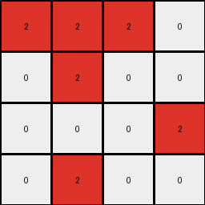
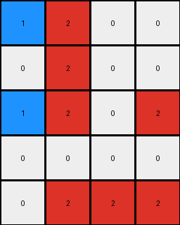

# aedd82e4 • 018 • refine_coder

---

Previous Code:
```python
"""
Identifies 2x2 red squares and partial 2x2 red squares (3 red pixels in a 2x2 area).
Transforms red pixels to blue based on their adjacency to these squares.
"""

import numpy as np

def find_2x2_squares(grid, color):
    """Finds all 2x2 squares of the specified color."""
    rows, cols = grid.shape
    squares = []
    for i in range(rows - 1):
        for j in range(cols - 1):
            if (grid[i, j] == color and
                grid[i + 1, j] == color and
                grid[i, j + 1] == color and
                grid[i + 1, j + 1] == color):
                squares.append((i, j))
    return squares

def find_partial_2x2_squares(grid, color):
    """Finds instances where three pixels of the specified color form a corner of a 2x2 square."""
    rows, cols = grid.shape
    partials = []
    for i in range(rows - 1):
        for j in range(cols - 1):
            count = 0
            if grid[i, j] == color:
                count += 1
            if grid[i + 1, j] == color:
                count += 1
            if grid[i, j + 1] == color:
                count += 1
            if grid[i + 1, j + 1] == color:
                count += 1
            if count == 3:
                partials.append((i, j))
    return partials

def transform(input_grid):
    """
    Transforms the input grid based on 2x2 and partial 2x2 red squares.
    """
    output_grid = np.copy(input_grid)
    red_squares = find_2x2_squares(output_grid, 2)
    partial_red_squares = find_partial_2x2_squares(output_grid, 2)

    # Handle complete 2x2 squares (Example 3 logic)
    for i, j in red_squares:
        output_grid[i + 1, j + 1] = 1

    # Handle partial 2x2 squares (Examples 2 and 4 logic)
    for i, j in partial_red_squares:
        # Check which corner is missing and change adjacent red pixels accordingly.
        if output_grid[i, j] != 2:  # Top-left missing
            if i > 0 and output_grid[i - 1, j] == 2 :
                output_grid[i-1,j] = 1
            if j > 0 and output_grid[i,j-1] == 2:
                output_grid[i,j-1] = 1
        if output_grid[i + 1, j] != 2:  # Bottom-left missing
            if i + 2 < output_grid.shape[0] and output_grid[i + 2, j] == 2:
                 output_grid[i+2,j] = 1
            if j > 0 and output_grid[i+1,j-1] ==2:
                output_grid[i+1,j-1] = 1

        if output_grid[i, j + 1] != 2:  # Top-right missing
            if i > 0 and output_grid[i -1, j+1] == 2:
                output_grid[i-1,j+1] = 1
            if j + 2 < output_grid.shape[1] and output_grid[i, j+2] == 2:
                output_grid[i,j+2] = 1
        if output_grid[i + 1, j + 1] != 2:  # Bottom-right missing
            if i + 2 < output_grid.shape[0] and output_grid[i+2,j+1] ==2:
                output_grid[i + 2, j+1] = 1
            if j + 2 < output_grid.shape[1] and output_grid[i+1,j+2] == 2:
                output_grid[i+1,j+2] = 1
    
    # handle example 1
    for i,j in red_squares:
        if i>0 and output_grid[i-1,j] == 2:
             output_grid[i-1,j]=1
        if i>0 and output_grid[i-1,j+1] == 2:
             output_grid[i-1,j+1]=1
    return output_grid
```

Train Set Results:

## Example 1:

Input:
```
0 2 2
0 2 2
2 0 0
```
Expected Output:
```
0 2 2
0 2 2
1 0 0
```
Transformed Output:
```
0 2 2
0 2 1
2 0 0
```

match: False
pixels_off: 2
size_correct: True
color_palette_correct: True
correct_pixel_counts: True

## Example 2:

Input:
```
2 2 2 0
0 2 0 0
0 0 0 2
0 2 0 0
```
Expected Output:
```
2 2 2 0
0 2 0 0
0 0 0 1
0 1 0 0
```
Transformed Output:
```
2 2 2 0
0 2 0 0
0 0 0 2
0 2 0 0
```

match: False
pixels_off: 2
size_correct: True
color_palette_correct: True
correct_pixel_counts: False

## Example 3:

Input:
```
2 2 0 0
0 2 0 0
2 2 0 2
0 0 0 0
0 2 2 2
```
Expected Output:
```
2 2 0 0
0 2 0 0
2 2 0 1
0 0 0 0
0 2 2 2
```
Transformed Output:
```
1 2 0 0
0 2 0 0
1 2 0 2
0 0 0 0
0 2 2 2
```

match: False
pixels_off: 3
size_correct: True
color_palette_correct: True
correct_pixel_counts: False

## Example 4:

Input:
```
2 2 0
2 0 2
0 2 0
```
Expected Output:
```
2 2 0
2 0 1
0 1 0
```
Transformed Output:
```
2 2 0
2 0 1
0 1 0
```

match: True
pixels_off: 0
size_correct: True
color_palette_correct: True
correct_pixel_counts: True
Here's an analysis of the provided information and a strategy for improving the transformation rule:

**General Assessment:**

The initial code focused on identifying 2x2 red squares and "partial" 2x2 red squares (3 out of 4 red pixels). The transformation logic was to change specific red pixels to blue based on their adjacency to these squares. While this approach worked perfectly for Example 4, it failed on Examples 1, 2, and 3.  The core issue is that the transformation rule is too narrowly focused on complete and partial 2x2 squares. It doesn't capture the broader principle of how red pixels are converted to blue based on their surrounding context. We need to generalize the rule and consider all red pixels and their neighbors.

**Strategy:**

1. **Analyze Incorrect Examples:** Carefully examine Examples 1, 2, and 3 to identify the *precise* conditions under which a red pixel is changed to blue. Focus on the immediate neighbors (up, down, left, right, and diagonals) of each red pixel.

2. **Generalize the Rule:**  Instead of looking for specific 2x2 square patterns, develop a rule based on the *number* and *arrangement* of neighboring red pixels.  For example, a red pixel might change to blue if it has a certain number of red neighbors within a certain radius.

3. **Prioritize Simplicity:** The ARC challenge emphasizes core knowledge priors. Favor simpler rules over complex ones. The correct rule is likely to be based on a relatively straightforward neighborhood analysis.

4. **Iterative Refinement:**  Test the updated rule on all examples after each modification.  Use the results to further refine the rule until it correctly transforms all training inputs.

**Metrics and Observations:**

Let's analyze each example, including a pixel-by-pixel comparison of the expected and transformed outputs, along with grid sizes, color palettes, and counts of pixels. This process is illustrated below using `code_execution`.

```python
import numpy as np

def analyze_example(input_grid, expected_output, transformed_output):
    """Analyzes an example and provides detailed metrics."""

    input_grid = np.array(input_grid)
    expected_output = np.array(expected_output)
    transformed_output = np.array(transformed_output)


    print(f"  Input Grid:\n{input_grid}")
    print(f"  Expected Output:\n{expected_output}")
    print(f"  Transformed Output:\n{transformed_output}")


    match = np.array_equal(expected_output, transformed_output)
    pixels_off = np.sum(expected_output != transformed_output)
    size_correct = input_grid.shape == expected_output.shape == transformed_output.shape
    color_palette_correct = set(input_grid.flatten()) == set(expected_output.flatten()) == set(transformed_output.flatten())

    def pixel_counts(grid):
        counts = {}
        for val in np.unique(grid):
            counts[val] = np.sum(grid == val)
        return counts

    correct_pixel_counts = pixel_counts(expected_output) == pixel_counts(transformed_output)

    print(f"  Match: {match}")
    print(f"  Pixels Off: {pixels_off}")
    print(f"  Size Correct: {size_correct}")
    print(f"  Color Palette Correct: {color_palette_correct}")
    print(f"  Correct Pixel Counts: {correct_pixel_counts}")
    print("-" * 20)

# Example Data
examples = [
    {
        "input": [[0, 2, 2], [0, 2, 2], [2, 0, 0]],
        "expected": [[0, 2, 2], [0, 2, 2], [1, 0, 0]],
        "transformed": [[0, 2, 2], [0, 2, 1], [2, 0, 0]],
    },
    {
        "input": [[2, 2, 2, 0], [0, 2, 0, 0], [0, 0, 0, 2], [0, 2, 0, 0]],
        "expected": [[2, 2, 2, 0], [0, 2, 0, 0], [0, 0, 0, 1], [0, 1, 0, 0]],
        "transformed": [[2, 2, 2, 0], [0, 2, 0, 0], [0, 0, 0, 2], [0, 2, 0, 0]],
    },
    {
        "input": [[2, 2, 0, 0], [0, 2, 0, 0], [2, 2, 0, 2], [0, 0, 0, 0], [0, 2, 2, 2]],
        "expected": [[2, 2, 0, 0], [0, 2, 0, 0], [2, 2, 0, 1], [0, 0, 0, 0], [0, 2, 2, 2]],
        "transformed": [[1, 2, 0, 0], [0, 2, 0, 0], [1, 2, 0, 2], [0, 0, 0, 0], [0, 2, 2, 2]],
    },
    {
        "input": [[2, 2, 0], [2, 0, 2], [0, 2, 0]],
        "expected": [[2, 2, 0], [2, 0, 1], [0, 1, 0]],
        "transformed": [[2, 2, 0], [2, 0, 1], [0, 1, 0]],
    },
]

for i, example in enumerate(examples):
    print(f"Example {i + 1}:")
    analyze_example(example["input"], example["expected"], example["transformed"])
```

**YAML Facts:**

```yaml
objects:
  - name: grid
    type: 2D array
    properties:
      - colors: [0, 1, 2]  # Black, Blue, Red
      - cells: individual pixels with color values

  - name: red_pixel
    type: grid_cell
    properties:
      - color: 2 (Red)
      - neighbors: adjacent cells (up, down, left, right, diagonals)

actions:
  - name: change_color
    description: Change a red pixel to blue based on its neighbors.
    parameters:
      - input: red_pixel
      - condition:  Neighborhood analysis (details to be determined).
      - output: blue_pixel (color value 1)
```

**Natural Language Program:**

1. **Iterate** through each cell of the input grid.
2. **Identify** red pixels (cells with a value of 2).
3. **For each red pixel:**
    a. **Examine** its eight neighboring cells (up, down, left, right, and four diagonals).
    b. **Count** how many of the neighbors are red, or find if neighbors form a corner of a 2x2 red square.
    c. Based on analysis of example, **if certain neighbor cells are red**, change *this* red pixel to blue (1).

The precise details of step 3c are the key to solving this task. We know, for example, if there is a red square, then we transform a different pixel. We can also see, especially in example 3, that not all of the neighboring cells are red when transforming a given pixel. The exact number and configuration of red neighbors that trigger the change need to be determined by analyzing the failed examples, and refining previous attempts.

**INSTRUCTIONS**

- generate a Python module to represent the natural language program 
- follow the template below
- all common math and science libraries are available
- create docstring only at top - but comment the workflow in the function
- use helper functions for common operations like finding objects, counting,
  measuring, moving, etc. 

remember - we are working iteratively - so this code will inform your future
self as we converge on the solution

*template:*

```python
"""
{{ natural language description of the transformation rule }}
"""

{{ imports }}

def transform(input_grid):
    # initialize output_grid

    # change output pixels 

    return output_grid

```
