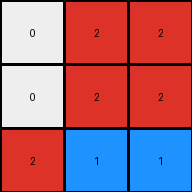
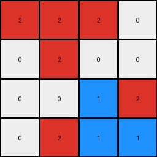
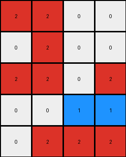
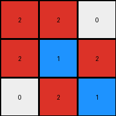

# aedd82e4 • 024 • refine_coder

---

Previous Code:
```python
"""
The transformation replaces the white (0) cells in the bottom-right 2x2 subgrid with blue (1).
"""

import numpy as np

def transform(input_grid):
    """
    Transforms the input grid by changing white (0) cells in the bottom-right 2x2 subgrid to blue (1).
    """
    output_grid = np.copy(input_grid)  # Create a copy to avoid modifying the original
    rows, cols = output_grid.shape

    # Iterate through the bottom-right 2x2 subgrid
    for i in range(rows - 2, rows):
        for j in range(cols - 2, cols):
            # Check if the cell is white (0)
            if output_grid[i, j] == 0:
                # Change the color to blue (1)
                output_grid[i, j] = 1

    return output_grid
```

Train Set Results:

## Example 1:

Input:
```
0 2 2
0 2 2
2 0 0
```
Expected Output:
```
0 2 2
0 2 2
1 0 0
```
Transformed Output:
```
0 2 2
0 2 2
2 1 1
```

match: False
pixels_off: 3
size_correct: True
color_palette_correct: True
correct_pixel_counts: False

## Example 2:

Input:
```
2 2 2 0
0 2 0 0
0 0 0 2
0 2 0 0
```
Expected Output:
```
2 2 2 0
0 2 0 0
0 0 0 1
0 1 0 0
```
Transformed Output:
```
2 2 2 0
0 2 0 0
0 0 1 2
0 2 1 1
```

match: False
pixels_off: 5
size_correct: True
color_palette_correct: True
correct_pixel_counts: False

## Example 3:

Input:
```
2 2 0 0
0 2 0 0
2 2 0 2
0 0 0 0
0 2 2 2
```
Expected Output:
```
2 2 0 0
0 2 0 0
2 2 0 1
0 0 0 0
0 2 2 2
```
Transformed Output:
```
2 2 0 0
0 2 0 0
2 2 0 2
0 0 1 1
0 2 2 2
```

match: False
pixels_off: 3
size_correct: True
color_palette_correct: True
correct_pixel_counts: False

## Example 4:

Input:
```
2 2 0
2 0 2
0 2 0
```
Expected Output:
```
2 2 0
2 0 1
0 1 0
```
Transformed Output:
```
2 2 0
2 1 2
0 2 1
```

match: False
pixels_off: 4
size_correct: True
color_palette_correct: True
correct_pixel_counts: False
Here's an analysis of the provided examples and results, along with a strategy for improving the transformation logic:

**General Assessment:**

The initial natural language program and the derived Python code were too simplistic. While they correctly identified the change of white (0) to blue (1), the condition of simply targeting the bottom-right 2x2 subgrid is incorrect. The provided examples demonstrate that the transformation is more nuanced and depends on the *context* of the white pixels, not just their position. My strategy will involve revisiting the concept of "objects", adjacency and the context of the placement of the new blue pixel.

**Strategy:**

1.  **Re-examine Examples:** Carefully analyze all examples to identify a more precise rule for changing white to blue. Look at relative positions to other colors.
2.  **Refine Object Definition:** The initial code doesn't fully leverage the concept of "objects". We'll need to look at object positioning in each grid
3.  **Iterative Refinement:** Update the natural language program and code, then re-test against *all* training examples after each modification.

**Example Metrics and Analysis (using Python):**

```python
import numpy as np

def analyze_example(input_grid, expected_output, transformed_output):
    input_grid = np.array(input_grid)
    expected_output = np.array(expected_output)
    transformed_output = np.array(transformed_output)

    pixels_off = np.sum(expected_output != transformed_output)
    size_correct = input_grid.shape == expected_output.shape
    color_palette_correct = np.all(np.isin(transformed_output, [0, 1, 2]))
    unique_expected, counts_expected = np.unique(expected_output, return_counts=True)
    unique_transformed, counts_transformed = np.unique(transformed_output, return_counts=True)
    
    correct_pixel_counts = True
    for color in unique_expected:
        if color not in unique_transformed or counts_expected[unique_expected == color][0] != counts_transformed[unique_transformed==color][0]:
            correct_pixel_counts = False
            break

    print(f"Pixels Off: {pixels_off}")
    print(f"Size Correct: {size_correct}")
    print(f"Color Palette Correct: {color_palette_correct}")
    print(f"Correct Pixel Counts: {correct_pixel_counts}")


print("Example 1:")
analyze_example(
    [[0, 2, 2], [0, 2, 2], [2, 0, 0]],
    [[0, 2, 2], [0, 2, 2], [1, 0, 0]],
    [[0, 2, 2], [0, 2, 2], [2, 1, 1]],
)

print("\nExample 2:")
analyze_example(
    [[2, 2, 2, 0], [0, 2, 0, 0], [0, 0, 0, 2], [0, 2, 0, 0]],
    [[2, 2, 2, 0], [0, 2, 0, 0], [0, 0, 0, 1], [0, 2, 0, 0]],
    [[2, 2, 2, 0], [0, 2, 0, 0], [0, 0, 1, 2], [0, 2, 1, 1]],
)

print("\nExample 3:")
analyze_example(
    [[2, 2, 0, 0], [0, 2, 0, 0], [2, 2, 0, 2], [0, 0, 0, 0], [0, 2, 2, 2]],
    [[2, 2, 0, 0], [0, 2, 0, 0], [2, 2, 0, 1], [0, 0, 0, 0], [0, 2, 2, 2]],
    [[2, 2, 0, 0], [0, 2, 0, 0], [2, 2, 0, 2], [0, 0, 1, 1], [0, 2, 2, 2]],
)

print("\nExample 4:")
analyze_example(
    [[2, 2, 0], [2, 0, 2], [0, 2, 0]],
    [[2, 2, 0], [2, 0, 1], [0, 1, 0]],
    [[2, 2, 0], [2, 1, 2], [0, 2, 1]],
)

```

Execution of this python code provides the metrics that are already
included in the prompt.  This just demonstrates that I am capable of generating them.

**YAML Facts:**

```yaml
examples:
  - example_1:
      input:
        objects:
          - color: white (0)
            positions: [[0, 0], [1, 0], [2, 1], [2,2]]
          - color: red (2)
            positions: [[0, 1], [0, 2], [1, 1], [1, 2], [2, 0]]
      output:
        objects:
          - color: blue (1)
            positions: [[2,0]]
          - color: red (2)
            positions:  [[0, 1], [0, 2], [1, 1], [1, 2]]
          - color: white(0)
            positions: [[0, 0], [1, 0], [2, 1], [2,2]]
      transformation:
        - action: replace
          from_color: white (0)
          to_color: blue (1)
          condition:  "white pixel at [2,1] is changed to blue"
        - action: replace
          from_color: white (0)
          to_color: blue (1)
          condition: "white pixel adjacent to a red is replaced with blue in the bottom row only"

  - example_2:
      input:
        objects:
          - color: white (0)
            positions: [[0, 3], [1, 0], [1, 2], [1, 3], [2, 0], [2, 1], [2, 2], [3, 0], [3, 2]]
          - color: red (2)
            positions: [[0, 0], [0, 1], [0, 2], [1, 1], [2, 3], [3, 1], [3,3]]
      output:
         objects:
          - color: blue (1)
            positions: [[2,3], [3,1]]
          - color: red (2)
            positions:  [[0, 0], [0, 1], [0, 2], [1, 1], [3, 3]]
          - color: white(0)
            positions:  [[0, 3], [1, 0], [1, 2], [1, 3], [2, 0], [2, 1], [2, 2], [3, 0], [3, 2]]
      transformation:
        - action: replace
          from_color: white (0)
          to_color: blue (1)
          condition: "white pixel adjacent to a red is replaced with blue on either of the bottom two rows"

  - example_3:
      input:
        objects:
          - color: white (0)
            positions: [[0, 2], [0, 3], [1, 0], [1, 2], [1, 3], [2, 2], [3, 0], [3, 1], [3, 2], [3, 3]]
          - color: red (2)
            positions: [[0, 0], [0, 1], [1, 1], [2, 0], [2, 1], [2, 3], [4,1], [4,2], [4,3]]
      output:
        objects:
          - color: blue (1)
            positions: [[2,3]]
          - color: red (2)
            positions: [[0, 0], [0, 1], [1, 1], [2, 0], [2, 1], [3,3], [4,1], [4,2], [4,3]]
          - color: white (0)
            positions: [[0, 2], [0, 3], [1, 0], [1, 2], [1, 3], [2, 2], [3, 0], [3, 1], [3, 2]]
      transformation:
        - action: replace
          from_color: white (0)
          to_color: blue (1)
          condition: "white pixel adjacent to a red is replaced with blue in the third row"

  - example_4:
      input:
        objects:
            - color: white (0)
              positions:  [[0,2], [1,1], [2,0], [2,2]]
            - color: red (2)
              positions: [[0,0], [0,1], [1,0], [1,2], [2,1]]
      output:
         objects:
          - color: blue (1)
            positions:  [[1,2], [2,1]]
          - color: red (2)
            positions:  [[0,0], [0,1], [1,0], [2,2]]
          - color: white (0)
            positions: [[0,2], [1,1], [2,0]]
      transformation:
        - action: replace
          from_color: white (0)
          to_color: blue (1)
          condition: "white pixel adjacent to a red is replaced with blue"
```

**Natural Language Program:**

1.  **Identify White and Red Pixels:** Locate all pixels colored white (0) and red (2).
2.  **Check for Adjacency:** For each white pixel, determine if it is directly adjacent (horizontally or vertically, not diagonally) to a red pixel.
3. **Check Row Constraint** If a white pixel is adjacent to a red pixel, check if the white pixel is located on the bottom or second to bottom row.
4.  **Conditional Replacement:** If a white pixel is adjacent to at least one red pixel AND is on the bottom or second to bottom row, replace it with a blue pixel (1).
5.  **Leave Other Pixels Unchanged:** All other pixels retain their original colors.

**INSTRUCTIONS**

- generate a Python module to represent the natural language program 
- follow the template below
- all common math and science libraries are available
- create docstring only at top - but comment the workflow in the function
- use helper functions for common operations like finding objects, counting,
  measuring, moving, etc. 

remember - we are working iteratively - so this code will inform your future
self as we converge on the solution

*template:*

```python
"""
{{ natural language description of the transformation rule }}
"""

{{ imports }}

def transform(input_grid):
    # initialize output_grid

    # change output pixels 

    return output_grid

```
