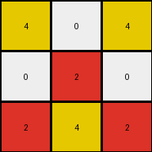
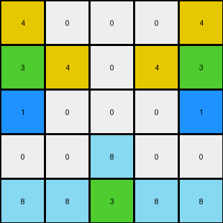
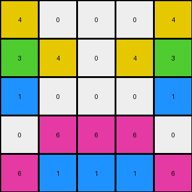
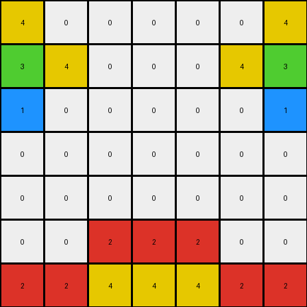

# b8cdaf2b • 005 • refine_dreamer

---


Previous Code:
```python
"""
Copy the input grid to the output grid. Find contiguous blocks of rows that are entirely white (all pixels are 0). For each contiguous block, modify the outer pixels of certain rows within the block based on their position within the block. The first row's outer pixels change to yellow (4), the second row's outer pixels change to green (3), and the third row's outer pixels change to blue (1). If a block has more than one row, the second row's second-from-outer pixels also change to yellow (4).
"""

import numpy as np

def transform(input_grid):
    # Initialize output_grid as a copy of the input grid
    output_grid = np.copy(input_grid)
    num_rows = input_grid.shape[0]
    num_cols = input_grid.shape[1]

    # Function to find contiguous blocks of all-white rows
    def find_white_blocks(grid):
        blocks = []
        start_row = None
        for i in range(num_rows):
            if all(grid[i, :] == 0):
                if start_row is None:
                    start_row = i
            elif start_row is not None:
                blocks.append((start_row, i - 1))
                start_row = None
        if start_row is not None:
            blocks.append((start_row, num_rows - 1))
        return blocks

    # Find contiguous blocks of all-white rows
    white_blocks = find_white_blocks(input_grid)

    # Iterate through each block and modify the output grid
    for start_row, end_row in white_blocks:
        block_length = end_row - start_row + 1

        # Modify rows based on their index within the block
        for i in range(start_row, end_row + 1):
            row_index_in_block = i - start_row
            if row_index_in_block == 0 and num_cols > 0:
                output_grid[i, 0] = 4
                if num_cols > 1:
                   output_grid[i, -1] = 4
            elif row_index_in_block == 1 and num_cols > 0:
                output_grid[i, 0] = 3
                if num_cols > 1:
                    output_grid[i, -1] = 3
                if block_length > 1:
                    if num_cols > 3:
                        output_grid[i,1] = 4
                        output_grid[i,-2] = 4
            elif row_index_in_block == 2 and num_cols > 0:
                output_grid[i, 0] = 1
                if num_cols > 1:
                    output_grid[i, -1] = 1

    return output_grid
```

Train Set Results:

## Example 1:

Input:
```
0 0 0
0 2 0
2 4 2
```
Expected Output:
```
4 0 4
0 2 0
2 4 2
```
Transformed Output:
```
4 0 4
0 2 0
2 4 2
```

match: True
pixels_off: 0
size_correct: True
color_palette_correct: True
correct_pixel_counts: True

## Example 2:

Input:
```
0 0 0 0 0
0 0 0 0 0
0 0 0 0 0
0 0 8 0 0
8 8 3 8 8
```
Expected Output:
```
0 0 0 0 0
3 0 0 0 3
0 3 0 3 0
0 0 8 0 0
8 8 3 8 8
```
Transformed Output:
```
4 0 0 0 4
3 4 0 4 3
1 0 0 0 1
0 0 8 0 0
8 8 3 8 8
```

match: False
pixels_off: 8
size_correct: True
color_palette_correct: False
correct_pixel_counts: False

## Example 3:

Input:
```
0 0 0 0 0
0 0 0 0 0
0 0 0 0 0
0 6 6 6 0
6 1 1 1 6
```
Expected Output:
```
0 0 0 0 0
0 0 0 0 0
1 0 0 0 1
0 6 6 6 0
6 1 1 1 6
```
Transformed Output:
```
4 0 0 0 4
3 4 0 4 3
1 0 0 0 1
0 6 6 6 0
6 1 1 1 6
```

match: False
pixels_off: 6
size_correct: True
color_palette_correct: False
correct_pixel_counts: False

## Example 4:

Input:
```
0 0 0 0 0 0 0
0 0 0 0 0 0 0
0 0 0 0 0 0 0
0 0 0 0 0 0 0
0 0 0 0 0 0 0
0 0 2 2 2 0 0
2 2 4 4 4 2 2
```
Expected Output:
```
0 0 0 0 0 0 0
0 0 0 0 0 0 0
0 0 0 0 0 0 0
4 0 0 0 0 0 4
0 4 0 0 0 4 0
0 0 2 2 2 0 0
2 2 4 4 4 2 2
```
Transformed Output:
```
4 0 0 0 0 0 4
3 4 0 0 0 4 3
1 0 0 0 0 0 1
0 0 0 0 0 0 0
0 0 0 0 0 0 0
0 0 2 2 2 0 0
2 2 4 4 4 2 2
```

match: False
pixels_off: 12
size_correct: True
color_palette_correct: False
correct_pixel_counts: False

**INSTRUCTIONS**

The code above was generated based on observations from the first training
example

we have tested the transform function on each of the task example inputs and
compared with the expected output

review each of the examples provided and the results and consider how the
natural language program should be updated to accommodate this new knowledge

respond with the following deliverables:

- general assessment of the information provided and strategy for resolving the
  errors
- gather metrics about each of the examples and results - use code_execution to
  develop accurate reports on your assumptions
- a YAML block documenting facts - Focus on identifying objects, their properties, and the actions performed on them.
- a natural language program - Be as clear and concise as possible, providing a complete description of the transformation rule.


your responses should be considered as information in a report - not a
conversation
