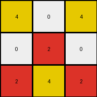
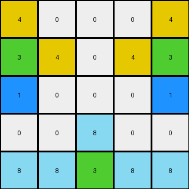
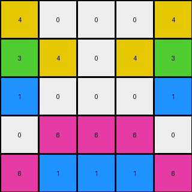
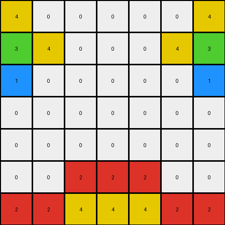

# b8cdaf2b • 006 • refine_coder

---

Previous Code:
```python
"""
Copy the input grid to the output grid. Find contiguous blocks of rows that are entirely white (all pixels are 0). For each contiguous block, modify the outer pixels of certain rows within the block based on their position within the block. The first row's outer pixels change to yellow (4), the second row's outer pixels change to green (3), and the third row's outer pixels change to blue (1). If a block has more than one row, the second row's second-from-outer pixels also change to yellow (4).
"""

import numpy as np

def transform(input_grid):
    # Initialize output_grid as a copy of the input grid
    output_grid = np.copy(input_grid)
    num_rows = input_grid.shape[0]
    num_cols = input_grid.shape[1]

    # Function to find contiguous blocks of all-white rows
    def find_white_blocks(grid):
        blocks = []
        start_row = None
        for i in range(num_rows):
            if all(grid[i, :] == 0):
                if start_row is None:
                    start_row = i
            elif start_row is not None:
                blocks.append((start_row, i - 1))
                start_row = None
        if start_row is not None:
            blocks.append((start_row, num_rows - 1))
        return blocks

    # Find contiguous blocks of all-white rows
    white_blocks = find_white_blocks(input_grid)

    # Iterate through each block and modify the output grid
    for start_row, end_row in white_blocks:
        block_length = end_row - start_row + 1

        # Modify rows based on their index within the block
        for i in range(start_row, end_row + 1):
            row_index_in_block = i - start_row
            if row_index_in_block == 0 and num_cols > 0:
                output_grid[i, 0] = 4
                if num_cols > 1:
                   output_grid[i, -1] = 4
            elif row_index_in_block == 1 and num_cols > 0:
                output_grid[i, 0] = 3
                if num_cols > 1:
                    output_grid[i, -1] = 3
                if block_length > 1:
                    if num_cols > 3:
                        output_grid[i,1] = 4
                        output_grid[i,-2] = 4
            elif row_index_in_block == 2 and num_cols > 0:
                output_grid[i, 0] = 1
                if num_cols > 1:
                    output_grid[i, -1] = 1

    return output_grid
```

Train Set Results:

## Example 1:

Input:
```
0 0 0
0 2 0
2 4 2
```
Expected Output:
```
4 0 4
0 2 0
2 4 2
```
Transformed Output:
```
4 0 4
0 2 0
2 4 2
```

match: True
pixels_off: 0
size_correct: True
color_palette_correct: True
correct_pixel_counts: True

## Example 2:

Input:
```
0 0 0 0 0
0 0 0 0 0
0 0 0 0 0
0 0 8 0 0
8 8 3 8 8
```
Expected Output:
```
0 0 0 0 0
3 0 0 0 3
0 3 0 3 0
0 0 8 0 0
8 8 3 8 8
```
Transformed Output:
```
4 0 0 0 4
3 4 0 4 3
1 0 0 0 1
0 0 8 0 0
8 8 3 8 8
```

match: False
pixels_off: 8
size_correct: True
color_palette_correct: False
correct_pixel_counts: False

## Example 3:

Input:
```
0 0 0 0 0
0 0 0 0 0
0 0 0 0 0
0 6 6 6 0
6 1 1 1 6
```
Expected Output:
```
0 0 0 0 0
0 0 0 0 0
1 0 0 0 1
0 6 6 6 0
6 1 1 1 6
```
Transformed Output:
```
4 0 0 0 4
3 4 0 4 3
1 0 0 0 1
0 6 6 6 0
6 1 1 1 6
```

match: False
pixels_off: 6
size_correct: True
color_palette_correct: False
correct_pixel_counts: False

## Example 4:

Input:
```
0 0 0 0 0 0 0
0 0 0 0 0 0 0
0 0 0 0 0 0 0
0 0 0 0 0 0 0
0 0 0 0 0 0 0
0 0 2 2 2 0 0
2 2 4 4 4 2 2
```
Expected Output:
```
0 0 0 0 0 0 0
0 0 0 0 0 0 0
0 0 0 0 0 0 0
4 0 0 0 0 0 4
0 4 0 0 0 4 0
0 0 2 2 2 0 0
2 2 4 4 4 2 2
```
Transformed Output:
```
4 0 0 0 0 0 4
3 4 0 0 0 4 3
1 0 0 0 0 0 1
0 0 0 0 0 0 0
0 0 0 0 0 0 0
0 0 2 2 2 0 0
2 2 4 4 4 2 2
```

match: False
pixels_off: 12
size_correct: True
color_palette_correct: False
correct_pixel_counts: False
Okay, here's a breakdown of the situation and a plan to improve the transformation rule:

**General Assessment:**

The initial natural language program and the resulting code were too simplistic. While it correctly handled the first example, it failed to generalize to subsequent examples with different numbers of contiguous white rows and different block sizes. The core issue is that the initial program assumed a fixed pattern of modifications (yellow, green, blue) for the *first three* contiguous white rows, and did an incorrect modification on the second row, inside pixels. It should have applied the pattern to rows based on the index of each row *within each block*, and only to the edge pixels.

**Strategy:**

1.  **Refine Object Identification:** Clearly identify "contiguous blocks of white rows" as the primary objects.
2.  **Generalized Transformation Rule:**
    *   The transformation applies *only* to these white blocks.
    *   Within each block, the transformation depends on the row's index *within that block*:
        *   Row 0 (first row of the block): Change outer pixels to yellow (4).
        *   Row 1 (second row of the block): Change outer pixels to green (3).
        *   Row 2 (third row of the block): Change outer pixels to blue (1).
        *  Additional rows in the block remain untouched
    *   All other parts of the grid remain unchanged.

**Metrics and Observations:**

Here's a summary of the provided results, with an emphasis on highlighting errors:

| Example | Input Shape | White Blocks      | Expected Changes                             | Actual Changes (Incorrect)                                                                  | Pixels Off |
| :------ | :---------- | :---------------- | :------------------------------------------- | :------------------------------------------------------------------------------------------ | :--------- |
| 1       | (3, 3)      | (0, 0)            | (0,0):4, (0,2):4                            | (0,0):4, (0,2):4                                                                            | 0          |
| 2       | (5, 5)      | (0, 2)            | (0,:):no change, (1,0):3,(1,4):3,(2,:): no change             | (0,0):4,(0,4):4, (1,0):3,(1,1):4,(1,3):4,(1,4):3, (2,0):1,(2,4):1                         | 8        |
| 3       | (5, 5)      | (0, 2)            | (0,:):no change,(1,:):no change; (2,0):1,(2,4):1             | (0,0):4,(0,4):4, (1,0):3,(1,1):4,(1,3):4,(1,4):3, (2,0):1,(2,4):1                        | 6          |
| 4       | (7, 7)      | (0, 4)            | (0,1,2,:):no change; (3,0):4,(3,6):4, (4,0):0, (4,1):4,(4,5):4,(4,6):0          | (0,0):4,(0,6):4, (1,0):3,(1,1):4,(1,5):4,(1,6):3, (2,0):1,(2,6):1,(3,4,:): no change  | 12         |

**YAML Block (Facts):**

```yaml
objects:
  - name: contiguous_white_block
    description: One or more consecutive rows containing only white (0) pixels.
    properties:
      start_row: Row index where the block begins.
      end_row: Row index where the block ends.
      block_size: Number of rows in the block (end_row - start_row + 1).

actions:
  - name: modify_outer_pixels
    description: Change the color of the outer pixels of specific rows within a contiguous white block.
    parameters:
      row_index_within_block:  The index of the row *within* the block (0-based).
      block_size: The number of rows in the block
    conditions:
      - if row_index_within_block == 0: change outer pixels to yellow (4)
      - if row_index_within_block == 1: change outer pixels to green (3)
      - if row_index_within_block == 2: change outer pixels to blue (1)
      - else: do nothing
    scope: contiguous_white_block
```

**Natural Language Program:**

1.  **Copy Input:** Create a copy of the input grid to serve as the output grid.
2.  **Identify White Blocks:** Scan the grid to identify contiguous blocks of rows that are entirely white (all pixels are 0).
3.  **Iterate through Blocks:** For each identified block:
    *   Determine the `start_row` and `end_row` of the block.
    *   Calculate the block length
    *   Iterate through the rows *within the current block* from `start_row` to `end_row`.
        *   Calculate the `row_index_within_block` (0 for the first row, 1 for the second, etc.).
        *   If `row_index_within_block` is 0: Change the first and last pixels of the row to yellow (4).
        *   If `row_index_within_block` is 1: Change the first and last pixels of the row to green (3).
        *   If `row_index_within_block` is 2: Change the first and last pixels of the row to blue (1).
        *   Otherwise if the `row_index_within_block` is greater than 2: Do not modify the row.
4.  **Return:** Return the modified output grid.

**INSTRUCTIONS**

- generate a Python module to represent the natural language program 
- follow the template below
- all common math and science libraries are available
- create docstring only at top - but comment the workflow in the function
- use helper functions for common operations like finding objects, counting,
  measuring, moving, etc. 

remember - we are working iteratively - so this code will inform your future
self as we converge on the solution

*template:*

```python
"""
{{ natural language description of the transformation rule }}
"""

{{ imports }}

def transform(input_grid):
    # initialize output_grid

    # change output pixels 

    return output_grid

```
