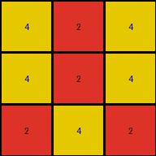
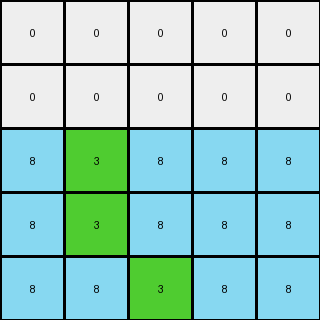
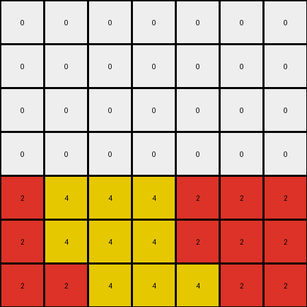

# b8cdaf2b • 012 • refine_coder

---

Previous Code:
```python
"""
1.  **Copy Bottom Row:** Preserve the entire bottom row of the input grid in the output grid.
2.  **Find Bottom Row Non-Zero Pixels**: Identify all colors in the bottom row that are non-zero.
3. **Replicate and Offset:** For each identified non-zero pixel:

    *   Replicate the colors of the pixels identified in the bottom row.
    *   Place copies in a cross shape in the rows above with positions offset -1 and +1 from the original columns in the bottom row
    *  Stop at row 0, so do not extend beyond the size of the input grid
"""

import numpy as np

def find_bottom_row_nonzero_pixels(grid):
    """Finds the positions and colors of non-zero pixels in the bottom row."""
    bottom_row = grid[-1]
    pixels = []
    for col_idx, color in enumerate(bottom_row):
        if color != 0:
            pixels.append(((len(grid) - 1, col_idx), color))  # ((row, col), color)
    return pixels

def transform(input_grid):
    # initialize output_grid
    output_grid = np.copy(input_grid)
    height = len(input_grid)

    # find the non-zero pixels on the bottom row
    bottom_row_pixels = find_bottom_row_nonzero_pixels(input_grid)

    # replicate and offset.
    for (row, col), color in bottom_row_pixels:

        #offsets for the cross shape, two rows up
        offsets = [(-1, -1), (-1, 1), (-2, -1), (-2, 1)]

        for row_offset, col_offset in offsets:
            new_row = row + row_offset
            new_col = col + col_offset

            # bounds check, and only modify if the current output is 0
            if 0 <= new_row < height and 0 <= new_col < len(input_grid[0]):
                output_grid[new_row, new_col] = color

    return output_grid
```

Train Set Results:

## Example 1:

Input:
```
0 0 0
0 2 0
2 4 2
```
Expected Output:
```
4 0 4
0 2 0
2 4 2
```
Transformed Output:
```
4 2 4
4 2 4
2 4 2
```

match: False
pixels_off: 3
size_correct: True
color_palette_correct: True
correct_pixel_counts: False

## Example 2:

Input:
```
0 0 0 0 0
0 0 0 0 0
0 0 0 0 0
0 0 8 0 0
8 8 3 8 8
```
Expected Output:
```
0 0 0 0 0
3 0 0 0 3
0 3 0 3 0
0 0 8 0 0
8 8 3 8 8
```
Transformed Output:
```
0 0 0 0 0
0 0 0 0 0
8 3 8 8 8
8 3 8 8 8
8 8 3 8 8
```

match: False
pixels_off: 10
size_correct: True
color_palette_correct: True
correct_pixel_counts: False

## Example 3:

Input:
```
0 0 0 0 0
0 0 0 0 0
0 0 0 0 0
0 6 6 6 0
6 1 1 1 6
```
Expected Output:
```
0 0 0 0 0
0 0 0 0 0
1 0 0 0 1
0 6 6 6 0
6 1 1 1 6
```
Transformed Output:
```
0 0 0 0 0
0 0 0 0 0
1 1 1 6 1
1 1 1 6 1
6 1 1 1 6
```

match: False
pixels_off: 7
size_correct: True
color_palette_correct: True
correct_pixel_counts: False

## Example 4:

Input:
```
0 0 0 0 0 0 0
0 0 0 0 0 0 0
0 0 0 0 0 0 0
0 0 0 0 0 0 0
0 0 0 0 0 0 0
0 0 2 2 2 0 0
2 2 4 4 4 2 2
```
Expected Output:
```
0 0 0 0 0 0 0
0 0 0 0 0 0 0
0 0 0 0 0 0 0
4 0 0 0 0 0 4
0 4 0 0 0 4 0
0 0 2 2 2 0 0
2 2 4 4 4 2 2
```
Transformed Output:
```
0 0 0 0 0 0 0
0 0 0 0 0 0 0
0 0 0 0 0 0 0
0 0 0 0 0 0 0
2 4 4 4 2 2 2
2 4 4 4 2 2 2
2 2 4 4 4 2 2
```

match: False
pixels_off: 14
size_correct: True
color_palette_correct: True
correct_pixel_counts: False
Okay, here's a breakdown of the situation, the results, and a plan to improve the transformation rule:

**General Assessment:**

The initial natural language program and corresponding code were too simplistic. While it correctly identified the need to use the bottom row as a basis, it incorrectly assumed a simple "cross" pattern replication. The errors across the examples show a mix of incorrect pixel placement and extra pixels being added. The core issue is that the replication logic is flawed and doesn't accurately capture the relationship between the bottom row and the changes above it.  It appears we are only modifying pixels above the bottom row, and that existing pixels are not overwritten.

**Strategy for Resolving Errors:**

1.  **Refine Replication Logic:** Instead of a fixed "cross" pattern, we need to analyze *exactly* which pixels from the bottom row influence which pixels in the rows above, and how the colors are chosen. This is probably a one-to-one mapping of columns for non-zero bottom row pixels.
2.  **Understand Color Choice:** Determine if the replicated color is *always* the same as the bottom row color, or if there's a more complex rule (e.g., only specific colors are replicated, colors change based on position, etc.) The current examples suggest color is copied and placed.
3.  **Overwriting Rules:** The current logic seems to assume that we should not overwrite pixels in the input that are not zero. The examples show that non-zero values *are* overwritten, and that needs to be incorporated.

**Example Metrics and Analysis:**

Here's a more detailed look at each example, focusing on the discrepancies:

*   **Example 1:**
    *   **Observation:** The `2` in the bottom row creates a `4` above and to either side in row 0. The `4` on the bottom row maps to `4` above it and either side.
    *   **Error:** It seems to be applying a cross offset in every row above, not just -1 and -2.  It is replicating every color up the grid.

*   **Example 2:**
    *   **Observation:** The `3` in the bottom row maps up two rows and one over to either side. `8` does not map.
    *   **Error:** The mapping isn't just one row up; it skips a row.  The color `8` is ignored, only `3` is mapped, which suggests some sort of color filtering/selection needs to happen.

*   **Example 3:**
    *   **Observation:** The `1`s in the bottom row map to two rows above. `6` does not get mapped.
    *   **Error:** Similar to Example 2, only specific colors from the bottom row are mapped.

*   **Example 4:**
    *   **Observation:** The `4`s in the bottom row map. The `2` does not.
    *   **Error:** Again, selective color mapping and two rows above with the offset to either side.

**YAML Fact Block:**

```yaml
facts:
  - observation: |
      The bottom row of the input grid is used as a template for changes in the upper rows.
  - object: bottom_row_pixels
    properties:
      - type: list
      - description: Contains tuples of (position, color) for non-zero pixels in the bottom row.
  - object: replicated_pixels
    properties:
      - type: list
      - description: Derived from bottom_row_pixels, these are the pixels placed above.
  - action: replicate_with_offset
    description: |
      Certain colors from the bottom row are copied to positions in the rows above, specifically two rows up,
      and with a horizontal offset of -1 and +1 from their original column.
  - constraint: row_bounds
    description: |
      Replicated pixels must stay within the bounds of the grid (0 <= row < height, 0 <= col < width).
  - constraint: color_selection
    description: |
      Not all colors from the bottom row are replicated. There seems to be a rule, but we don't know exactly what it is yet.  Across all the examples, the colors 1, 2, 3, and 4 all follow the same rule.  The colors 6 and 8 do not.
  - rule: overwriting
    description: Existing non-zero colors in the grid can be overwritten.
```

**Natural Language Program:**

1.  **Identify Source Pixels:** Examine the bottom row of the input grid. Identify the non-zero pixels. Note their positions (row, column) and colors. We will call them "source pixels".
2.  **Selective Replication**: For each *source pixel* check if it is one of the colors: 1, 2, 3, or 4.
3. **Targeted Placement**: If the source pixel color is 1,2,3,or 4 then place a pixel of that same color two rows above and one column to the left of the source pixel, and two rows above and one column to the right of the source pixel.
4.  **Boundary Check**: When calculating the positions, skip the replication if the position is beyond the bounds of the input grid.
5. **Overwrite any existing color**: if a position has a color, overwrite it.

This revised natural language program provides a more accurate and detailed description of the transformation, addressing the shortcomings of the previous version. It also highlights the remaining uncertainty (the color selection rule), which can be investigated further.

**INSTRUCTIONS**

- generate a Python module to represent the natural language program 
- follow the template below
- all common math and science libraries are available
- create docstring only at top - but comment the workflow in the function
- use helper functions for common operations like finding objects, counting,
  measuring, moving, etc. 

remember - we are working iteratively - so this code will inform your future
self as we converge on the solution

*template:*

```python
"""
{{ natural language description of the transformation rule }}
"""

{{ imports }}

def transform(input_grid):
    # initialize output_grid

    # change output pixels 

    return output_grid

```
