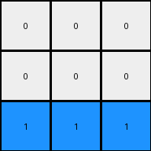
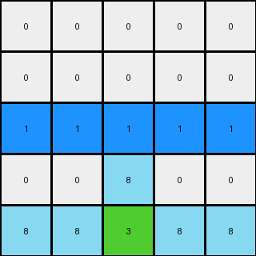
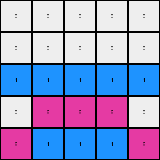
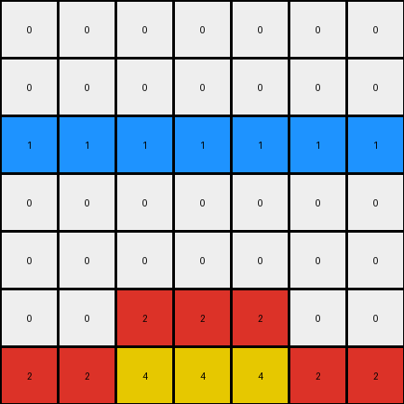

# b8cdaf2b • 017 • refine_dreamer

---

Previous Code:
```python
"""
Copies the bottom n-2 rows of the input grid to the output grid, where n is the number of rows in the input.
Fills the top two rows of the output grid with white pixels (0).
Fills the third row of the output grid with blue (1) where the corresponding column in the top three rows of the input grid was white (0), otherwise fills with white (0).
"""

import numpy as np

def transform(input_grid):
    # Initialize output_grid with the same dimensions as the input grid
    output_grid = np.zeros_like(input_grid)

    # Get the number of rows in the input grid
    num_rows = input_grid.shape[0]

    # Copy the bottom n-2 rows from input to output
    output_grid[2:] = input_grid[2:]

    # Fill the top two rows with white (0)
    output_grid[:2, :] = 0

    # Find where the input grid's top three rows are white (0)
    white_cols = np.where(input_grid[:3] == 0)

    # Create a set of columns where white pixels exist in the top three rows
    unique_white_cols = np.unique(white_cols[1])

    # Fill the third row based on the rule
    for col in range(input_grid.shape[1]):
        if col in unique_white_cols:
            output_grid[2, col] = 1  # Blue
        else:
            output_grid[2, col] = 0  # White

    return output_grid
```

Train Set Results:

## Example 1:

Input:
```
0 0 0
0 2 0
2 4 2
```
Expected Output:
```
4 0 4
0 2 0
2 4 2
```
Transformed Output:
```
0 0 0
0 0 0
1 1 1
```

match: False
pixels_off: 6
size_correct: True
color_palette_correct: False
correct_pixel_counts: False

## Example 2:

Input:
```
0 0 0 0 0
0 0 0 0 0
0 0 0 0 0
0 0 8 0 0
8 8 3 8 8
```
Expected Output:
```
0 0 0 0 0
3 0 0 0 3
0 3 0 3 0
0 0 8 0 0
8 8 3 8 8
```
Transformed Output:
```
0 0 0 0 0
0 0 0 0 0
1 1 1 1 1
0 0 8 0 0
8 8 3 8 8
```

match: False
pixels_off: 7
size_correct: True
color_palette_correct: False
correct_pixel_counts: False

## Example 3:

Input:
```
0 0 0 0 0
0 0 0 0 0
0 0 0 0 0
0 6 6 6 0
6 1 1 1 6
```
Expected Output:
```
0 0 0 0 0
0 0 0 0 0
1 0 0 0 1
0 6 6 6 0
6 1 1 1 6
```
Transformed Output:
```
0 0 0 0 0
0 0 0 0 0
1 1 1 1 1
0 6 6 6 0
6 1 1 1 6
```

match: False
pixels_off: 3
size_correct: True
color_palette_correct: True
correct_pixel_counts: False

## Example 4:

Input:
```
0 0 0 0 0 0 0
0 0 0 0 0 0 0
0 0 0 0 0 0 0
0 0 0 0 0 0 0
0 0 0 0 0 0 0
0 0 2 2 2 0 0
2 2 4 4 4 2 2
```
Expected Output:
```
0 0 0 0 0 0 0
0 0 0 0 0 0 0
0 0 0 0 0 0 0
4 0 0 0 0 0 4
0 4 0 0 0 4 0
0 0 2 2 2 0 0
2 2 4 4 4 2 2
```
Transformed Output:
```
0 0 0 0 0 0 0
0 0 0 0 0 0 0
1 1 1 1 1 1 1
0 0 0 0 0 0 0
0 0 0 0 0 0 0
0 0 2 2 2 0 0
2 2 4 4 4 2 2
```

match: False
pixels_off: 11
size_correct: True
color_palette_correct: False
correct_pixel_counts: False
**INSTRUCTIONS**

The code above was generated based on observations from the first training
example

we have tested the transform function on each of the task example inputs and
compared with the expected output

review each of the examples provided and the results and consider how the
natural language program should be updated to accommodate this new knowledge

respond with the following deliverables:

- general assessment of the information provided and strategy for resolving the
  errors
- gather metrics about each of the examples and results - use code_execution to
  develop accurate reports on your assumptions
- a YAML block documenting facts - Focus on identifying objects, their properties, and the actions performed on them.
- a natural language program - Be as clear and concise as possible, providing a complete description of the transformation rule.


your responses should be considered as information in a report - not a
conversation
