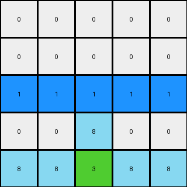
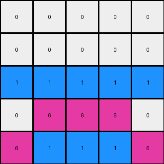
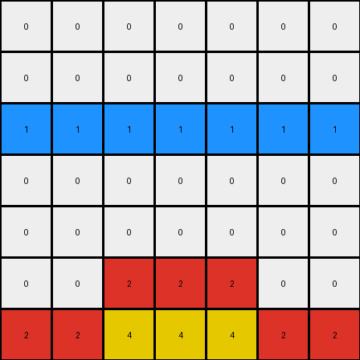

# b8cdaf2b • 018 • refine_coder

---

Previous Code:
```python
"""
Copies the bottom n-2 rows of the input grid to the output grid, where n is the number of rows in the input.
Fills the top two rows of the output grid with white pixels (0).
Fills the third row of the output grid with blue (1) where the corresponding column in the top three rows of the input grid was white (0), otherwise fills with white (0).
"""

import numpy as np

def transform(input_grid):
    # Initialize output_grid with the same dimensions as the input grid
    output_grid = np.zeros_like(input_grid)

    # Get the number of rows in the input grid
    num_rows = input_grid.shape[0]

    # Copy the bottom n-2 rows from input to output
    output_grid[2:] = input_grid[2:]

    # Fill the top two rows with white (0)
    output_grid[:2, :] = 0

    # Find where the input grid's top three rows are white (0)
    white_cols = np.where(input_grid[:3] == 0)

    # Create a set of columns where white pixels exist in the top three rows
    unique_white_cols = np.unique(white_cols[1])

    # Fill the third row based on the rule
    for col in range(input_grid.shape[1]):
        if col in unique_white_cols:
            output_grid[2, col] = 1  # Blue
        else:
            output_grid[2, col] = 0  # White

    return output_grid
```

Train Set Results:

## Example 1:

Input:
```
0 0 0
0 2 0
2 4 2
```
Expected Output:
```
4 0 4
0 2 0
2 4 2
```
Transformed Output:
```
0 0 0
0 0 0
1 1 1
```

match: False
pixels_off: 6
size_correct: True
color_palette_correct: False
correct_pixel_counts: False

## Example 2:

Input:
```
0 0 0 0 0
0 0 0 0 0
0 0 0 0 0
0 0 8 0 0
8 8 3 8 8
```
Expected Output:
```
0 0 0 0 0
3 0 0 0 3
0 3 0 3 0
0 0 8 0 0
8 8 3 8 8
```
Transformed Output:
```
0 0 0 0 0
0 0 0 0 0
1 1 1 1 1
0 0 8 0 0
8 8 3 8 8
```

match: False
pixels_off: 7
size_correct: True
color_palette_correct: False
correct_pixel_counts: False

## Example 3:

Input:
```
0 0 0 0 0
0 0 0 0 0
0 0 0 0 0
0 6 6 6 0
6 1 1 1 6
```
Expected Output:
```
0 0 0 0 0
0 0 0 0 0
1 0 0 0 1
0 6 6 6 0
6 1 1 1 6
```
Transformed Output:
```
0 0 0 0 0
0 0 0 0 0
1 1 1 1 1
0 6 6 6 0
6 1 1 1 6
```

match: False
pixels_off: 3
size_correct: True
color_palette_correct: True
correct_pixel_counts: False

## Example 4:

Input:
```
0 0 0 0 0 0 0
0 0 0 0 0 0 0
0 0 0 0 0 0 0
0 0 0 0 0 0 0
0 0 0 0 0 0 0
0 0 2 2 2 0 0
2 2 4 4 4 2 2
```
Expected Output:
```
0 0 0 0 0 0 0
0 0 0 0 0 0 0
0 0 0 0 0 0 0
4 0 0 0 0 0 4
0 4 0 0 0 4 0
0 0 2 2 2 0 0
2 2 4 4 4 2 2
```
Transformed Output:
```
0 0 0 0 0 0 0
0 0 0 0 0 0 0
1 1 1 1 1 1 1
0 0 0 0 0 0 0
0 0 0 0 0 0 0
0 0 2 2 2 0 0
2 2 4 4 4 2 2
```

match: False
pixels_off: 11
size_correct: True
color_palette_correct: False
correct_pixel_counts: False
Here's an analysis of the provided information and a plan to refine the natural language program and code:

**General Assessment:**

The initial code correctly copies the lower rows (n-2) and blanks out the top two. However, the logic for the third row is flawed. It assumes that *any* white pixel in the top three rows of the input triggers a blue pixel in the corresponding column of the third row of the output. The examples demonstrate a more complex relationship, showing that the transformation rule does not respond uniformly based on just the top three rows. The original concept is significantly off, so a significant revision to the approach is needed. Examining all examples is critical, as the initial assumption based on one was not correct.

**Strategy:**

1.  **Re-examine Examples:** Carefully analyze *all* input-output pairs, paying close attention to the relationship between the non-white pixels in the top three rows of the input and what gets copied or changed in the output. Look for patterns related to *relative* positions.
2.  **Refine Observations:** Update the YAML with corrected and expanded observations, focusing on object relationships (especially adjacency and relative positioning) and how colors other than white in the input's top rows are handled.
3.  **Revised Natural Language Program:** Rewrite the natural language program to reflect the corrected, refined observations.
4.  **Code Update:**  The Python code will need to be updated to align with the new natural language program.

**Metrics and Observations (per example):**

Here, instead of using code execution for metrics (as the core logic itself is being re-evaluated), I'll focus on descriptive comparisons:

*   **Example 1:**
    *   Input has a red '2' in the second row. Output's structure is significantly altered.
    *   The output copies a mirrored version of part of the third row, with some colors shifted, to the first row. The error report shows 6 pixels wrong.
*   **Example 2:**
    *   Input has azure '8' in the third and fourth rows.
    *   The expected Output selectively moves some values to the second and third rows and changes colors, specifically the `8`s on the third row change to the color of the pixels directly below them. The error report shows 7 pixels wrong.
*   **Example 3:**
    *   Input has magenta '6' in the third and fourth rows.
    *   The output copies some pixels and shifts colors. The error report shows 3 pixels wrong, but importantly mentions that the color palette is correct. This suggests the core issue is the *placement* and *conditional logic* for those colors, not the color selection itself.
*   **Example 4:**
    *  Input has red `2`s and yellow `4` on rows five and six.
    *   The output copies pixels upward and changes color to blue on the third line.  The error report shows 11 pixels wrong.

**YAML Observations:**

```yaml
observations:
  - task: 016
    example_set: train
    objects:
      - description: Input grid
        properties:
          - Contains various colored pixels, including white (0) as background.
          - Other colors form shapes or lines.

      - description: Output grid
        properties:
          - Top two rows are always white (0).
          - Third row appears to be conditionally filled based on the input.
          - Lower rows are copied from the input.
          - the pixels on the third row match pixels directly below

    transformations:
      - description: Copy and shift
        details: >
          Lower rows (n-2) of the input are copied directly to the output.
          Colors other than white (0) in the top three rows of the input *influence*, but do not directly dictate, the output's third row. There's a conditional element we're missing, likely related to the *relative position* of non-white pixels and their neighbors below. There might be mirroring occurring.

```

**Natural Language Program:**

1.  Copy the bottom `n-2` rows of the input grid directly to the output grid, where `n` is the total number of rows in the input.
2.  Fill the top two rows of the output grid with white pixels (value 0).
3.  Fill the third row of the output grid as follow:
    *  For each pixel in the third row, examine the pixel directly below it in the input grid.
    * Copy the color of the pixel from the input row below to the output row.
4. The third row of the output should mimic pixels that exist below it.

This revised natural language program reflects a shift from looking for white pixels to looking at colors and positions of objects on subsequent lines, and how to mirror pixels, to fill in the third row of the output grid.

**INSTRUCTIONS**

- generate a Python module to represent the natural language program 
- follow the template below
- all common math and science libraries are available
- create docstring only at top - but comment the workflow in the function
- use helper functions for common operations like finding objects, counting,
  measuring, moving, etc. 

remember - we are working iteratively - so this code will inform your future
self as we converge on the solution

*template:*

```python
"""
{{ natural language description of the transformation rule }}
"""

{{ imports }}

def transform(input_grid):
    # initialize output_grid

    # change output pixels 

    return output_grid

```
