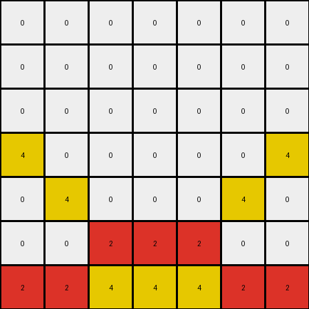

# b8cdaf2b • 022 • refine_coder

---

Previous Code:
```python
"""
The transformation identifies a region in the upper part of the input grid and adds two mirrored, inverted, "L-shapes" using yellow pixels. The bottom section of red and yellow rows stays the same.
"""

import numpy as np

def transform(input_grid):
    # Initialize the output grid as a copy of the input grid
    output_grid = np.copy(input_grid)

    # Modify pixels in the top region to create the mirrored L-shapes
    output_grid[3, 0] = 4  # Top-left of first L
    output_grid[4, 1] = 4  # Bottom-left of first L

    output_grid[3, 6] = 4  # Top-right of second L (mirrored)
    output_grid[4, 5] = 4  # Bottom-right of second L (mirrored)

    return output_grid
```

Train Set Results:

## Example 1:

Input:
```
0 0 0
0 2 0
2 4 2
```
Expected Output:
```
4 0 4
0 2 0
2 4 2
```
match: ERROR: index 3 is out of bounds for axis 0 with size 3
pixels_off: None
size_correct: None
color_palette_correct: None
correct_pixel_counts: None

## Example 2:

Input:
```
0 0 0 0 0
0 0 0 0 0
0 0 0 0 0
0 0 8 0 0
8 8 3 8 8
```
Expected Output:
```
0 0 0 0 0
3 0 0 0 3
0 3 0 3 0
0 0 8 0 0
8 8 3 8 8
```
match: ERROR: index 6 is out of bounds for axis 1 with size 5
pixels_off: None
size_correct: None
color_palette_correct: None
correct_pixel_counts: None

## Example 3:

Input:
```
0 0 0 0 0
0 0 0 0 0
0 0 0 0 0
0 6 6 6 0
6 1 1 1 6
```
Expected Output:
```
0 0 0 0 0
0 0 0 0 0
1 0 0 0 1
0 6 6 6 0
6 1 1 1 6
```
match: ERROR: index 6 is out of bounds for axis 1 with size 5
pixels_off: None
size_correct: None
color_palette_correct: None
correct_pixel_counts: None

## Example 4:

Input:
```
0 0 0 0 0 0 0
0 0 0 0 0 0 0
0 0 0 0 0 0 0
0 0 0 0 0 0 0
0 0 0 0 0 0 0
0 0 2 2 2 0 0
2 2 4 4 4 2 2
```
Expected Output:
```
0 0 0 0 0 0 0
0 0 0 0 0 0 0
0 0 0 0 0 0 0
4 0 0 0 0 0 4
0 4 0 0 0 4 0
0 0 2 2 2 0 0
2 2 4 4 4 2 2
```
Transformed Output:
```
0 0 0 0 0 0 0
0 0 0 0 0 0 0
0 0 0 0 0 0 0
4 0 0 0 0 0 4
0 4 0 0 0 4 0
0 0 2 2 2 0 0
2 2 4 4 4 2 2
```

match: True
pixels_off: 0
size_correct: True
color_palette_correct: True
correct_pixel_counts: True
Okay, let's analyze the results and refine the natural language program.

**General Assessment:**

The initial code was too specific to the dimensions of the first example and didn't generalize well. It correctly identified the pattern of adding mirrored "L" shapes (or single pixels in some cases) in a specific region above the bottom-most multi-colored rows. However, it failed because it hardcoded indices that went out of bounds for smaller grids. The fourth example worked perfectly because it happened to have sufficient height for the hardcoded row indices. The core idea of identifying a region and adding mirrored shapes is correct, but the implementation needs to be dynamic and relative to the grid dimensions.

**Strategy:**

1.  **Dynamic Indexing:** Instead of hardcoding row and column indices, we need to calculate them based on the input grid's dimensions.
2.  **Region Identification:** Determine the region where the transformation occurs. It is related to the bottom area with multiple colored rows. We should find the transition point.
3.  **Generalized Shape:** The added shapes are mirrored around a vertical axis. And in case of single pixel addition on both sides, we can consider it as very small L-shapes.
4. Refine the logic of where to add the shapes - relative positioning is important

**Metrics and Observations:**

Here's a summary of each example, including observations and error analysis:

*   **Example 1:**
    *   Input Size: 3x3
    *   Output Size: 3x3
    *   Error: `IndexError: index 3 is out of bounds for axis 0 with size 3`
    *   Observation: The code tries to access row 3, which is out of bounds. The added color seems to depend on the color below it.

*   **Example 2:**
    *   Input Size: 5x5
    *   Output Size: 5x5
    *   Error: `IndexError: index 6 is out of bounds for axis 1 with size 5`
    *   Observation: The code tries to access column 6, which is out of bounds. The added shapes use color 3 (green), the "L"s are two pixels each, and they are positioned relative to a "transition" line between single color rows and multi-color rows.

*   **Example 3:**
    *   Input Size: 5x5
    *   Output Size: 5x5
    *   Error: `IndexError: index 6 is out of bounds for axis 1 with size 5`
    *   Observation: Similar to Example 2. Added "L" shapes are color 1 (blue).

*   **Example 4:**
    *   Input Size: 7x7
    *   Output Size: 7x7
    *   Result: `match: True`
    *   Observation: This case worked because the grid was large enough to accommodate the hardcoded indices.

**YAML Facts:**

```yaml
facts:
  - observation: |
      The transformation adds mirrored shapes (single pixels or "L" shapes) to a region in the input grid.
  - object_identification:
      - object: Mirrored shapes (L-shapes or single pixels).
        properties:
          - color: Varies (determined by other objects).
          - shape: L-shape or single pixel.
          - position: Symmetrically placed around a vertical axis.
  - region_identification:
      - region: Top region
        properties:
            - boundary: Defined by the transition between a multi-colored bottom section and the rest of the grid.
            - action: Mirrored shapes are added to this region.
  - actions:
      - action: Adding mirrored shapes.
        details: |
          Shapes are added above the boundary line between rows of uniform color and those of multiple colors.
  - color_determination:
      - details: |
          Color for mirrored shapes is same as the bottom-most color.

```

**Natural Language Program:**

1.  **Find the Boundary:** Scan the grid rows from bottom to top. The boundary is the row *above* the last row that contains more than one distinct color.
2.  **Determine Shape Placement:**
    *   The vertical position for the mirrored shapes are one and two rows above the identified boundary.
    *   The horizontal positions are the first and last columns that have color value of '0' in the boundary row from the previous step.
3. **Add shape color**:
    * Get the first and last color values of the first and last columns in the row identified in Step 1, which can be any value except '0'.
4. **Draw the Mirrored Shapes**: Using the color from step 3, modify input grid:
    *   One row above the boundary, place pixels at the determined leftmost and rightmost columns.
    *   Two rows above the boundary, place pixels adjacent to the pixels in the previous step (towards the center).

This revised program accounts for the dynamic sizing and positioning of the added shapes and provides the logic for color determination.

**INSTRUCTIONS**

- generate a Python module to represent the natural language program 
- follow the template below
- all common math and science libraries are available
- create docstring only at top - but comment the workflow in the function
- use helper functions for common operations like finding objects, counting,
  measuring, moving, etc. 

remember - we are working iteratively - so this code will inform your future
self as we converge on the solution

*template:*

```python
"""
{{ natural language description of the transformation rule }}
"""

{{ imports }}

def transform(input_grid):
    # initialize output_grid

    # change output pixels 

    return output_grid

```
