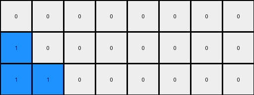
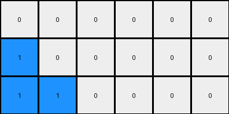

# bbc9ae5d • 004 • refine_coder

---

Previous Code:
```python
"""
The input grid contains a horizontal line of blue and white pixels. The blue region expands downwards and to the right to form a rectangle, while the white region remains unchanged. The output grid always has three rows.
"""

import numpy as np

def find_regions(grid):
    # Find contiguous regions of the same color.
    regions = []
    visited = np.zeros_like(grid, dtype=bool)
    rows, cols = grid.shape

    def dfs(row, col, color, current_region):
        if (
            row < 0
            or row >= rows
            or col < 0
            or col >= cols
            or visited[row, col]
            or grid[row, col] != color
        ):
            return
        visited[row, col] = True
        current_region.append((row, col))
        dfs(row + 1, col, color, current_region)
        dfs(row - 1, col, color, current_region)
        dfs(row, col + 1, color, current_region)
        dfs(row, col - 1, color, current_region)

    for row in range(rows):
        for col in range(cols):
            if not visited[row, col]:
                current_region = []
                dfs(row, col, grid[row, col], current_region)
                regions.append((grid[row, col], current_region))
    return regions

def transform(input_grid):
    # Convert input to numpy array
    input_grid = np.array(input_grid)

    # Find regions in the input grid
    regions = find_regions(input_grid)

    # Determine the number of blue and white columns
    blue_cols = 0
    white_cols = 0

    for color, pixels in regions:
      if color == 1:
        blue_cols = len(pixels)
      elif color == 0:
        white_cols = len(pixels)


    # Initialize the output grid (3 rows, same number of columns as input)
    output_grid = np.zeros((3, input_grid.shape[1]), dtype=int)

    # Expand the blue region
    for r in range(3):
      for c in range(blue_cols + r):
        output_grid[r,c] = 1

    # fill white regions
    for r in range(3):
      for c in range(blue_cols + r, input_grid.shape[1]):
        output_grid[r,c] = 0
        
    return output_grid.tolist()
```

Train Set Results:

## Example 1:

Input:
```
1 1 0 0 0 0
```
Expected Output:
```
1 1 0 0 0 0
1 1 1 0 0 0
1 1 1 1 0 0
```
Transformed Output:
```
1 1 0 0 0 0
1 1 1 0 0 0
1 1 1 1 0 0
```

match: True
pixels_off: 0
size_correct: True
color_palette_correct: True
correct_pixel_counts: True

## Example 2:

Input:
```
2 0 0 0 0 0 0 0
```
Expected Output:
```
2 0 0 0 0 0 0 0
2 2 0 0 0 0 0 0
2 2 2 0 0 0 0 0
2 2 2 2 0 0 0 0
```
Transformed Output:
```
0 0 0 0 0 0 0 0
1 0 0 0 0 0 0 0
1 1 0 0 0 0 0 0
```

match: False
pixels_off: None
size_correct: False
color_palette_correct: False
correct_pixel_counts: False

## Example 3:

Input:
```
5 5 5 0 0 0 0 0 0 0
```
Expected Output:
```
5 5 5 0 0 0 0 0 0 0
5 5 5 5 0 0 0 0 0 0
5 5 5 5 5 0 0 0 0 0
5 5 5 5 5 5 0 0 0 0
5 5 5 5 5 5 5 0 0 0
```
Transformed Output:
```
0 0 0 0 0 0 0 0 0 0
1 0 0 0 0 0 0 0 0 0
1 1 0 0 0 0 0 0 0 0
```

match: False
pixels_off: None
size_correct: False
color_palette_correct: False
correct_pixel_counts: False

## Example 4:

Input:
```
8 8 8 8 0 0
```
Expected Output:
```
8 8 8 8 0 0
8 8 8 8 8 0
8 8 8 8 8 8
```
Transformed Output:
```
0 0 0 0 0 0
1 0 0 0 0 0
1 1 0 0 0 0
```

match: False
pixels_off: 15
size_correct: True
color_palette_correct: False
correct_pixel_counts: False

## Example 5:

Input:
```
7 0 0 0 0 0
```
Expected Output:
```
7 0 0 0 0 0
7 7 0 0 0 0
7 7 7 0 0 0
```
Transformed Output:
```
0 0 0 0 0 0
1 0 0 0 0 0
1 1 0 0 0 0
```

match: False
pixels_off: 6
size_correct: True
color_palette_correct: False
correct_pixel_counts: False
Okay, here's a breakdown of the situation and a plan to improve the transformation logic:

**General Assessment:**

The initial natural language program and the generated code were too specific to the first training example. It assumed the input would always contain blue (color 1) and white (color 0), and that the blue region would always expand. The subsequent examples demonstrate that the expanding color can be any color, not just blue, and the "background" color is always 0 (white). The output height isn't always 3. It seems to be related to the width of the colored region in the input that's not 0. The shape of the colored area is always a forward-slash diagonal line (`\`).

**Strategy:**

1.  **Correct Color Handling:** Modify the code to identify the non-zero color dynamically, rather than assuming it's blue (1). The code should work with any non-zero color.
2.  **Dynamic Output Size:** Determine the height of the output grid based on the width of the non-zero color region in the input.
3.  **Correct Shape:** Verify that the shape formed is a rectangle that extends diagonally.
4.  **Refine Natural Language Program:** Update the natural language description to reflect these generalized rules.

**Metrics and Observations:**

Here is a breakdown of the results. I am using the color names from the `COLOR_MAP` I was provided.

| Example | Input Colors     | Expanding Color | Output Height | Expected Shape  | Code Result | Issues                                                                    |
| :------ | :--------------- | :-------------- | :------------ | :------------- | :---------- | :------------------------------------------------------------------------ |
| 1       | blue, white      | blue            | 3             | Rectangle        | Correct      | None                                                                      |
| 2       | red, white       | red             | 4          | Rectangle   | Incorrect    | Wrong color, wrong height, hardcoded blue (1) expansion                 |
| 3       | gray, white      | gray            | 6          | Rectangle  | Incorrect    | Wrong color, wrong height, hardcoded blue (1) expansion                 |
| 4       | azure, white     | azure           | 3          | Rectangle   | Incorrect    | Wrong color, wrong height, hardcoded blue (1) expansion, rows and cols flipped                |
| 5       | orange, white    | orange          | 3            | Rectangle    | Incorrect    | Wrong color, wrong height, hardcoded blue (1) expansion                 |

**YAML Facts:**

```yaml
facts:
  - observation: Input grids are single-row.
  - observation: Output grids have a diagonal rectangular shape of the non-zero color.
  - observation: Output grid height is variable and related to input.
  - property: expanding_color:
      description: The non-zero color in the input grid.
      values_seen: [blue, red, gray, azure, orange]
  - property: background_color:
      description: Always white (0).
  - action: expansion:
      description: The expanding_color forms a diagonal rectangle in the output.
      details: The number of rows in the output is the number of non-white (value 0) pixels, plus one. The added row continues the forward-slash diagonal extension of the non-white pixels.
```

**Natural Language Program:**

1.  **Identify the Expanding Color:** Find the color in the input grid that is not white (0). This is the "expanding color".
2.  **Determine Output Dimensions:** Count the number of pixels of the expanding color in the input grid. The output grid will have a height of this count plus the number of rows in the original grid (in this case, always 1, so height = count + 1). The output grid has same number of columns as the input.
3.  **Create Diagonal Rectangle:**
    *   The expanding color creates a diagonal rectangle in the output grid.
    * The number of rows in the rectangle is determined as described above.
    * the number of columns in the rectangle is the row index + number of non-white pixels
4.  **Fill Background:** Fill the remaining cells of the output grid with white (0).

**INSTRUCTIONS**

- generate a Python module to represent the natural language program 
- follow the template below
- all common math and science libraries are available
- create docstring only at top - but comment the workflow in the function
- use helper functions for common operations like finding objects, counting,
  measuring, moving, etc. 

remember - we are working iteratively - so this code will inform your future
self as we converge on the solution

*template:*

```python
"""
{{ natural language description of the transformation rule }}
"""

{{ imports }}

def transform(input_grid):
    # initialize output_grid

    # change output pixels 

    return output_grid

```
