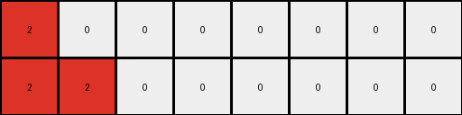
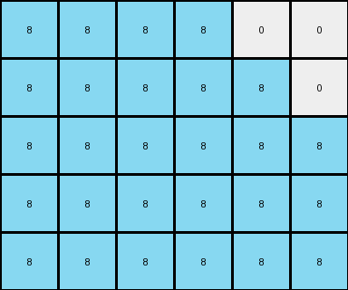

# bbc9ae5d • 005 • refine_dreamer

---

Previous Code:
```python
"""
1. Identify the Expanding Color: Find the color in the input grid that is not white (0). This is the "expanding color".
2. Determine Output Dimensions: Count the number of pixels of the expanding color in the input grid. The output grid will have a height of this count plus the number of rows in the input (which is always 1, so count + 1). The output grid has same number of columns as the input.
3. Create Diagonal Rectangle:
    *   The expanding color creates a diagonal rectangle in the output grid.
    * The height of the rectangle is equal to the count determined before + 1
4. Fill Background: Fill the remaining cells of the output grid with white (0).
"""

import numpy as np

def transform(input_grid):
    # Convert input to numpy array
    input_grid = np.array(input_grid)
    rows, cols = input_grid.shape

    # Find the expanding color (non-zero color)
    expanding_color = None
    for color in np.unique(input_grid):
        if color != 0:
            expanding_color = color
            break

    # Count the number of pixels of the expanding color
    expanding_color_count = np.count_nonzero(input_grid == expanding_color)

    # Determine output dimensions
    output_rows = expanding_color_count + rows
    output_cols = cols
    output_grid = np.zeros((output_rows, output_cols), dtype=int)

    # Create the diagonal rectangle
    for i in range(output_rows):
        for j in range(min(output_cols, expanding_color_count + i)):
            output_grid[i, j] = expanding_color

    return output_grid.tolist()
```

Train Set Results:

## Example 1:

Input:
```
1 1 0 0 0 0
```
Expected Output:
```
1 1 0 0 0 0
1 1 1 0 0 0
1 1 1 1 0 0
```
Transformed Output:
```
1 1 0 0 0 0
1 1 1 0 0 0
1 1 1 1 0 0
```

match: True
pixels_off: 0
size_correct: True
color_palette_correct: True
correct_pixel_counts: True

## Example 2:

Input:
```
2 0 0 0 0 0 0 0
```
Expected Output:
```
2 0 0 0 0 0 0 0
2 2 0 0 0 0 0 0
2 2 2 0 0 0 0 0
2 2 2 2 0 0 0 0
```
Transformed Output:
```
2 0 0 0 0 0 0 0
2 2 0 0 0 0 0 0
```

match: False
pixels_off: None
size_correct: False
color_palette_correct: True
correct_pixel_counts: False

## Example 3:

Input:
```
5 5 5 0 0 0 0 0 0 0
```
Expected Output:
```
5 5 5 0 0 0 0 0 0 0
5 5 5 5 0 0 0 0 0 0
5 5 5 5 5 0 0 0 0 0
5 5 5 5 5 5 0 0 0 0
5 5 5 5 5 5 5 0 0 0
```
Transformed Output:
```
5 5 5 0 0 0 0 0 0 0
5 5 5 5 0 0 0 0 0 0
5 5 5 5 5 0 0 0 0 0
5 5 5 5 5 5 0 0 0 0
```

match: False
pixels_off: None
size_correct: False
color_palette_correct: True
correct_pixel_counts: False

## Example 4:

Input:
```
8 8 8 8 0 0
```
Expected Output:
```
8 8 8 8 0 0
8 8 8 8 8 0
8 8 8 8 8 8
```
Transformed Output:
```
8 8 8 8 0 0
8 8 8 8 8 0
8 8 8 8 8 8
8 8 8 8 8 8
8 8 8 8 8 8
```

match: False
pixels_off: None
size_correct: False
color_palette_correct: True
correct_pixel_counts: False

## Example 5:

Input:
```
7 0 0 0 0 0
```
Expected Output:
```
7 0 0 0 0 0
7 7 0 0 0 0
7 7 7 0 0 0
```
Transformed Output:
```
7 0 0 0 0 0
7 7 0 0 0 0
```

match: False
pixels_off: None
size_correct: False
color_palette_correct: True
correct_pixel_counts: False
**INSTRUCTIONS**

The code above was generated based on observations from the first training
example

we have tested the transform function on each of the task example inputs and
compared with the expected output

review each of the examples provided and the results and consider how the
natural language program should be updated to accommodate this new knowledge

respond with the following deliverables:

- general assessment of the information provided and strategy for resolving the
  errors
- gather metrics about each of the examples and results - use code_execution to
  develop accurate reports on your assumptions
- a YAML block documenting facts - Focus on identifying objects, their properties, and the actions performed on them.
- a natural language program - Be as clear and concise as possible, providing a complete description of the transformation rule.


your responses should be considered as information in a report - not a
conversation
