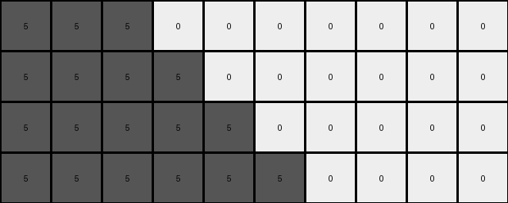

# bbc9ae5d • 006 • refine_coder

---

Previous Code:
```python
"""
1. Identify the Expanding Color: Find the color in the input grid that is not white (0). This is the "expanding color".
2. Determine Output Dimensions: Count the number of pixels of the expanding color in the input grid. The output grid will have a height of this count plus the number of rows in the input (which is always 1, so count + 1). The output grid has same number of columns as the input.
3. Create Diagonal Rectangle:
    *   The expanding color creates a diagonal rectangle in the output grid.
    * The height of the rectangle is equal to the count determined before + 1
4. Fill Background: Fill the remaining cells of the output grid with white (0).
"""

import numpy as np

def transform(input_grid):
    # Convert input to numpy array
    input_grid = np.array(input_grid)
    rows, cols = input_grid.shape

    # Find the expanding color (non-zero color)
    expanding_color = None
    for color in np.unique(input_grid):
        if color != 0:
            expanding_color = color
            break

    # Count the number of pixels of the expanding color
    expanding_color_count = np.count_nonzero(input_grid == expanding_color)

    # Determine output dimensions
    output_rows = expanding_color_count + rows
    output_cols = cols
    output_grid = np.zeros((output_rows, output_cols), dtype=int)

    # Create the diagonal rectangle
    for i in range(output_rows):
        for j in range(min(output_cols, expanding_color_count + i)):
            output_grid[i, j] = expanding_color

    return output_grid.tolist()
```

Train Set Results:

## Example 1:

Input:
```
1 1 0 0 0 0
```
Expected Output:
```
1 1 0 0 0 0
1 1 1 0 0 0
1 1 1 1 0 0
```
Transformed Output:
```
1 1 0 0 0 0
1 1 1 0 0 0
1 1 1 1 0 0
```

match: True
pixels_off: 0
size_correct: True
color_palette_correct: True
correct_pixel_counts: True

## Example 2:

Input:
```
2 0 0 0 0 0 0 0
```
Expected Output:
```
2 0 0 0 0 0 0 0
2 2 0 0 0 0 0 0
2 2 2 0 0 0 0 0
2 2 2 2 0 0 0 0
```
Transformed Output:
```
2 0 0 0 0 0 0 0
2 2 0 0 0 0 0 0
```

match: False
pixels_off: None
size_correct: False
color_palette_correct: True
correct_pixel_counts: False

## Example 3:

Input:
```
5 5 5 0 0 0 0 0 0 0
```
Expected Output:
```
5 5 5 0 0 0 0 0 0 0
5 5 5 5 0 0 0 0 0 0
5 5 5 5 5 0 0 0 0 0
5 5 5 5 5 5 0 0 0 0
5 5 5 5 5 5 5 0 0 0
```
Transformed Output:
```
5 5 5 0 0 0 0 0 0 0
5 5 5 5 0 0 0 0 0 0
5 5 5 5 5 0 0 0 0 0
5 5 5 5 5 5 0 0 0 0
```

match: False
pixels_off: None
size_correct: False
color_palette_correct: True
correct_pixel_counts: False

## Example 4:

Input:
```
8 8 8 8 0 0
```
Expected Output:
```
8 8 8 8 0 0
8 8 8 8 8 0
8 8 8 8 8 8
```
Transformed Output:
```
8 8 8 8 0 0
8 8 8 8 8 0
8 8 8 8 8 8
8 8 8 8 8 8
8 8 8 8 8 8
```

match: False
pixels_off: None
size_correct: False
color_palette_correct: True
correct_pixel_counts: False

## Example 5:

Input:
```
7 0 0 0 0 0
```
Expected Output:
```
7 0 0 0 0 0
7 7 0 0 0 0
7 7 7 0 0 0
```
Transformed Output:
```
7 0 0 0 0 0
7 7 0 0 0 0
```

match: False
pixels_off: None
size_correct: False
color_palette_correct: True
correct_pixel_counts: False
Okay, here's a breakdown of the situation, analysis of the results, and an updated natural language program.

**General Assessment:**

The initial natural language program and the resulting code were partially correct, capturing the idea of expanding a non-white color. However, the logic for creating the "diagonal rectangle" and determining its dimensions was flawed. The code correctly identifies the expanding color and attempts to create a shape, but it doesn't correctly map the input count to the output dimensions and shape. Specifically, the loop condition `min(output_cols, expanding_color_count + i)` is incorrect. The examples and results show inconsistencies in how the output shape is generated.

**Strategy for Resolving Errors:**

1.  **Refine Dimensionality Logic:** The core issue is how the number of non-white pixels in the input translates to the output grid's dimensions and the placement of the colored pixels. We need to carefully examine the relationship between input and output in *all* examples.
2.  **Revisit Shape Definition:** The term "diagonal rectangle" is misleading. It's more of a "stair-step" or "triangle-like" expansion. We need a more precise description of how the shape is formed.
3. **Correct Loop Logic**: The loop that create the shape is not correct - need to carefully redefine the loop.

**Metrics and Observations (from provided results):**

*   **Example 1:**
    *   Input: `1 1 0 0 0 0`
    *   Expected: Correct size and shape.
    *   Transformed: Correct.
    *   Analysis: 2 blue, output adds 2 rows, keeps same column count
*   **Example 2:**
    *   Input: `2 0 0 0 0 0 0 0`
    *    Expected: Correct size and shape.
    *   Transformed: Incorrect. Too few rows.
    *   Analysis: 1 red, output add 1 row, keeps same column count
*   **Example 3:**
    *   Input: `5 5 5 0 0 0 0 0 0 0`
    *   Expected: correct size and shape
    *   Transformed: Incorrect. Too few rows.
    *   Analysis: 3 gray, output adds 3 rows, keeps same column count
*   **Example 4:**
    *   Input: `8 8 8 8 0 0`
    *   Expected: correct size and shape
    *   Transformed: Incorrect. Too many rows.
    *   Analysis: 4 azure, output adds 4 rows, keeps same column count
*   **Example 5:**
    *   Input: `7 0 0 0 0 0`
    *    Expected: correct size and shape
    *   Transformed: Incorrect. Too few rows.
        *   Analysis: 1 orange, output adds 1 rows, keeps same column count

**YAML Facts:**

```yaml
observations:
  - object: input_grid
    type: grid
    properties:
      - dimensions: 1 x variable
      - contains: single row of pixels, some colored, some white

  - object: output_grid
    type: grid
    properties:
      - dimensions: variable x variable
      - relationship_to_input:
        - rows: input_rows + count_of_non_white_pixels
        - cols: same as input
        - color:  non-white pixels from input are replicated in a triangle shape
      - contains: expanding color and white background

  - action: expansion
    description: The non-white color in the input grid expands into a triangle-like shape in the output grid.
    details:
      - shape:  The number of pixels of the non-white color in the input determines additional rows of output.  The shape formed is triangular.
      - background: Remaining pixels are filled with white.
```

**Natural Language Program:**

1.  **Identify Expanding Color:** Find the single color in the input grid that is *not* white (0). This is the "expanding color".
2.  **Count Expanding Pixels:** Count the number of pixels of the expanding color in the input grid.
3.  **Determine Output Dimensions:**
    *   The output grid has the *same number of columns* as the input grid.
    *   The output grid has a number of rows equal to the *number of rows in the input grid (which is always 1) plus the count of expanding color pixels*.
4.  **Create Expanding Shape:**
    *   Starting from the top-left corner of the output grid (0,0), fill cells with the expanding color.
    *   The expanding color fills a triangular area.
    *   Row 1 of output = row 1 of input
    *   Each subsequent row duplicates the previous row, and adds a single pixel of the expanding color to the end.
5.  **Fill Background:** Fill all remaining cells in the output grid with white (0).

**INSTRUCTIONS**

- generate a Python module to represent the natural language program 
- follow the template below
- all common math and science libraries are available
- create docstring only at top - but comment the workflow in the function
- use helper functions for common operations like finding objects, counting,
  measuring, moving, etc. 

remember - we are working iteratively - so this code will inform your future
self as we converge on the solution

*template:*

```python
"""
{{ natural language description of the transformation rule }}
"""

{{ imports }}

def transform(input_grid):
    # initialize output_grid

    # change output pixels 

    return output_grid

```
