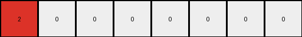

# bbc9ae5d • 010 • refine_coder

---

Previous Code:
```python
"""
Transforms a single-row grid into a multi-row grid where a non-zero pixel is replicated diagonally downwards and to the right.
"""

import numpy as np

def transform(input_grid):
    # Find the non-zero pixel and its color
    non_zero_pixels = np.nonzero(input_grid)[1]  # Get column indices of non-zero elements
    first_non_zero_color = input_grid[0, non_zero_pixels[0]] if non_zero_pixels.size > 0 else 0
        
    red_pixels_count = np.count_nonzero(input_grid == first_non_zero_color)


    # Initialize output grid
    output_rows = red_pixels_count
    output_cols = input_grid.shape[1]
    output_grid = np.zeros((output_rows, output_cols), dtype=int)

    # Replicate the non-zero pixel diagonally
    if non_zero_pixels.size > 0 :
        for i in range(output_rows):
            output_grid[i, :i+1] = first_non_zero_color
        

    return output_grid
```

Train Set Results:

## Example 1:

Input:
```
1 1 0 0 0 0
```
Expected Output:
```
1 1 0 0 0 0
1 1 1 0 0 0
1 1 1 1 0 0
```
Transformed Output:
```
1 0 0 0 0 0
1 1 0 0 0 0
```

match: False
pixels_off: None
size_correct: False
color_palette_correct: True
correct_pixel_counts: False

## Example 2:

Input:
```
2 0 0 0 0 0 0 0
```
Expected Output:
```
2 0 0 0 0 0 0 0
2 2 0 0 0 0 0 0
2 2 2 0 0 0 0 0
2 2 2 2 0 0 0 0
```
Transformed Output:
```
2 0 0 0 0 0 0 0
```

match: False
pixels_off: None
size_correct: False
color_palette_correct: True
correct_pixel_counts: False

## Example 3:

Input:
```
5 5 5 0 0 0 0 0 0 0
```
Expected Output:
```
5 5 5 0 0 0 0 0 0 0
5 5 5 5 0 0 0 0 0 0
5 5 5 5 5 0 0 0 0 0
5 5 5 5 5 5 0 0 0 0
5 5 5 5 5 5 5 0 0 0
```
Transformed Output:
```
5 0 0 0 0 0 0 0 0 0
5 5 0 0 0 0 0 0 0 0
5 5 5 0 0 0 0 0 0 0
```

match: False
pixels_off: None
size_correct: False
color_palette_correct: True
correct_pixel_counts: False

## Example 4:

Input:
```
8 8 8 8 0 0
```
Expected Output:
```
8 8 8 8 0 0
8 8 8 8 8 0
8 8 8 8 8 8
```
Transformed Output:
```
8 0 0 0 0 0
8 8 0 0 0 0
8 8 8 0 0 0
8 8 8 8 0 0
```

match: False
pixels_off: None
size_correct: False
color_palette_correct: True
correct_pixel_counts: False

## Example 5:

Input:
```
7 0 0 0 0 0
```
Expected Output:
```
7 0 0 0 0 0
7 7 0 0 0 0
7 7 7 0 0 0
```
Transformed Output:
```
7 0 0 0 0 0
```

match: False
pixels_off: None
size_correct: False
color_palette_correct: True
correct_pixel_counts: False
Okay, let's analyze the results and update our approach.

**General Assessment:**

The initial code was too simplistic and focused only on the first non-zero color and diagonal replication. It doesn't correctly handle the shifting pattern of the replicated color. The core issue is that the initial code doesn't correctly fill the columns after the first non-zero blocks. It stops at the diagonal, whereas it should continue filling with the identified color up to the count of that color in the input.

**Strategy:**

1.  **Correct the Row Count:** The number of output rows is determined by the number of times the most frequent non-zero color in the input row appears.
2.  **Correct Column Filling:** For each row, we must populate the output with the color starting at the first column. The number of columns filled will be increased with each new output row.

**Metrics and Observations:**

Here's a breakdown of each example, incorporating observations:

```yaml
examples:
  - id: example_1
    input_grid: "1 1 0 0 0 0"
    output_grid: "1 1 0 0 0 0\n1 1 1 0 0 0\n1 1 1 1 0 0"
    transformed_output: "1 0 0 0 0 0\n1 1 0 0 0 0"
    match: False
    observations:
      - The input has two '1's (blue).
      - The expected output has 3 rows, corresponding to the counts of '1' plus one. It seems to be taking count of 1's and adding a shifted copy in additional row.
      - The transformed output only created 2 rows. Only a diagonal was filled.

  - id: example_2
    input_grid: "2 0 0 0 0 0 0 0"
    output_grid: "2 0 0 0 0 0 0 0\n2 2 0 0 0 0 0 0\n2 2 2 0 0 0 0 0\n2 2 2 2 0 0 0 0"
    transformed_output: "2 0 0 0 0 0 0 0"
    match: False
    observations:
      - The input has one '2' (red).
      - The output expands to four rows.
      - The transformed output only has one row.

  - id: example_3
    input_grid: "5 5 5 0 0 0 0 0 0 0"
    output_grid: "5 5 5 0 0 0 0 0 0 0\n5 5 5 5 0 0 0 0 0 0\n5 5 5 5 5 0 0 0 0 0\n5 5 5 5 5 5 0 0 0 0\n5 5 5 5 5 5 5 0 0 0"
    transformed_output: "5 0 0 0 0 0 0 0 0 0\n5 5 0 0 0 0 0 0 0 0\n5 5 5 0 0 0 0 0 0 0"
    match: False
    observations:
      - Input has three '5's (gray).
      - Output has five rows.
      - The transformed output only has three rows.

  - id: example_4
    input_grid: "8 8 8 8 0 0"
    output_grid: "8 8 8 8 0 0\n8 8 8 8 8 0\n8 8 8 8 8 8"
    transformed_output: "8 0 0 0 0 0\n8 8 0 0 0 0\n8 8 8 0 0 0\n8 8 8 8 0 0"
    match: False
    observations:
      - Input has four '8' (azure)
      - Output has 3 rows.
      - Transformed output has 4 rows.

  - id: example_5
    input_grid: "7 0 0 0 0 0"
    output_grid: "7 0 0 0 0 0\n7 7 0 0 0 0\n7 7 7 0 0 0"
    transformed_output: "7 0 0 0 0 0"
    match: False
    observations:
        - Input has one '7' (orange).
        - Output has three rows.
        - The transformed output has only 1 row.

```

**YAML Facts:**

```yaml
facts:
  - object: input_row
    type: grid
    properties:
      - dimensions: 1 x N (where N is variable)
      - elements: integers (0-9 representing colors)
    actions:
      - identified: The most frequent non-zero color is identified.
      - counted: The occurrences of the most frequent non-zero color are counted.

  - object: output_grid
    type: grid
    properties:
      - rows: equal to number of occurrences of identified non-zero color in input row + (number of occurences of identified non-zero color in the input row - 1)
      - columns: same as the input row
      - elements: integers (0-9 representing colors)
    actions:
      - filled: Each row is filled sequentially. The number of color filled columns increases by 1 in each row.
      - replicated:  First non-zero color is replicated, and shifted by one to the right for next row.

```

**Natural Language Program:**

1.  **Identify the most frequent non-zero color:** Scan the input row and determine the non-zero color that appears most often.
2.  **Count Occurrences:** Count how many times the identified color appears in the input row. Let's call this `count`.
3.  **Determine Output Dimensions:**
    *   The output grid has the same number of columns as the input row.
    *   The output grid has `count + (count - 1)` rows.
4.  **Populate Output Grid:**
    *   Iterate from row `r = 0` to `2*count - 2`:
        *   Fill the first `r + 1` cells of the current row with the identified color.


**INSTRUCTIONS**

- generate a Python module to represent the natural language program 
- follow the template below
- all common math and science libraries are available
- create docstring only at top - but comment the workflow in the function
- use helper functions for common operations like finding objects, counting,
  measuring, moving, etc. 

remember - we are working iteratively - so this code will inform your future
self as we converge on the solution

*template:*

```python
"""
{{ natural language description of the transformation rule }}
"""

{{ imports }}

def transform(input_grid):
    # initialize output_grid

    # change output pixels 

    return output_grid

```
