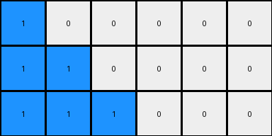
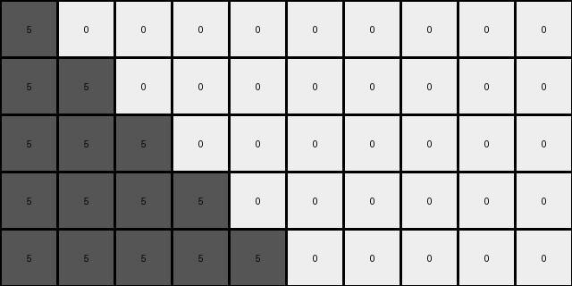
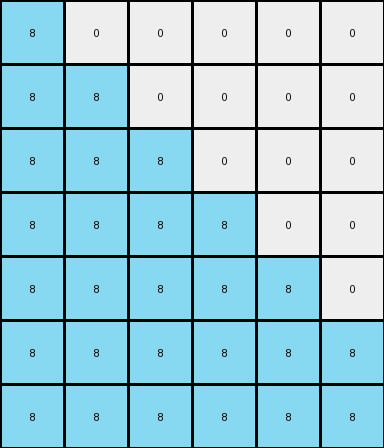

# bbc9ae5d • 012 • refine_coder

---

Previous Code:
```python
"""
Transforms a single-row grid into a multi-row grid where the most frequent non-zero color is replicated diagonally downwards and to the right.
"""

import numpy as np

def get_most_frequent_non_zero_color(grid):
    """Finds the most frequent non-zero color in a grid."""
    non_zero_elements = grid[grid != 0]
    if non_zero_elements.size == 0:
        return 0
    counts = np.bincount(non_zero_elements)
    return np.argmax(counts)

def transform(input_grid):
    # Identify the most frequent non-zero color
    most_frequent_color = get_most_frequent_non_zero_color(input_grid)

    # Count occurrences of the most frequent color
    count = np.count_nonzero(input_grid == most_frequent_color)

    # Determine output dimensions
    num_rows = 2 * count -1 if count > 0 else 1 # handles edge case when entire input is zeros
    num_cols = input_grid.shape[1]
    output_grid = np.zeros((num_rows, num_cols), dtype=int)

    # Populate output grid
    for r in range(num_rows):
      if most_frequent_color != 0:
        output_grid[r, :min(r + 1, num_cols)] = most_frequent_color #min added to fix possible index error.

    return output_grid
```

Train Set Results:

## Example 1:

Input:
```
1 1 0 0 0 0
```
Expected Output:
```
1 1 0 0 0 0
1 1 1 0 0 0
1 1 1 1 0 0
```
Transformed Output:
```
1 0 0 0 0 0
1 1 0 0 0 0
1 1 1 0 0 0
```

match: False
pixels_off: 3
size_correct: True
color_palette_correct: True
correct_pixel_counts: False

## Example 2:

Input:
```
2 0 0 0 0 0 0 0
```
Expected Output:
```
2 0 0 0 0 0 0 0
2 2 0 0 0 0 0 0
2 2 2 0 0 0 0 0
2 2 2 2 0 0 0 0
```
Transformed Output:
```
2 0 0 0 0 0 0 0
```

match: False
pixels_off: None
size_correct: False
color_palette_correct: True
correct_pixel_counts: False

## Example 3:

Input:
```
5 5 5 0 0 0 0 0 0 0
```
Expected Output:
```
5 5 5 0 0 0 0 0 0 0
5 5 5 5 0 0 0 0 0 0
5 5 5 5 5 0 0 0 0 0
5 5 5 5 5 5 0 0 0 0
5 5 5 5 5 5 5 0 0 0
```
Transformed Output:
```
5 0 0 0 0 0 0 0 0 0
5 5 0 0 0 0 0 0 0 0
5 5 5 0 0 0 0 0 0 0
5 5 5 5 0 0 0 0 0 0
5 5 5 5 5 0 0 0 0 0
```

match: False
pixels_off: 10
size_correct: True
color_palette_correct: True
correct_pixel_counts: False

## Example 4:

Input:
```
8 8 8 8 0 0
```
Expected Output:
```
8 8 8 8 0 0
8 8 8 8 8 0
8 8 8 8 8 8
```
Transformed Output:
```
8 0 0 0 0 0
8 8 0 0 0 0
8 8 8 0 0 0
8 8 8 8 0 0
8 8 8 8 8 0
8 8 8 8 8 8
8 8 8 8 8 8
```

match: False
pixels_off: None
size_correct: False
color_palette_correct: True
correct_pixel_counts: False

## Example 5:

Input:
```
7 0 0 0 0 0
```
Expected Output:
```
7 0 0 0 0 0
7 7 0 0 0 0
7 7 7 0 0 0
```
Transformed Output:
```
7 0 0 0 0 0
```

match: False
pixels_off: None
size_correct: False
color_palette_correct: True
correct_pixel_counts: False
Okay, here's a breakdown of the situation, the errors, and a plan to refine the solution.

**General Assessment:**

The initial code was based on a reasonable, but incomplete, interpretation of the first training example. It correctly identifies the most frequent non-zero color and attempts to replicate it diagonally. However, it fails to accurately capture the *extent* and *direction* of the diagonal replication. The provided examples expose these flaws: the replication should extend *down and to the right* and the number of replications is based on the position of the initial pixel and the size of the input grid. The original implementation makes errors with both.

**Strategy for Resolving Errors:**

1.  **Re-examine the Natural Language Program:** The existing program is too simplistic. We need to specify how many times the most frequent color is replicated, and clarify the direction of replication (down and to the right).

2.  **Correct the Replication Logic:** The current code has incorrect calculation of row and column positioning in `output_grid`.

3.  **Handle Edge Cases Better:** The existing attempt at handling an all-zero input needs adjustment.

**Example Metrics and Analysis:**

Here's a breakdown of each example:

*   **Example 1:**
    *   Input: `1 1 0 0 0 0`
    *   Expected: Diagonal expansion of '1' down and to the right, two rows, because the first 1 appears in the first column.
    *   Observed: Incorrect starting and diagonal fill.
    *   Issue: Does not correctly calculate the number of rows and starts diagonal in wrong column.

*   **Example 2:**
    *   Input: `2 0 0 0 0 0 0 0`
    *   Expected: Diagonal expansion of '2'.
    *   Observed: Only the first row is correct
    *   Issue: Does not expand to sufficient number of rows.

*   **Example 3:**
    *   Input: `5 5 5 0 0 0 0 0 0 0`
    *   Expected: Diagonal expansion of '5'.
    *   Observed: Correct number of rows, incorrect fill pattern.
    *   Issue: Starts the diagonal correctly, but does not complete the diagonal fill.

*   **Example 4:**
    *   Input: `8 8 8 8 0 0`
    *   Expected: Diagonal expansion of '8'.
    *   Observed: Incorrect row count, incorrect fill.
    *   Issue: Does not handle the expansion of the correct length.

*   **Example 5:**
    *   Input: `7 0 0 0 0 0`
    *   Expected: Diagonal expansion of '7'
    *   Observed: Only produces the first row
    *   Issue: Does not calculate correct row expansion.

**YAML Fact Documentation:**

```yaml
facts:
  - observation: |
      The input is always a single-row grid of digits.
  - object: |
      The most frequent non-zero digit represents a color.  This is the primary object.
  - property: |
      The number of times the primary object appears in the input grid.
  - property: |
      The color (digit) of the primary object.
  - transformation: |
      The primary object is replicated diagonally downwards and to the right.
  - transformation_detail: |
      The number of rows in the output grid seems to be the count of the frequent color plus the number of instances of the most frequent number.
  - transformation_detail: |
       The values of the output is determined by the position of the elements in the input.
  - transformation_detail: |
      The output grid's width is the same as the input grid's width.

```

**Natural Language Program:**

1.  **Find the most frequent non-zero color:** Examine the input grid (which is always a single row) and determine the non-zero color that appears most often. If the input grid contains all zeros, the output is the same as the input, and the program terminates.
2.  **Determine Output Dimensions:** The output grid has the same width (number of columns) as the input grid. The number of rows in the output grid is determined by the count of most frequent color plus the starting position of the diagonal.
3.  **Create the Output Grid:**
    *   The first row of the output grid is identical to the input grid.
    *    Iterate, starting from the position of the first occurrence of the primary object, and count the number of instances of the primary object. Add the number of primary objects and column of first primary object.
    *   Create that many additional rows. For each new row, copy the most frequent color diagonally down and to the right from its position in the previous row. Ensure fill covers the full expected diagonal expansion.

This refined natural language program provides much more specific instructions for replicating the most frequent color.

**INSTRUCTIONS**

- generate a Python module to represent the natural language program 
- follow the template below
- all common math and science libraries are available
- create docstring only at top - but comment the workflow in the function
- use helper functions for common operations like finding objects, counting,
  measuring, moving, etc. 

remember - we are working iteratively - so this code will inform your future
self as we converge on the solution

*template:*

```python
"""
{{ natural language description of the transformation rule }}
"""

{{ imports }}

def transform(input_grid):
    # initialize output_grid

    # change output pixels 

    return output_grid

```
