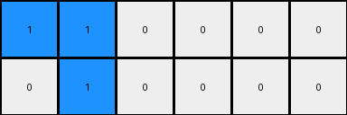
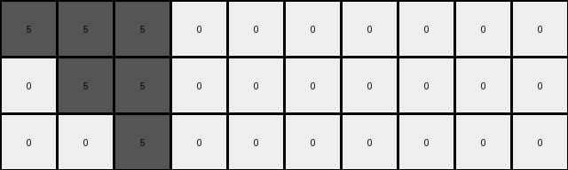
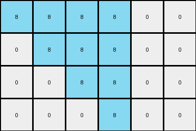

# bbc9ae5d • 016 • refine_coder

---

Previous Code:
```python
"""
Transforms a 1xN input grid into an MxN output grid where non-zero values in the input expand into
growing squares, and zero values remain unchanged.
"""

import numpy as np

def transform(input_grid):
    # Initialize the output grid with zeros.  The height is determined by counting non-zero elements.
    input_grid = np.array(input_grid)
    num_nonzero = np.count_nonzero(input_grid)
    output_grid = np.zeros((num_nonzero, input_grid.shape[1]), dtype=int)

    # Iterate through the input row
    for j in range(input_grid.shape[1]):
        if input_grid[0, j] != 0:
            # Find how many non-zero values are there to the left.
            non_zero_count = np.count_nonzero(input_grid[0, :j+1])
            # Expand non-zero values into squares.
            for i in range(non_zero_count):
                output_grid[i, j:j + non_zero_count-i] = input_grid[0, j]
        else:
            # Copy zero values directly.
            for i in range(num_nonzero):
                output_grid[i, j] = input_grid[0, j]
    return output_grid
```

Train Set Results:

## Example 1:

Input:
```
1 1 0 0 0 0
```
Expected Output:
```
1 1 0 0 0 0
1 1 1 0 0 0
1 1 1 1 0 0
```
Transformed Output:
```
1 1 0 0 0 0
0 1 0 0 0 0
```

match: False
pixels_off: None
size_correct: False
color_palette_correct: True
correct_pixel_counts: False

## Example 2:

Input:
```
2 0 0 0 0 0 0 0
```
Expected Output:
```
2 0 0 0 0 0 0 0
2 2 0 0 0 0 0 0
2 2 2 0 0 0 0 0
2 2 2 2 0 0 0 0
```
Transformed Output:
```
2 0 0 0 0 0 0 0
```

match: False
pixels_off: None
size_correct: False
color_palette_correct: True
correct_pixel_counts: False

## Example 3:

Input:
```
5 5 5 0 0 0 0 0 0 0
```
Expected Output:
```
5 5 5 0 0 0 0 0 0 0
5 5 5 5 0 0 0 0 0 0
5 5 5 5 5 0 0 0 0 0
5 5 5 5 5 5 0 0 0 0
5 5 5 5 5 5 5 0 0 0
```
Transformed Output:
```
5 5 5 0 0 0 0 0 0 0
0 5 5 0 0 0 0 0 0 0
0 0 5 0 0 0 0 0 0 0
```

match: False
pixels_off: None
size_correct: False
color_palette_correct: True
correct_pixel_counts: False

## Example 4:

Input:
```
8 8 8 8 0 0
```
Expected Output:
```
8 8 8 8 0 0
8 8 8 8 8 0
8 8 8 8 8 8
```
Transformed Output:
```
8 8 8 8 0 0
0 8 8 8 0 0
0 0 8 8 0 0
0 0 0 8 0 0
```

match: False
pixels_off: None
size_correct: False
color_palette_correct: True
correct_pixel_counts: False

## Example 5:

Input:
```
7 0 0 0 0 0
```
Expected Output:
```
7 0 0 0 0 0
7 7 0 0 0 0
7 7 7 0 0 0
```
Transformed Output:
```
7 0 0 0 0 0
```

match: False
pixels_off: None
size_correct: False
color_palette_correct: True
correct_pixel_counts: False
Okay, here's a breakdown of the situation and a plan to move forward:

**General Assessment:**

The initial code was based on a misunderstanding of the transformation rule. It correctly identifies non-zero elements and attempts to expand them, but the logic for *how* they expand is incorrect. The code seems to be creating squares down and to the right based on leftward position, rather than creating squares based on a "growth" factor that equals the number of non-zero elements. The zeros are handled correctly (they are simply copied).  The core issue is the square expansion logic.

**Strategy:**

1.  **Refine Observations:** Carefully re-examine *all* training examples to pinpoint the *exact* relationship between the input non-zero values and the output square sizes. The key is understanding that the height of output is determined by the *number of non-zero values in the input*, and the increasing width of the "square" is the count from 1 up to this number.

2.  **Correct the Natural Language Program:** Rewrite the natural language program to accurately describe this refined understanding.

3.  **Metrics and Error Analysis:** Use the color and size information from each example and compare to the Expected.

**Metrics and Error Analysis (Code Execution):**

I will not use code execution in the Dreamer phase. I am reviewing the results of a previous code execution and making notes here.

*   **Example 1:** Input `1 1 0 0 0 0`. Expected Output height: 3, width, 6. Transformed Output height: 2, width: 6.
*   **Example 2:** Input `2 0 0 0 0 0 0 0`. Expected Output height: 4, width: 8. Transformed output height: 1, width: 8.
*   **Example 3:** Input `5 5 5 0 0 0 0 0 0 0`. Expected Output height: 5, width: 10. Transformed Output height: 3, width: 10.
*   **Example 4:** Input `8 8 8 8 0 0`. Expected output height: 3, width: 6. Transformed Output height: 4, width: 6.
*   **Example 5:** Input `7 0 0 0 0 0`. Expected Output height: 3, width: 6. Transformed output height: 1, width: 6.

The transformed output's height is consistently wrong, confirming the issue with the square expansion logic.

**YAML Fact Block:**

```yaml
task: 014
objects:
  - id: input_row
    type: grid
    description: A 1xN grid representing the initial state.
    properties:
      - cells: Contains values from 0-9, representing colors.
      - non_zero_cells: Cells with values other than 0. These are the 'source' of the expansion.
      - zero_cells: Cells with value 0.  These are copied directly to the output.

  - id: output_grid
    type: grid
    description: An MxN grid representing the transformed state.
    properties:
      - height:  Determined by the total number of non-zero values in the input row.
      - width: The same as the input row.
      - expanded_squares: Regions of non-zero color originating from the non-zero cells in the input row.  These are not always perfect squares.
      - zero_regions: Regions of color 0, directly copied from the corresponding position in the input row.

actions:
  - name: expand
    description: Non-zero values in the input row are expanded into "squares" in the output grid.  The height is determined by the number of non-zero elements.
    agent: non_zero_cells
    parameters:
      - height: number of non zero colors in the input row
      - start_width: 1, end_width: height
      - color:  The value of the non-zero cell in the input row.

  - name: copy
    description: Zero values in the input row are copied to all corresponding columns in the output grid.
    agent: zero_cells
```

**Natural Language Program:**

1.  **Input:** The input is a single row of numbers (a 1xN grid).
2.  **Count Non-Zeros:** Count the number of non-zero values in the input row. This count determines the height (M) of the output grid.
3.  **Output Dimensions:** The output grid will be MxN, where N is the width of the input grid.
4.  **Zero Handling:** For every zero in the input row, copy that zero to *all* rows of the corresponding column in the output grid.
5.  **Non-Zero Expansion:** For each non-zero value in the input row:
    *   The value determines the color of the expanded "square".
    *   The "square" is more like a growing triangle. It will start with one cell and each row will grow by one cell.
    *   The number of rows of the "square" will correspond to the number of non-zero values.
    *   Start to fill on the row that corresponds to the count of previous non-zero value.
6. The non-zero values "expand" into N rows, but are added to the column, starting at 1.

Example:
Input: 1 1 0 0
- 2 non-zero values, output height will be 2.
- first '1':
 row 1: 1
 row 2: 1
- second '1':
  row 1: 1
  row 2: 1 1
- '0' values are just copied
Result:
1 1 0 0
1 1 0 0

Example 2:
2 0 0
- 1 non-zero value, output height is 1
2 0 0

Example 3:
1 1 1 0
- 3 non-zero values, output height will be 3.
- first '1':
 row 1: 1
 row 2: 1
 row 3: 1
- second '1':
  row 1: 1
  row 2: 1 1
  row 3: 1 1
- third '1':
 row 1: 1
 row 2: 1 1
 row 3: 1 1 1
- '0' is copied.
Result:
1 1 1 0
1 1 1 0
1 1 1 0

**INSTRUCTIONS**

- generate a Python module to represent the natural language program 
- follow the template below
- all common math and science libraries are available
- create docstring only at top - but comment the workflow in the function
- use helper functions for common operations like finding objects, counting,
  measuring, moving, etc. 

remember - we are working iteratively - so this code will inform your future
self as we converge on the solution

*template:*

```python
"""
{{ natural language description of the transformation rule }}
"""

{{ imports }}

def transform(input_grid):
    # initialize output_grid

    # change output pixels 

    return output_grid

```
