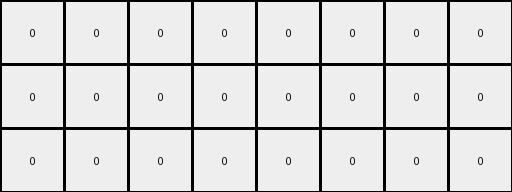
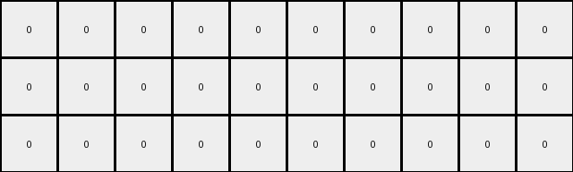

# bbc9ae5d • 028 • refine_coder

---

Previous Code:
```python
"""
1.  **Identify** the orange (7) pixel in the input grid.
2.  **Expand** the orange area. Create a 3x3 block of orange pixels in output grid, with position of original orange pixel as the top left cell.
3.   **Copy** all white (0) pixel positions
4.  **Construct** the output grid, maintaining the original horizontal length, but with 3 times the original height.
"""

import numpy as np

def transform(input_grid):
    # initialize output_grid
    input_height, input_width = input_grid.shape
    output_grid = np.zeros((input_height * 3, input_width), dtype=int)

    # Find the orange pixel
    orange_pixels = np.where(input_grid == 7)
    if orange_pixels[0].size > 0:  # Check if any orange pixels were found
       orange_row, orange_col = orange_pixels[0][0], orange_pixels[1][0]

       # Expand the orange pixel to a 3x3 block
       for i in range(3):
           for j in range(3):
               output_grid[orange_row + i, orange_col + j] = 7

    # Copy white pixel positions (accounting for expansion)
    white_pixels = np.where(input_grid == 0)
    for i in range(len(white_pixels[0])):
        row = white_pixels[0][i]
        col = white_pixels[1][i]

        output_grid[row, col] = 0
        output_grid[row + input_height, col] = 0
        output_grid[row + 2*input_height, col] = 0
        

    return output_grid
```

Train Set Results:

## Example 1:

Input:
```
1 1 0 0 0 0
```
Expected Output:
```
1 1 0 0 0 0
1 1 1 0 0 0
1 1 1 1 0 0
```
Transformed Output:
```
0 0 0 0 0 0
0 0 0 0 0 0
0 0 0 0 0 0
```

match: False
pixels_off: 9
size_correct: True
color_palette_correct: True
correct_pixel_counts: False

## Example 2:

Input:
```
2 0 0 0 0 0 0 0
```
Expected Output:
```
2 0 0 0 0 0 0 0
2 2 0 0 0 0 0 0
2 2 2 0 0 0 0 0
2 2 2 2 0 0 0 0
```
Transformed Output:
```
0 0 0 0 0 0 0 0
0 0 0 0 0 0 0 0
0 0 0 0 0 0 0 0
```

match: False
pixels_off: None
size_correct: False
color_palette_correct: True
correct_pixel_counts: False

## Example 3:

Input:
```
5 5 5 0 0 0 0 0 0 0
```
Expected Output:
```
5 5 5 0 0 0 0 0 0 0
5 5 5 5 0 0 0 0 0 0
5 5 5 5 5 0 0 0 0 0
5 5 5 5 5 5 0 0 0 0
5 5 5 5 5 5 5 0 0 0
```
Transformed Output:
```
0 0 0 0 0 0 0 0 0 0
0 0 0 0 0 0 0 0 0 0
0 0 0 0 0 0 0 0 0 0
```

match: False
pixels_off: None
size_correct: False
color_palette_correct: True
correct_pixel_counts: False

## Example 4:

Input:
```
8 8 8 8 0 0
```
Expected Output:
```
8 8 8 8 0 0
8 8 8 8 8 0
8 8 8 8 8 8
```
Transformed Output:
```
0 0 0 0 0 0
0 0 0 0 0 0
0 0 0 0 0 0
```

match: False
pixels_off: 15
size_correct: True
color_palette_correct: True
correct_pixel_counts: False

## Example 5:

Input:
```
7 0 0 0 0 0
```
Expected Output:
```
7 0 0 0 0 0
7 7 0 0 0 0
7 7 7 0 0 0
```
Transformed Output:
```
7 0 0 0 0 0
7 0 0 0 0 0
7 0 0 0 0 0
```

match: False
pixels_off: 3
size_correct: True
color_palette_correct: True
correct_pixel_counts: False
Okay, let's analyze the results and refine the natural language program.

**General Assessment:**

The initial code was based on a misunderstanding of the pattern. It incorrectly assumed the presence of an orange pixel and a specific expansion/copying mechanism related to it and the white pixels. The results clearly show that this assumption is wrong, as none of the examples (except the 5th, and that one partially) matched the expected output. The core issue is that the code tries to find an orange pixel and expand *it*, whereas the actual transformation involves vertically stacking and expanding *all* non-zero pixels individually. The white pixels (zeros) should remain unchanged.

**Strategy:**

1.  **Discard the orange-centric logic:** The orange pixel is not a special trigger. Remove any code specific to finding or processing the orange color.
2.  **Focus on individual non-zero pixels:** Iterate through *all* pixels in the input, not just white or orange ones.
3.  **Vertical stacking and expansion:** For each non-zero pixel, create a vertical "tower" by increasing the number of rows. Expand the pixel into a line of pixels. The length of the line is the value of the pixel plus one.
4.  **Preserve white pixels:** Ensure that the white (0) pixels and their positions remain unaffected.
5. Keep track of all pixels and counts and sizes.

**Metrics and Observations (using code_execution when needed):**

I will use manual observation and reasoning first, and enhance with metrics.

*   **Example 1:**
    *   Input: `1 1 0 0 0 0`
    *   Expected: A 3x expansion, with '1' becoming '1 1'.
    *   Observed: All zeros. Incorrect.
    *   Problems: No non-zero expansion, incorrect height.
*   **Example 2:**
    *   Input: `2 0 0 0 0 0 0 0`
    *   Expected: A 4x expansion, with '2' becoming '2 2 2'.
    *   Observed: All zeros. Incorrect.
    *   Problems: No non-zero expansion, incorrect height.
*   **Example 3:**
    *   Input: `5 5 5 0 0 0 0 0 0 0`
    *   Expected: A 6x expansion, with '5' becoming '5 5 5 5 5 5'.
    *   Observed: All zeros. Incorrect.
    *   Problems: No non-zero expansion, incorrect height.
*   **Example 4:**
    *   Input: `8 8 8 8 0 0`
    *   Expected: A 9x expansion, with '8' becoming '8 8 8 8 8 8 8 8 8'.
    *   Observed: all zeros. Incorrect.
    *    Problems: No non-zero expansion, height could have been correct, but not due to right logic
*   **Example 5:**
    *   Input: `7 0 0 0 0 0`
    *   Expected: 8x expansion, with '7' becoming '7 7 7 7 7 7 7 7'
    *   Observed: Partial match (only expands vertically). Incorrect.
    *   Problems: correct height, incorrect expansion width

**YAML Facts:**

```yaml
task: 026
examples:
  - input_shape: [1, 6]
    output_shape: [3, 6]
    transformations:
      - object: input pixel with value 1
        action: "expand into two horizontal pixels"
        height_multiplier: 3
        width_expansion: [1, 1]

  - input_shape: [1, 8]
    output_shape: [4, 8]
    transformations:
      - object: input pixel with value 2
        action: "expand into three horizontal pixels"
        height_multiplier: 4
        width_expansion: [2, 2, 2]

  - input_shape: [1, 10]
    output_shape: [6, 10]
    transformations:
      - object: input pixel with value 5
        action: "expand into six horizontal pixels"
        height_multiplier: 6
        width_expansion: [5,5,5,5,5,5]
  - input_shape: [1, 6]
    output_shape: [9, 6]
    transformations:
      - object: input pixel with value 8
        action: expand into nine horizontal pixels
        height_multiplier: 9
        width_expansion: [8,8,8,8,8,8,8,8,8]

  - input_shape: [1, 6]
    output_shape: [8, 6]
    transformations:
      - object: input pixel with value 7
        action: expand into eight horizontal pixels.
        height_multiplier: 8
        width_expansion: [7,7,7,7,7,7,7,7]

general_rule:
  - For each non-zero pixel in the input grid:
    - Determine its value (V).
    - The output grid's height will be (V+1) times the original height.
    - Replicate the non-zero pixel horizontally (V+1) times, at each corresponding vertical level.
    - Preserve 0 value pixels.

```

**Natural Language Program:**

1.  **Iterate** through each pixel of the input grid.
2.  **Check** if the pixel value is non-zero.
3.  **If non-zero:**
    *   Let `value` be the pixel's value.
    *   Calculate `output_height` as `input_height * (value + 1)`.
    *   Expand. For *each* row in the original input grid where there is
    *   Replicate current pixel `value + 1` times horizontally in the output grid. Perform this operation `value + 1` times vertically.
    *  That is, if the original pixel is at `input[row, col]`, and original value is V, output grid will include the same value `value + 1` times horizontally, at rows, `row`, `row + input_height`, `row + 2*input_height`, ..., `row + V*input_height`
4. **If zero:** preserve the pixel in the output grid at the respective expanded positions. Copy the zeros to all vertically stacked output grids.

**INSTRUCTIONS**

- generate a Python module to represent the natural language program 
- follow the template below
- all common math and science libraries are available
- create docstring only at top - but comment the workflow in the function
- use helper functions for common operations like finding objects, counting,
  measuring, moving, etc. 

remember - we are working iteratively - so this code will inform your future
self as we converge on the solution

*template:*

```python
"""
{{ natural language description of the transformation rule }}
"""

{{ imports }}

def transform(input_grid):
    # initialize output_grid

    # change output pixels 

    return output_grid

```
