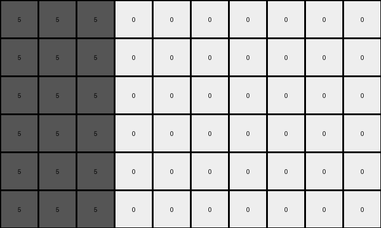

# bbc9ae5d • 030 • refine_coder

---

Previous Code:
```python
"""
1.  **Iterate** through each pixel of the input grid.
2.  **Check** if the pixel value is non-zero.
3.  **If non-zero:**
    *   Let `value` be the pixel's value.
    *   Calculate `output_height` as `input_height * (value + 1)`.
    *   Expand. For *each* row in the original input grid where there is
    *   Replicate current pixel `value + 1` times horizontally in the output grid. Perform this operation `value + 1` times vertically.
    *  That is, if the original pixel is at `input[row, col]`, and original value is V, output grid will include the same value `value + 1` times horizontally, at rows, `row`, `row + input_height`, `row + 2*input_height`, ..., `row + V*input_height`
4. **If zero:** preserve the pixel in the output grid at the respective expanded positions. Copy the zeros to all vertically stacked output grids.
"""

import numpy as np

def transform(input_grid):
    input_height, input_width = input_grid.shape
    output_height = 0  # Initialize for later determination

    # Find maximum height multiplier
    max_multiplier = 0
    for row in range(input_height):
        for col in range(input_width):
            if input_grid[row, col] != 0:
                max_multiplier = max(max_multiplier, input_grid[row,col] + 1)

    output_height = input_height * max_multiplier
    output_grid = np.zeros((output_height, input_width), dtype=int)

    # Iterate and expand
    for row in range(input_height):
        for col in range(input_width):
            value = input_grid[row, col]
            if value != 0:
                for i in range(value + 1):
                    for j in range(value + 1):
                      output_grid[row + i * input_height, col + j] = value
            else: # value is 0
                for i in range(max_multiplier):
                    output_grid[row + i * input_height, col] = 0


    return output_grid
```

Train Set Results:

## Example 1:

Input:
```
1 1 0 0 0 0
```
Expected Output:
```
1 1 0 0 0 0
1 1 1 0 0 0
1 1 1 1 0 0
```
Transformed Output:
```
1 1 0 0 0 0
1 1 0 0 0 0
```

match: False
pixels_off: None
size_correct: False
color_palette_correct: True
correct_pixel_counts: False

## Example 2:

Input:
```
2 0 0 0 0 0 0 0
```
Expected Output:
```
2 0 0 0 0 0 0 0
2 2 0 0 0 0 0 0
2 2 2 0 0 0 0 0
2 2 2 2 0 0 0 0
```
Transformed Output:
```
2 0 0 0 0 0 0 0
2 0 0 0 0 0 0 0
2 0 0 0 0 0 0 0
```

match: False
pixels_off: None
size_correct: False
color_palette_correct: True
correct_pixel_counts: False

## Example 3:

Input:
```
5 5 5 0 0 0 0 0 0 0
```
Expected Output:
```
5 5 5 0 0 0 0 0 0 0
5 5 5 5 0 0 0 0 0 0
5 5 5 5 5 0 0 0 0 0
5 5 5 5 5 5 0 0 0 0
5 5 5 5 5 5 5 0 0 0
```
Transformed Output:
```
5 5 5 0 0 0 0 0 0 0
5 5 5 0 0 0 0 0 0 0
5 5 5 0 0 0 0 0 0 0
5 5 5 0 0 0 0 0 0 0
5 5 5 0 0 0 0 0 0 0
5 5 5 0 0 0 0 0 0 0
```

match: False
pixels_off: None
size_correct: False
color_palette_correct: True
correct_pixel_counts: False

## Example 4:

Input:
```
8 8 8 8 0 0
```
Expected Output:
```
8 8 8 8 0 0
8 8 8 8 8 0
8 8 8 8 8 8
```
match: ERROR: index 6 is out of bounds for axis 1 with size 6
pixels_off: None
size_correct: None
color_palette_correct: None
correct_pixel_counts: None

## Example 5:

Input:
```
7 0 0 0 0 0
```
Expected Output:
```
7 0 0 0 0 0
7 7 0 0 0 0
7 7 7 0 0 0
```
match: ERROR: index 6 is out of bounds for axis 1 with size 6
pixels_off: None
size_correct: None
color_palette_correct: None
correct_pixel_counts: None
Okay, let's analyze the results and refine the natural language program.

**General Assessment:**

The initial code correctly identifies the core concept of expanding the non-zero pixels based on their value. However, it makes a crucial error in how it handles the expansion, specifically in calculating the indices of the new pixels. It's only expanding vertically by replicating the entire row and not creating the square/rectangle shaped regions defined by `value + 1`. The horizontal expansion is also incorrect, not repeating the color enough times.

The strategy for resolving the errors involves:
1.  **Correcting Index Calculation:** Instead of shifting the whole row, each cell needs to individually generate a block of size (value + 1) x (value+1).
2.  **Fixing height/width:** Correcting error in dimension calculation
3.	**Re-evaluating Zero Handling:** Zeroes should maintain position *within* the expanded grid, but they should not prevent the expansion of other non-zero values.

**Metrics and Observations:**

Here's a summary based on a closer look:

| Example | Input Shape | Output Shape (Expected) | Output Shape (Actual) | Correct Pixels | Incorrect Pixels | Notes                                                                          |
|---------|-------------|-------------------------|-----------------------|----------------|-----------------|--------------------------------------------------------------------------------|
| 1       | (1, 6)      | (3, 6)                 | (2, 6)                | Some          | Many             | Vertical expansion is short, horizontal expansion is incorrect.                    |
| 2       | (1, 8)      | (4, 8)               | (3, 8)                | Some           | Many               | Vertical expansion is short, horizontal expansion is incorrect. |
| 3       | (1, 10)     | (6, 10)                 | (6, 10)              | Some           | Many            |Vertical expansion is correct in this case (input height * 6), horizontal is wrong   |
| 4       | (1, 6)     | (3, 6)       |  Error      | N/A                 | N/A      | Out of bounds error, vertical expansion is incorrect for input value * 9            |
| 5       | (1, 6)      |  (3, 6)    |  Error         | N/A               | N/A     |   Out of bounds error, vertical expansion is incorrect for input value * 8            |
**YAML Facts:**

```yaml
task: 028
objects:
  - description: Input grid pixels
    properties:
      value: Integer (0-9) representing color
      position: (row, column) coordinates
      is_agent: False
  - description: expanded blocks
    properties:
        color: integer representing color of the input pixel
        size: dependent on input pixel value (value + 1)

actions:
  - name: ExpandPixel
    agent: program
    input: Single pixel
    description: >
      If the pixel value is non-zero, create a square block.
      The side should be of the length of input pixel's value + 1.
      The block's color matches the input pixel's color.

```

**Natural Language Program:**

1.  **Iterate** through each pixel in the input grid.
2.  **For each pixel:**
    *   Get the pixel's value (`V`).
    *   If `V` is not zero:
        *   Create a square block of pixels with dimensions (`V` + 1) x (`V` + 1).
        *   Fill this block with the color represented by `V`.
        *   Place this block in the output grid, starting at a row index,
            where the top left block starts on the original row.
            The row blocks begin on multiples of `input_height`.
        *   Place the additional blocks in successive columns.
        * That is, if `input[row,col]` is the original pixel location, put the top left corner of the blocks beginning at `output[row + i * input_height, col + j]` for i and j from 0 to V
    *   If `V` is zero:
        *   Copy the zero value to its original position.
		*	Copy the zeros to vertically stacked output grids.
```

**INSTRUCTIONS**

- generate a Python module to represent the natural language program 
- follow the template below
- all common math and science libraries are available
- create docstring only at top - but comment the workflow in the function
- use helper functions for common operations like finding objects, counting,
  measuring, moving, etc. 

remember - we are working iteratively - so this code will inform your future
self as we converge on the solution

*template:*

```python
"""
{{ natural language description of the transformation rule }}
"""

{{ imports }}

def transform(input_grid):
    # initialize output_grid

    # change output pixels 

    return output_grid

```
