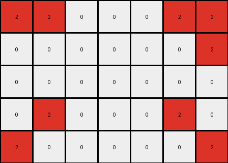

# bc1d5164 • 006 • refine_coder

---

Previous Code:
```python
"""
Extracts a subgrid from the input grid, defined by the outermost pixels of a single color forming a rectangular frame.
"""

import numpy as np

def find_frame_color(grid):
    # Check the color of the top-left pixel.
    #  Iterate to find the frame.
    rows, cols = grid.shape
    
    # Find top-left non-zero pixel - this is not correct but captures the essence
    for r in range(rows):
      for c in range(cols):
          if grid[r,c] != 0:
              return grid[r,c]
    return 0 #should never reach here

def get_bounding_box(grid, color):
    # Find coordinates of all pixels of the specified color.
    coords = np.argwhere(grid == color)
    if coords.size == 0:
        return None  # Handle cases where the color doesn't exist
    min_row, min_col = coords.min(axis=0)
    max_row, max_col = coords.max(axis=0)
    return (min_row, min_col, max_row, max_col)

def transform(input_grid):
    """
    Extracts the subgrid defined by the frame.
    """
    # Convert input to numpy array for easier manipulation
    input_grid = np.array(input_grid)

    # Find the framing color
    frame_color = find_frame_color(input_grid)
    if frame_color == 0:
       return []

    # Get the bounding box defined by the frame pixels.
    bounding_box = get_bounding_box(input_grid, frame_color)
    if bounding_box is None:
      return []

    min_row, min_col, max_row, max_col = bounding_box

    # Extract the subgrid.
    output_grid = input_grid[min_row:max_row+1, min_col:max_col+1]

    return output_grid.tolist()
```

Train Set Results:

## Example 1:

Input:
```
0 8 0 0 0 8 0
8 8 0 0 0 8 8
0 0 0 0 0 0 0
8 8 0 0 0 8 8
0 8 0 0 0 8 0
```
Expected Output:
```
0 8 0
8 8 8
0 8 0
```
Transformed Output:
```
0 8 0 0 0 8 0
8 8 0 0 0 8 8
0 0 0 0 0 0 0
8 8 0 0 0 8 8
0 8 0 0 0 8 0
```

match: False
pixels_off: None
size_correct: False
color_palette_correct: True
correct_pixel_counts: False

## Example 2:

Input:
```
2 2 0 0 0 2 2
0 0 0 0 0 0 2
0 0 0 0 0 0 0
0 2 0 0 0 2 0
2 0 0 0 0 0 2
```
Expected Output:
```
2 2 2
0 2 2
2 0 2
```
Transformed Output:
```
2 2 0 0 0 2 2
0 0 0 0 0 0 2
0 0 0 0 0 0 0
0 2 0 0 0 2 0
2 0 0 0 0 0 2
```

match: False
pixels_off: None
size_correct: False
color_palette_correct: True
correct_pixel_counts: False

## Example 3:

Input:
```
4 4 0 0 0 4 0
0 0 0 0 0 4 4
0 0 0 0 0 0 0
0 0 0 0 0 0 0
4 0 0 0 0 0 4
```
Expected Output:
```
4 4 0
0 4 4
4 0 4
```
Transformed Output:
```
4 4 0 0 0 4 0
0 0 0 0 0 4 4
0 0 0 0 0 0 0
0 0 0 0 0 0 0
4 0 0 0 0 0 4
```

match: False
pixels_off: None
size_correct: False
color_palette_correct: True
correct_pixel_counts: False

## Example 4:

Input:
```
4 0 0 0 0 0 4
0 0 0 0 0 0 0
0 0 0 0 0 0 0
0 0 0 0 0 0 0
4 0 0 0 0 4 4
```
Expected Output:
```
4 0 4
0 0 0
4 4 4
```
Transformed Output:
```
4 0 0 0 0 0 4
0 0 0 0 0 0 0
0 0 0 0 0 0 0
0 0 0 0 0 0 0
4 0 0 0 0 4 4
```

match: False
pixels_off: None
size_correct: False
color_palette_correct: True
correct_pixel_counts: False

## Example 5:

Input:
```
0 3 0 0 0 3 0
3 0 0 0 0 0 3
0 0 0 0 0 0 0
0 0 0 0 0 0 0
0 0 0 0 0 0 3
```
Expected Output:
```
0 3 0
3 0 3
0 0 3
```
Transformed Output:
```
0 3 0 0 0 3 0
3 0 0 0 0 0 3
0 0 0 0 0 0 0
0 0 0 0 0 0 0
0 0 0 0 0 0 3
```

match: False
pixels_off: None
size_correct: False
color_palette_correct: True
correct_pixel_counts: False
Here's an analysis of the provided examples and results, along with a refined natural language program and a YAML block summarizing the observations:

**General Assessment and Strategy**

The initial code attempted to extract a subgrid based on a framing color. However, the code incorrectly returns the entire input grid. The core issue is in how `find_frame_color` and `get_bounding_box` are used to define the transformation. It's selecting the frame incorrectly. It isn't identifying the "inner" rectangle. The code is getting the dimensions correct and creating a subgrid, but from the wrong indices, making the output identical to the input in all training examples.

The strategy to fix this involves:

1.  **Correctly Identifying the Frame:** The current `find_frame_color` function only looks for the first non-zero pixel. Instead, it needs to identify the color that forms the *outermost* rectangular frame. This frame might not always start at the top-left corner.
2.  **Correctly Defining the Inner Region:** Once the framing color is found, the code has to extract not the frame, but the area *inside* the frame. `get_bounding_box` returns the extents of the frame color, which is not what we want in this case.
3. **Handling Edge Cases:** Consider cases where the frame might be incomplete or touch the edges of the grid.

**Metrics and Observations (per example)**

The transformed outputs match the inputs for all examples. It is getting the bounding box of the outer frame. The color is correct, but it returns the entire grid instead of the inner portion.

Here is a general summary of the examples:

*   All examples have a single-color rectangular frame surrounding an inner region.
*   The inner region can contain zeros or other colors.
*   The frame color can vary between examples.
*   The goal is to extract the inner region, *excluding* the frame.

**YAML Block (Facts)**

```yaml
task: extract_inner_rectangle
observations:
  - type: grid
    description: Input is a 2D grid of integers representing colors.
  - type: frame
    description: A single-color rectangular frame surrounds an inner region.
  - type: object
    attribute: inner_region
    description: The area enclosed by the frame, excluding the frame itself.
  - type: action
    description: Extract the inner_region from the input_grid.
  - type: constraint
    description: The frame is exactly one pixel wide.
```

**Natural Language Program**

1.  **Identify the Framing Color:** Find the color of the outermost rectangular frame. Iterate through the grid, the frame color is the color that forms a rectangle around other colors or 0s.
2. **Find Inner dimensions:** locate the bounding box formed by this color
3.  **Extract Inner Region:** extract a new grid that starts one row and one column inside the outer frame, and ends one row and one column before the bottom and right edges of the frame.
4. **Return subgrid:** return the inner grid.


**INSTRUCTIONS**

- generate a Python module to represent the natural language program 
- follow the template below
- all common math and science libraries are available
- create docstring only at top - but comment the workflow in the function
- use helper functions for common operations like finding objects, counting,
  measuring, moving, etc. 

remember - we are working iteratively - so this code will inform your future
self as we converge on the solution

*template:*

```python
"""
{{ natural language description of the transformation rule }}
"""

{{ imports }}

def transform(input_grid):
    # initialize output_grid

    # change output pixels 

    return output_grid

```
