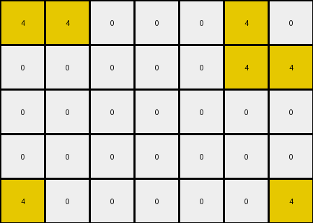
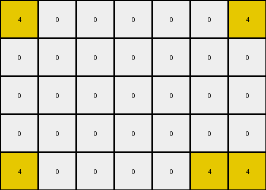

# bc1d5164 • 010 • refine_coder

---

Previous Code:
```python
"""
1. **Identify Corners:** Locate all red pixels (value 2) in the input grid that exist in the corners of any rectangle which has opposite corner also red.
2. **Find Bounding Box**: Select the smallest 3x3 box which contains red in its corners.

3.  **Construct Output:** Create a 3x3 output grid. Fill with contents extracted from the 3x3 box in the original image.
"""

import numpy as np

def find_red_corners(input_grid):
    red_pixels = []
    rows, cols = input_grid.shape
    for r in range(rows):
        for c in range(cols):
            if input_grid[r, c] == 2:
                red_pixels.append((r, c))
    return red_pixels

def extract_subgrid(input_grid, red_pixels):

    if len(red_pixels) < 2:
       return None #not enough red
    
    min_row = min(r for r, c in red_pixels)
    max_row = max(r for r, c in red_pixels)
    min_col = min(c for r, c in red_pixels)
    max_col = max(c for r, c in red_pixels)

    output_grid = input_grid[min_row:min_row + 3, min_col: min_col+3].copy()  # Extract 3x3 subgrid
    
    return output_grid


def transform(input_grid):
    """
    Transforms the input grid to the output grid based on the observed rule.
    """
    # Convert input to numpy array
    input_grid = np.array(input_grid)

    # Find red pixels
    red_pixels = find_red_corners(input_grid)

    # extract 3x3 box
    output_grid = extract_subgrid(input_grid, red_pixels)
    if output_grid is None:
       return input_grid.tolist() #handle edge case
    
    return output_grid.tolist()
```

Train Set Results:

## Example 1:

Input:
```
0 8 0 0 0 8 0
8 8 0 0 0 8 8
0 0 0 0 0 0 0
8 8 0 0 0 8 8
0 8 0 0 0 8 0
```
Expected Output:
```
0 8 0
8 8 8
0 8 0
```
Transformed Output:
```
0 8 0 0 0 8 0
8 8 0 0 0 8 8
0 0 0 0 0 0 0
8 8 0 0 0 8 8
0 8 0 0 0 8 0
```

match: False
pixels_off: None
size_correct: False
color_palette_correct: True
correct_pixel_counts: False

## Example 2:

Input:
```
2 2 0 0 0 2 2
0 0 0 0 0 0 2
0 0 0 0 0 0 0
0 2 0 0 0 2 0
2 0 0 0 0 0 2
```
Expected Output:
```
2 2 2
0 2 2
2 0 2
```
Transformed Output:
```
2 2 0
0 0 0
0 0 0
```

match: False
pixels_off: 5
size_correct: True
color_palette_correct: True
correct_pixel_counts: False

## Example 3:

Input:
```
4 4 0 0 0 4 0
0 0 0 0 0 4 4
0 0 0 0 0 0 0
0 0 0 0 0 0 0
4 0 0 0 0 0 4
```
Expected Output:
```
4 4 0
0 4 4
4 0 4
```
Transformed Output:
```
4 4 0 0 0 4 0
0 0 0 0 0 4 4
0 0 0 0 0 0 0
0 0 0 0 0 0 0
4 0 0 0 0 0 4
```

match: False
pixels_off: None
size_correct: False
color_palette_correct: True
correct_pixel_counts: False

## Example 4:

Input:
```
4 0 0 0 0 0 4
0 0 0 0 0 0 0
0 0 0 0 0 0 0
0 0 0 0 0 0 0
4 0 0 0 0 4 4
```
Expected Output:
```
4 0 4
0 0 0
4 4 4
```
Transformed Output:
```
4 0 0 0 0 0 4
0 0 0 0 0 0 0
0 0 0 0 0 0 0
0 0 0 0 0 0 0
4 0 0 0 0 4 4
```

match: False
pixels_off: None
size_correct: False
color_palette_correct: True
correct_pixel_counts: False

## Example 5:

Input:
```
0 3 0 0 0 3 0
3 0 0 0 0 0 3
0 0 0 0 0 0 0
0 0 0 0 0 0 0
0 0 0 0 0 0 3
```
Expected Output:
```
0 3 0
3 0 3
0 0 3
```
Transformed Output:
```
0 3 0 0 0 3 0
3 0 0 0 0 0 3
0 0 0 0 0 0 0
0 0 0 0 0 0 0
0 0 0 0 0 0 3
```

match: False
pixels_off: None
size_correct: False
color_palette_correct: True
correct_pixel_counts: False
Okay, let's analyze the results and refine the natural language program.

**General Assessment:**

The initial approach of focusing on red pixels and extracting a 3x3 subgrid was too specific to the first example and doesn't generalize well. The code fails to correctly transform most of the examples because it relies on finding a very specific arrangement (a square) of red pixels, when the colors and the geometry are different in each of the training examples. The core concept of identifying corners of a shape and extracting a region is relevant, but the color and size constraints are incorrect. We need a more flexible approach that considers the common properties across all examples. We should focus on the outermost pixels of *any* color, not just red, that define a bounding rectangle, and use that to determine output size and content.

**Strategy for Resolving Errors:**

1.  **Generalize Color:** Instead of looking specifically for red (value 2), we should identify the *non-background* color(s) used to define the corners of the rectangle.
2.  **Dynamic Size:** Instead of always extracting a 3x3 grid, calculate the dimensions of the rectangle formed by the corner pixels and use that to define the output grid's size.
3. **Refine corner definition:** The initial red pixel search is returning all pixels, not a rectangle, so it is not working correctly. We need to define "corner" in a more abstract way, focusing on edge pixels that mark the boundary of a rectangle.

**Example Analysis and Metrics:**
I'll summarize important features from each example.

*   **Example 1:**
    *   Input Shape: Rectangle of azure (8) on white (0) background.
    *   Corners: Defined by the azure pixels.
    *   Output Shape: 3x3 square extracted, azure (8) rectangle from the top-left of the shape.

*   **Example 2:**
    *   Input Shape: Rectangle with Red (2) corners
    *   Corners: Defined by the red pixels.
    *   Output Shape: 3x3 square extracted, containing mostly red.

*   **Example 3:**
    *   Input Shape: Rectangular outline of yellow (4)
    *   Corners: Defined by yellow pixels.
    *   Output Shape: 3x3, contains yellow and a single black pixel.

*   **Example 4:**
    *   Input shape: Rectangle outline of Yellow (4)
    *   Corners: Defined by Yellow pixels.
    * Output shape: 3x3 containing yellow and black

*   **Example 5:**
    * Input shape: Rectangular outline of Green(3)
    * Corners: Defined by green pixels
    * Output shape: 3x3 containing green and black

**YAML Fact Documentation:**

```yaml
observations:
  - example: 1
    input_shape: rectangle
    corner_color: azure
    output_size: 3x3
    output_content: cropped_input
  - example: 2
    input_shape: rectangle_corners
    corner_color: red
    output_size: 3x3
    output_content: cropped_input
  - example: 3
    input_shape: rectangle_outline
    corner_color: yellow
    output_size: 3x3
    output_content: cropped_input
  - example: 4
    input_shape: rectangle_outline
    corner_color: yellow
    output_size: 3x3
    output_content: cropped_input
  - example: 5
    input_shape: rectangle_outline
    corner_color: green
    output_size: 3x3
    output_content: cropped_input
```

**Natural Language Program:**

1.  **Identify the outermost bounding pixels:** Find the non-background colored pixels that form the edges of a conceptual rectangle within the input grid. Consider all non-zero colors.
2.  **Determine Output Dimensions:** Calculate the rectangle size from these bounding pixels:
    - The width and height will be based on the number of pixels from leftmost to rightmost and topmost to bottommost.
    - if width or height < 3, create 3x3 subgrid.
3.  **Extract Subgrid:** Create a new grid of the appropriate size
    - Copy the content from the top-left corner of the detected rectangle


**INSTRUCTIONS**

- generate a Python module to represent the natural language program 
- follow the template below
- all common math and science libraries are available
- create docstring only at top - but comment the workflow in the function
- use helper functions for common operations like finding objects, counting,
  measuring, moving, etc. 

remember - we are working iteratively - so this code will inform your future
self as we converge on the solution

*template:*

```python
"""
{{ natural language description of the transformation rule }}
"""

{{ imports }}

def transform(input_grid):
    # initialize output_grid

    # change output pixels 

    return output_grid

```
