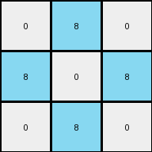
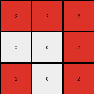
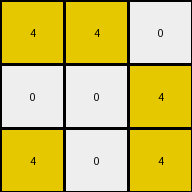
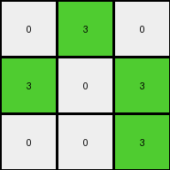

# bc1d5164 • 017 • refine_dreamer

---


Previous Code:
```python
"""
The transformation rule identifies the outermost pixels of a non-zero color in the input grid and maps them onto a 3x3 output grid, preserving their relative positions. The remaining cells in the output grid are filled with white (0) pixels.
"""

import numpy as np

def get_outermost_pixels(input_grid):
    input_grid = np.array(input_grid)
    rows, cols = input_grid.shape
    outermost_pixels = []
    outermost_color = 0

    for r in range(rows):
        for c in range(cols):
            if (r == 0 or r == rows - 1 or c == 0 or c == cols - 1) and input_grid[r, c] != 0:
                if outermost_color == 0:
                  outermost_color = input_grid[r,c]
                outermost_pixels.append((r, c))
    return outermost_pixels, outermost_color

def transform(input_grid):
    """
    Transforms the input grid according to the rule: extracts outermost pixels,
    places them on 3x3 grid, and fills the rest with '0's.
    """
    outermost_pixels, outermost_color = get_outermost_pixels(input_grid)
    output_grid = np.zeros((3, 3), dtype=int)

    # Map outermost pixels to output grid based on relative position
    num_pixels = len(outermost_pixels)

    if num_pixels > 0:
        # get corners
        min_row = min(outermost_pixels, key=lambda item: item[0])[0]
        max_row = max(outermost_pixels, key=lambda item: item[0])[0]
        min_col = min(outermost_pixels, key=lambda item: item[1])[1]
        max_col = max(outermost_pixels, key=lambda item: item[1])[1]

        for r, c in outermost_pixels:
            # map corners
            if r == min_row and c == min_col:
                output_grid[0, 0] = outermost_color
            elif r == min_row and c == max_col:
                output_grid[0, 2] = outermost_color
            elif r == max_row and c == min_col:
                output_grid[2, 0] = outermost_color
            elif r == max_row and c == max_col:
                output_grid[2, 2] = outermost_color
            # map edges
            elif r == min_row:
                output_grid[0, 1] = outermost_color
            elif r == max_row:
                output_grid[2, 1] = outermost_color
            elif c == min_col:
                output_grid[1, 0] = outermost_color
            elif c == max_col:
                output_grid[1, 2] = outermost_color
            else: # center, should not happen, but...
                output_grid[1,1] = outermost_color

    return output_grid.tolist()
```

Train Set Results:

## Example 1:

Input:
```
0 8 0 0 0 8 0
8 8 0 0 0 8 8
0 0 0 0 0 0 0
8 8 0 0 0 8 8
0 8 0 0 0 8 0
```
Expected Output:
```
0 8 0
8 8 8
0 8 0
```
Transformed Output:
```
0 8 0
8 0 8
0 8 0
```

match: False
pixels_off: 1
size_correct: True
color_palette_correct: True
correct_pixel_counts: False

## Example 2:

Input:
```
2 2 0 0 0 2 2
0 0 0 0 0 0 2
0 0 0 0 0 0 0
0 2 0 0 0 2 0
2 0 0 0 0 0 2
```
Expected Output:
```
2 2 2
0 2 2
2 0 2
```
Transformed Output:
```
2 2 2
0 0 2
2 0 2
```

match: False
pixels_off: 1
size_correct: True
color_palette_correct: True
correct_pixel_counts: False

## Example 3:

Input:
```
4 4 0 0 0 4 0
0 0 0 0 0 4 4
0 0 0 0 0 0 0
0 0 0 0 0 0 0
4 0 0 0 0 0 4
```
Expected Output:
```
4 4 0
0 4 4
4 0 4
```
Transformed Output:
```
4 4 0
0 0 4
4 0 4
```

match: False
pixels_off: 1
size_correct: True
color_palette_correct: True
correct_pixel_counts: False

## Example 4:

Input:
```
4 0 0 0 0 0 4
0 0 0 0 0 0 0
0 0 0 0 0 0 0
0 0 0 0 0 0 0
4 0 0 0 0 4 4
```
Expected Output:
```
4 0 4
0 0 0
4 4 4
```
Transformed Output:
```
4 0 4
0 0 0
4 4 4
```

match: True
pixels_off: 0
size_correct: True
color_palette_correct: True
correct_pixel_counts: True

## Example 5:

Input:
```
0 3 0 0 0 3 0
3 0 0 0 0 0 3
0 0 0 0 0 0 0
0 0 0 0 0 0 0
0 0 0 0 0 0 3
```
Expected Output:
```
0 3 0
3 0 3
0 0 3
```
Transformed Output:
```
0 3 0
3 0 3
0 0 3
```

match: True
pixels_off: 0
size_correct: True
color_palette_correct: True
correct_pixel_counts: True

**INSTRUCTIONS**

The code above was generated based on observations from the first training
example

we have tested the transform function on each of the task example inputs and
compared with the expected output

review each of the examples provided and the results and consider how the
natural language program should be updated to accommodate this new knowledge

respond with the following deliverables:

- general assessment of the information provided and strategy for resolving the
  errors
- gather metrics about each of the examples and results - use code_execution to
  develop accurate reports on your assumptions
- a YAML block documenting facts - Focus on identifying objects, their properties, and the actions performed on them.
- a natural language program - Be as clear and concise as possible, providing a complete description of the transformation rule.


your responses should be considered as information in a report - not a
conversation
