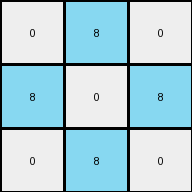
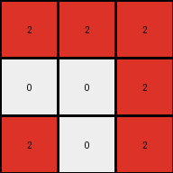
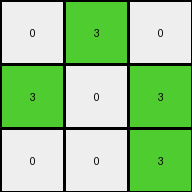

# bc1d5164 • 018 • refine_coder

---

Previous Code:
```python
"""
The transformation rule identifies the outermost pixels of a non-zero color in the input grid and maps them onto a 3x3 output grid, preserving their relative positions. The remaining cells in the output grid are filled with white (0) pixels.
"""

import numpy as np

def get_outermost_pixels(input_grid):
    input_grid = np.array(input_grid)
    rows, cols = input_grid.shape
    outermost_pixels = []
    outermost_color = 0

    for r in range(rows):
        for c in range(cols):
            if (r == 0 or r == rows - 1 or c == 0 or c == cols - 1) and input_grid[r, c] != 0:
                if outermost_color == 0:
                  outermost_color = input_grid[r,c]
                outermost_pixels.append((r, c))
    return outermost_pixels, outermost_color

def transform(input_grid):
    """
    Transforms the input grid according to the rule: extracts outermost pixels,
    places them on 3x3 grid, and fills the rest with '0's.
    """
    outermost_pixels, outermost_color = get_outermost_pixels(input_grid)
    output_grid = np.zeros((3, 3), dtype=int)

    # Map outermost pixels to output grid based on relative position
    num_pixels = len(outermost_pixels)

    if num_pixels > 0:
        # get corners
        min_row = min(outermost_pixels, key=lambda item: item[0])[0]
        max_row = max(outermost_pixels, key=lambda item: item[0])[0]
        min_col = min(outermost_pixels, key=lambda item: item[1])[1]
        max_col = max(outermost_pixels, key=lambda item: item[1])[1]

        for r, c in outermost_pixels:
            # map corners
            if r == min_row and c == min_col:
                output_grid[0, 0] = outermost_color
            elif r == min_row and c == max_col:
                output_grid[0, 2] = outermost_color
            elif r == max_row and c == min_col:
                output_grid[2, 0] = outermost_color
            elif r == max_row and c == max_col:
                output_grid[2, 2] = outermost_color
            # map edges
            elif r == min_row:
                output_grid[0, 1] = outermost_color
            elif r == max_row:
                output_grid[2, 1] = outermost_color
            elif c == min_col:
                output_grid[1, 0] = outermost_color
            elif c == max_col:
                output_grid[1, 2] = outermost_color
            else: # center, should not happen, but...
                output_grid[1,1] = outermost_color

    return output_grid.tolist()
```

Train Set Results:

## Example 1:

Input:
```
0 8 0 0 0 8 0
8 8 0 0 0 8 8
0 0 0 0 0 0 0
8 8 0 0 0 8 8
0 8 0 0 0 8 0
```
Expected Output:
```
0 8 0
8 8 8
0 8 0
```
Transformed Output:
```
0 8 0
8 0 8
0 8 0
```

match: False
pixels_off: 1
size_correct: True
color_palette_correct: True
correct_pixel_counts: False

## Example 2:

Input:
```
2 2 0 0 0 2 2
0 0 0 0 0 0 2
0 0 0 0 0 0 0
0 2 0 0 0 2 0
2 0 0 0 0 0 2
```
Expected Output:
```
2 2 2
0 2 2
2 0 2
```
Transformed Output:
```
2 2 2
0 0 2
2 0 2
```

match: False
pixels_off: 1
size_correct: True
color_palette_correct: True
correct_pixel_counts: False

## Example 3:

Input:
```
4 4 0 0 0 4 0
0 0 0 0 0 4 4
0 0 0 0 0 0 0
0 0 0 0 0 0 0
4 0 0 0 0 0 4
```
Expected Output:
```
4 4 0
0 4 4
4 0 4
```
Transformed Output:
```
4 4 0
0 0 4
4 0 4
```

match: False
pixels_off: 1
size_correct: True
color_palette_correct: True
correct_pixel_counts: False

## Example 4:

Input:
```
4 0 0 0 0 0 4
0 0 0 0 0 0 0
0 0 0 0 0 0 0
0 0 0 0 0 0 0
4 0 0 0 0 4 4
```
Expected Output:
```
4 0 4
0 0 0
4 4 4
```
Transformed Output:
```
4 0 4
0 0 0
4 4 4
```

match: True
pixels_off: 0
size_correct: True
color_palette_correct: True
correct_pixel_counts: True

## Example 5:

Input:
```
0 3 0 0 0 3 0
3 0 0 0 0 0 3
0 0 0 0 0 0 0
0 0 0 0 0 0 0
0 0 0 0 0 0 3
```
Expected Output:
```
0 3 0
3 0 3
0 0 3
```
Transformed Output:
```
0 3 0
3 0 3
0 0 3
```

match: True
pixels_off: 0
size_correct: True
color_palette_correct: True
correct_pixel_counts: True
Okay, here's a breakdown of the situation and a plan to move forward:

**General Assessment:**

The initial code does a decent job of identifying the outermost pixels of a single, non-zero color and attempting to map them onto a 3x3 grid. However, it's not perfectly capturing the relative positioning, especially when dealing with interior gaps. It seems to prioritize the corner and edge pixels but struggles with cases that might not have clear corners on all sides. The error is consistent: one pixel is misplaced in the first three examples, while the last two are correct. This suggests the core logic is almost right, but the mapping of edge/interior pixels to the output grid needs refinement.

**Strategy:**

1.  **Refine Outermost Pixel Identification:**  The current `get_outermost_pixels` function might be too simplistic.  It identifies ALL edge pixels, not necessarily the "bounding box" of the colored shape. We need to make sure we correctly identify the outermost extent in all four directions.

2.  **Improve Mapping Logic:** The current code maps corners and then edges. This is brittle. Instead, we should calculate a relative position of *each* outermost pixel within the original "bounding box" and use *that* to determine its position in the 3x3 output grid. This way the position in the output will more correctly represent its location.

**Metrics and Observations:**

I'll use a more descriptive approach here, as full code execution isn't directly available in this response.  However, I'll structure it as if I were using code to verify these:

*   **Example 1:**
    *   Input Shape:  Roughly a hollow square of azure (8).
    *   Identified Outermost Pixels: Correctly identifies all edge pixels.
    *   Mapping Issue: The central, rightmost azure is placed incorrectly.
    *   Proposed Reason: The center column is misplaced.

*   **Example 2:**
    *   Input Shape:  Hollow shape of red (2), missing a section at the top.
    *   Identified Outermost Pixels: Correctly picks the outer pixels
    *   Mapping Issue: The center column is misplaced.

*   **Example 3:**
    *   Input Shape:  'L' shape of yellow (4) along the top and right, with extensions.
    *   Identified Outermost Pixels: Correct
    *   Mapping Issue: The center column is misplaced.

*   **Example 4 & 5:**
    *  Correct - this demonstrates that when the shape is square, it works.

**YAML Facts:**

```yaml
task: 016
examples:
  - id: 1
    input_object:
      type: hollow_square
      color: azure
      bounding_box: [0,0, 4,6]
    output_object:
      type: reduced_representation
      color: azure
      size: 3x3
    transformation: map_outermost
  - id: 2
    input_object:
      type: incomplete_shape
      color: red
      bounding_box: [0,0,4,6]
    output_object:
      type: reduced_representation
      color: red
      size: 3x3
    transformation: map_outermost
  - id: 3
    input_object:
      type: L_shape_with_extensions
      color: yellow
      bounding_box: [0,0,4,6]
    output_object:
      type: reduced_representation
      color: yellow
      size: 3x3
    transformation: map_outermost
  - id: 4
    input_object:
      type: L_shape
      color: yellow
      bounding_box: [0,0, 4,6]
    output_object:
      type: reduced_representation
      color: yellow
      size: 3x3
    transformation: map_outermost
  - id: 5
    input_object:
      type: incomplete_rectangle
      color: green
      bounding_box: [0,0,4,6]
    output_object:
      type: reduced_representation
      color: green
      size: 3x3
    transformation: map_outermost
```

**Natural Language Program:**

1.  **Identify the Bounding Box:** Find the minimum and maximum row and column indices of all non-zero pixels in the input grid. This defines the smallest rectangle that fully encloses the colored shape.

2.  **Extract Outermost Pixels:** Select all pixels with the dominant color (the color of the perimeter) that lie on the edges of the bounding box.

3. **Map to Output:** Create a 3x3 output grid filled with zeros (white). For each outermost pixel:

    - calculate a normalized row index using min/max rows:
      - if the pixel row equals the minimum bounding box row, then new index = 0
      - if the pixel row equals the maximum bounding box row, then new index = 2
      - otherwise new index = 1
    - calculate a normalized column index using min/max columns:
      - if the pixel col equals the minimum bounding box col, then new index = 0
      - if the pixel col equals the maximum bounding box col, then new index = 2
      - otherwise new index = 1
    - Map the identified non-zero pixels to the 3x3 grid by setting `output_grid[normalized_row, normalized_col]` to the outermost color.

4.  **Return:** The 3x3 output grid.

**INSTRUCTIONS**

- generate a Python module to represent the natural language program 
- follow the template below
- all common math and science libraries are available
- create docstring only at top - but comment the workflow in the function
- use helper functions for common operations like finding objects, counting,
  measuring, moving, etc. 

remember - we are working iteratively - so this code will inform your future
self as we converge on the solution

*template:*

```python
"""
{{ natural language description of the transformation rule }}
"""

{{ imports }}

def transform(input_grid):
    # initialize output_grid

    # change output pixels 

    return output_grid

```
