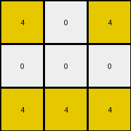

# bc1d5164 • 021 • refine_dreamer

---

Previous Code:
```python
"""
1.  **Identify** all pixels with the color yellow (value 4) in the input grid.
2.  **Determine** the bounding box that encompasses all yellow pixels. Or, determine maximum and minimum row/column.
3. **Create** a new output grid with dimensions that, relatively speaking, capture the yellow pixels in a minimal bounding box.
4. **Map** the positions of the identified yellow pixels from the input grid to the output grid. Preserve position *relative to the minimal bounding box.*
5.  **Fill** all other cells in the output grid with the color white (value 0). Essentially, the bounding box created in (2.) is fit into 3x3 grid.
"""

import numpy as np

def get_yellow_pixels(grid):
    # find coordinates of yellow pixels
    yellow_pixels = []
    for row_index, row in enumerate(grid):
        for col_index, pixel in enumerate(row):
            if pixel == 4:
                yellow_pixels.append((row_index, col_index))
    return yellow_pixels

def transform(input_grid):
    """Transforms the input grid by extracting yellow pixels and placing them in a 3x3 grid."""

    # Convert input to numpy array
    input_grid = np.array(input_grid)
    
    # 1. Identify all yellow pixels.
    yellow_pixels = get_yellow_pixels(input_grid)

    # 2. Determine the bounding box (min/max row/col).
    if not yellow_pixels:  # Handle the case where there are no yellow pixels
        return np.zeros((3, 3), dtype=int)

    min_row, min_col = yellow_pixels[0]
    max_row, max_col = yellow_pixels[0]

    for row, col in yellow_pixels:
        min_row = min(min_row, row)
        max_row = max(max_row, row)
        min_col = min(min_col, col)
        max_col = max(max_col, col)

    # 3. Create a 3x3 output grid initialized with white (0).
    output_grid = np.zeros((3, 3), dtype=int)

    # 4. Map yellow pixel positions to the output grid.
    for row, col in yellow_pixels:
        # Normalize row and col positions to the range [0, 2]
        norm_row = int(((row - min_row) / (max_row - min_row)) * 2) if (max_row - min_row) > 0 else 0
        norm_col = int(((col - min_col) / (max_col - min_col)) * 2) if (max_col - min_col) > 0 else 0

        # Place the yellow pixel in output
        output_grid[norm_row, norm_col] = 4

    # 5. Output grid is already filled with 0s (white).
    return output_grid
```

Train Set Results:

## Example 1:

Input:
```
0 8 0 0 0 8 0
8 8 0 0 0 8 8
0 0 0 0 0 0 0
8 8 0 0 0 8 8
0 8 0 0 0 8 0
```
Expected Output:
```
0 8 0
8 8 8
0 8 0
```
Transformed Output:
```
0 0 0
0 0 0
0 0 0
```

match: False
pixels_off: 5
size_correct: True
color_palette_correct: True
correct_pixel_counts: False

## Example 2:

Input:
```
2 2 0 0 0 2 2
0 0 0 0 0 0 2
0 0 0 0 0 0 0
0 2 0 0 0 2 0
2 0 0 0 0 0 2
```
Expected Output:
```
2 2 2
0 2 2
2 0 2
```
Transformed Output:
```
0 0 0
0 0 0
0 0 0
```

match: False
pixels_off: 7
size_correct: True
color_palette_correct: True
correct_pixel_counts: False

## Example 3:

Input:
```
4 4 0 0 0 4 0
0 0 0 0 0 4 4
0 0 0 0 0 0 0
0 0 0 0 0 0 0
4 0 0 0 0 0 4
```
Expected Output:
```
4 4 0
0 4 4
4 0 4
```
Transformed Output:
```
4 4 4
0 0 0
4 0 4
```

match: False
pixels_off: 3
size_correct: True
color_palette_correct: True
correct_pixel_counts: False

## Example 4:

Input:
```
4 0 0 0 0 0 4
0 0 0 0 0 0 0
0 0 0 0 0 0 0
0 0 0 0 0 0 0
4 0 0 0 0 4 4
```
Expected Output:
```
4 0 4
0 0 0
4 4 4
```
Transformed Output:
```
4 0 4
0 0 0
4 4 4
```

match: True
pixels_off: 0
size_correct: True
color_palette_correct: True
correct_pixel_counts: True

## Example 5:

Input:
```
0 3 0 0 0 3 0
3 0 0 0 0 0 3
0 0 0 0 0 0 0
0 0 0 0 0 0 0
0 0 0 0 0 0 3
```
Expected Output:
```
0 3 0
3 0 3
0 0 3
```
Transformed Output:
```
0 0 0
0 0 0
0 0 0
```

match: False
pixels_off: 4
size_correct: True
color_palette_correct: True
correct_pixel_counts: False
**INSTRUCTIONS**

The code above was generated based on observations from the first training
example

we have tested the transform function on each of the task example inputs and
compared with the expected output

review each of the examples provided and the results and consider how the
natural language program should be updated to accommodate this new knowledge

respond with the following deliverables:

- general assessment of the information provided and strategy for resolving the
  errors
- gather metrics about each of the examples and results - use code_execution to
  develop accurate reports on your assumptions
- a YAML block documenting facts - Focus on identifying objects, their properties, and the actions performed on them.
- a natural language program - Be as clear and concise as possible, providing a complete description of the transformation rule.


your responses should be considered as information in a report - not a
conversation
