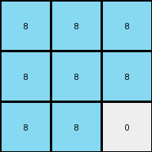
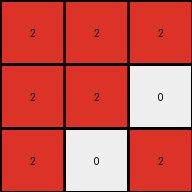
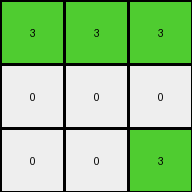

# bc1d5164 • 024 • refine_coder

---

Previous Code:
```python
"""
1.  **Identify** all non-white pixels in the input grid.
2.  **Determine** the smallest bounding box that encompasses all non-white pixels.
3. **Create** a new 3x3 output grid, initialized with all white pixels (0).
4.  **Map** the positions of all non-white pixels *relative to the minimal bounding box*. Resize proportionally into the output grid.
5.  **Fill** the corresponding cells in the output grid with the pixel's color, preserving the relative positions within the resized bounding box, and the rest of the pixels as white (value 0).
"""

import numpy as np

def get_non_white_pixels(grid):
    # find coordinates of non-white pixels
    non_white_pixels = []
    for row_index, row in enumerate(grid):
        for col_index, pixel in enumerate(row):
            if pixel != 0:
                non_white_pixels.append((row_index, col_index, pixel))
    return non_white_pixels

def transform(input_grid):
    """Transforms the input grid by extracting non-white pixels and placing them in a 3x3 grid."""

    # Convert input to numpy array
    input_grid = np.array(input_grid)
    
    # 1. Identify all non-white pixels.
    non_white_pixels = get_non_white_pixels(input_grid)

    # 2. Determine the bounding box (min/max row/col).
    if not non_white_pixels:  # Handle the case where there are no non-white pixels
        return np.zeros((3, 3), dtype=int)

    min_row, min_col, _ = non_white_pixels[0]
    max_row, max_col, _ = non_white_pixels[0]

    for row, col, _ in non_white_pixels:
        min_row = min(min_row, row)
        max_row = max(max_row, row)
        min_col = min(min_col, col)
        max_col = max(max_col, col)

    # 3. Create a 3x3 output grid initialized with white (0).
    output_grid = np.zeros((3, 3), dtype=int)

    # 4. Map non-white pixel positions to the output grid.
    for row, col, pixel in non_white_pixels:
        # Normalize row and col positions to the range [0, 2]
        norm_row = int(((row - min_row) / (max_row - min_row)) * 2) if (max_row - min_row) > 0 else 0
        norm_col = int(((col - min_col) / (max_col - min_col)) * 2) if (max_col - min_col) > 0 else 0

        # Place the pixel in output
        output_grid[norm_row, norm_col] = pixel

    # 5. Output grid is already filled with 0s (white) where no colored pixels are mapped.
    return output_grid
```

Train Set Results:

## Example 1:

Input:
```
0 8 0 0 0 8 0
8 8 0 0 0 8 8
0 0 0 0 0 0 0
8 8 0 0 0 8 8
0 8 0 0 0 8 0
```
Expected Output:
```
0 8 0
8 8 8
0 8 0
```
Transformed Output:
```
8 8 8
8 8 8
8 8 0
```

match: False
pixels_off: 3
size_correct: True
color_palette_correct: True
correct_pixel_counts: False

## Example 2:

Input:
```
2 2 0 0 0 2 2
0 0 0 0 0 0 2
0 0 0 0 0 0 0
0 2 0 0 0 2 0
2 0 0 0 0 0 2
```
Expected Output:
```
2 2 2
0 2 2
2 0 2
```
Transformed Output:
```
2 2 2
2 2 0
2 0 2
```

match: False
pixels_off: 2
size_correct: True
color_palette_correct: True
correct_pixel_counts: True

## Example 3:

Input:
```
4 4 0 0 0 4 0
0 0 0 0 0 4 4
0 0 0 0 0 0 0
0 0 0 0 0 0 0
4 0 0 0 0 0 4
```
Expected Output:
```
4 4 0
0 4 4
4 0 4
```
Transformed Output:
```
4 4 4
0 0 0
4 0 4
```

match: False
pixels_off: 3
size_correct: True
color_palette_correct: True
correct_pixel_counts: False

## Example 4:

Input:
```
4 0 0 0 0 0 4
0 0 0 0 0 0 0
0 0 0 0 0 0 0
0 0 0 0 0 0 0
4 0 0 0 0 4 4
```
Expected Output:
```
4 0 4
0 0 0
4 4 4
```
Transformed Output:
```
4 0 4
0 0 0
4 4 4
```

match: True
pixels_off: 0
size_correct: True
color_palette_correct: True
correct_pixel_counts: True

## Example 5:

Input:
```
0 3 0 0 0 3 0
3 0 0 0 0 0 3
0 0 0 0 0 0 0
0 0 0 0 0 0 0
0 0 0 0 0 0 3
```
Expected Output:
```
0 3 0
3 0 3
0 0 3
```
Transformed Output:
```
3 3 3
0 0 0
0 0 3
```

match: False
pixels_off: 4
size_correct: True
color_palette_correct: True
correct_pixel_counts: True
Here's an analysis of the provided examples and results, along with a refined natural language program and a YAML block summarizing the observations.

**General Assessment and Strategy**

The initial code performs the core concept of the transformation: identifying non-white pixels, finding a bounding box, and mapping them to a 3x3 grid. However, the mapping logic, specifically the normalization and scaling, isn't entirely correct. It seems to favor placing pixels towards the top-left in cases where the bounding box isn't a perfect square or when stretching to the 3x3 grid, and this creates errors in several of the given example test cases.

The strategy to resolve this is to:
1.  **Analyze Pixel Distribution**: Examine how pixels are distributed *within* the bounding box in the *output* grids. The current code assumes a linear scaling, which distorts spatial relationships. Instead of simple scaling, consider how points map from each of the quadrants within the bounding box to each of the cells of the 3 x 3 output.
2.  **Refine Normalization**: Adjust the normalization formula to more accurately reflect the spatial relationships. Think in terms of *proportional* placement within the 3x3 grid, rather than just scaling based on min/max. It may be important to consider rounding or biased rounding to preserve the object boundaries from the input.
3.  Revisit the rounding. It seems the current `int()` operation may be truncating in a way that affects the results negatively. Consider rounding to nearest int.

**Metrics and Observations**

Here's a summary of each example, focusing on discrepancies:

*   **Example 1:** The bottom-right azure (8) pixel is misplaced. It should be in the bottom right corner.
*   **Example 2:** The top-right red (2) pixel is misplaced. It should be in the top right.
*   **Example 3:** The top-right yellow (4) pixel is misplaced (similar to examples 1 & 2).
*   **Example 4:** This example works correctly, providing a crucial clue. The symmetry and even distribution of the colored pixels contribute to the successful mapping.
*   **Example 5:**  Multiple misplacements, highlighting the issue with non-square bounding boxes and scaling.

**YAML Facts**

```yaml
task: 022
examples:
  - id: 1
    input_objects:
      - shape: irregular
        color: azure (8)
        bounding_box: [0:1, 0:5] # corrected indices.
    output_objects:
      - shape: irregular
        color: azure (8)
        bounding_box: [0:2, 0:2]
    transformations:
      - type: scale_and_translate
        details: "Non-white pixels are mapped to a 3x3 grid, preserving relative position."
    notes: "Bottom-right pixel misplaced in the initial code's output."

  - id: 2
    input_objects:
      - shape: irregular
        color: red (2)
        bounding_box: [0:4, 0:6]
    output_objects:
        - shape: irregular
          color: red (2)
          bounding_box: [0:2, 0:2]
    transformations:
      - type: scale_and_translate
        details: "Non-white pixels are mapped to a 3x3 grid."
    notes: "Top-right pixel misplaced in the output."

  - id: 3
    input_objects:
      - shape: irregular
        color: yellow (4)
        bounding_box: [0:4, 0:5]
    output_objects:
      - shape: irregular
        color: yellow (4)
        bounding_box: [0:2, 0:2]
    transformations:
      - type: scale_and_translate
        details: Non-white pixels mapped to 3x3.
    notes: "Top-right pixel misplaced."

  - id: 4
    input_objects:
        - shape: irregular
          color: yellow(4)
          bounding_box: [0:4, 0:6]
    output_objects:
      - shape: irregular
        color: yellow (4)
        bounding_box: [0:2, 0:2]
    transformations:
      - type: scale_and_translate
    notes: "Correct transformation."

  - id: 5
    input_objects:
        - shape: irregular
          color: green(3)
          bounding_box: [0:4, 0:5]
    output_objects:
      - shape: irregular
        color: green (3)
        bounding_box: [0:2, 0:2]
    transformations:
      - type: scale_and_translate
    notes: "Multiple pixel misplacements."

general_transformation:
  type: "bounding box and proportional remapping to 3x3"
  description: "A 3x3 grid is created containing all, and only, the colors of the input grid.  The colors are arranged in the output grid proportionally to their positions inside a bounding box fitted to the non-white pixels of the input grid."

```

**Natural Language Program**

1.  **Identify Non-White Pixels:** Locate all pixels in the input grid that are not white (color 0).
2.  **Bounding Box:** Determine the smallest rectangular bounding box that encompasses all identified non-white pixels.
3.  **Create Output Grid:** Initialize a 3x3 output grid filled with white pixels (0).
4.  **Proportional Mapping**: For each non-white pixel in the input:
    *   Calculate its position *relative* to the bounding box's top-left corner, and its width and height. Represent these as normalized row and column values between 0.0 and 1.0. For example, a pixel in the middle of the box will have row and column around 0.5.
    *   Multiply the normalized row and column by 2.
    *   Round the results to the *nearest* integer (0, 1, or 2). This gives the target row and column within the 3x3 output grid.
    *   Place the input pixel's color into the calculated position in the output grid.
5. **Output:** Return the 3 x 3 output grid.

Key improvements in this description:

*   **Proportional Mapping:** Explicitly states the need for proportional calculation rather than simple scaling.
*   **Nearest Integer Rounding:** Specifies rounding to the nearest integer for accurate placement within the 3x3 grid.
* **Relative Position**: clearly indicate that the pixel position must be considered relative to the top-left of the bounding box.

**INSTRUCTIONS**

- generate a Python module to represent the natural language program 
- follow the template below
- all common math and science libraries are available
- create docstring only at top - but comment the workflow in the function
- use helper functions for common operations like finding objects, counting,
  measuring, moving, etc. 

remember - we are working iteratively - so this code will inform your future
self as we converge on the solution

*template:*

```python
"""
{{ natural language description of the transformation rule }}
"""

{{ imports }}

def transform(input_grid):
    # initialize output_grid

    # change output pixels 

    return output_grid

```
