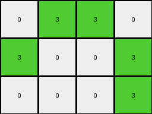

# bc1d5164 • 027 • refine_dreamer

---


Previous Code:
```python
"""
The transformation extracts columns and rows from the input grid that contain at least one green (3) cell, discarding others to construct the output grid.
"""

import numpy as np

def get_rows_with_value(grid, value):
    """
    Returns a list of row indices that contain at least one cell with the specified value.
    """
    rows = []
    for i, row in enumerate(grid):
        if value in row:
            rows.append(i)
    return rows

def get_cols_with_value(grid, value):
    """
    Returns a list of column indices that contain at least one cell with the specified value.
    """
    return get_rows_with_value(grid.T, value)

def extract_rows(grid, row_indices):
    """Extracts specific rows from a grid, based on row indices."""
    return grid[row_indices]


def extract_cols(grid, col_indices):
    """Extracts specific columns from a grid, based on column indices."""

    return grid[:, col_indices]

def transform(input_grid):
    """
    Transforms the input grid by extracting rows and columns that contain the value '3'.
    """
    # Convert to numpy array for easier manipulation
    input_grid = np.array(input_grid)

    # 1. Identify Columns with '3's
    cols_with_3 = get_cols_with_value(input_grid, 3)

    # 2. Extract those columns
    intermediate_grid = extract_cols(input_grid, cols_with_3)

    # 3. Identify rows with '3's in the modified grid
    rows_with_3 = get_rows_with_value(intermediate_grid, 3)

    # 4. Extract those rows.
    output_grid = extract_rows(intermediate_grid, rows_with_3)

    return output_grid.tolist()
```

Train Set Results:

## Example 1:

Input:
```
0 8 0 0 0 8 0
8 8 0 0 0 8 8
0 0 0 0 0 0 0
8 8 0 0 0 8 8
0 8 0 0 0 8 0
```
Expected Output:
```
0 8 0
8 8 8
0 8 0
```
Transformed Output:
```

```

match: False
pixels_off: None
size_correct: False
color_palette_correct: True
correct_pixel_counts: False

## Example 2:

Input:
```
2 2 0 0 0 2 2
0 0 0 0 0 0 2
0 0 0 0 0 0 0
0 2 0 0 0 2 0
2 0 0 0 0 0 2
```
Expected Output:
```
2 2 2
0 2 2
2 0 2
```
Transformed Output:
```

```

match: False
pixels_off: None
size_correct: False
color_palette_correct: True
correct_pixel_counts: False

## Example 3:

Input:
```
4 4 0 0 0 4 0
0 0 0 0 0 4 4
0 0 0 0 0 0 0
0 0 0 0 0 0 0
4 0 0 0 0 0 4
```
Expected Output:
```
4 4 0
0 4 4
4 0 4
```
Transformed Output:
```

```

match: False
pixels_off: None
size_correct: False
color_palette_correct: True
correct_pixel_counts: False

## Example 4:

Input:
```
4 0 0 0 0 0 4
0 0 0 0 0 0 0
0 0 0 0 0 0 0
0 0 0 0 0 0 0
4 0 0 0 0 4 4
```
Expected Output:
```
4 0 4
0 0 0
4 4 4
```
Transformed Output:
```

```

match: False
pixels_off: None
size_correct: False
color_palette_correct: True
correct_pixel_counts: False

## Example 5:

Input:
```
0 3 0 0 0 3 0
3 0 0 0 0 0 3
0 0 0 0 0 0 0
0 0 0 0 0 0 0
0 0 0 0 0 0 3
```
Expected Output:
```
0 3 0
3 0 3
0 0 3
```
Transformed Output:
```
0 3 3 0
3 0 0 3
0 0 0 3
```

match: False
pixels_off: None
size_correct: False
color_palette_correct: True
correct_pixel_counts: False

**INSTRUCTIONS**

The code above was generated based on observations from the first training
example

we have tested the transform function on each of the task example inputs and
compared with the expected output

review each of the examples provided and the results and consider how the
natural language program should be updated to accommodate this new knowledge

respond with the following deliverables:

- general assessment of the information provided and strategy for resolving the
  errors
- gather metrics about each of the examples and results - use code_execution to
  develop accurate reports on your assumptions
- a YAML block documenting facts - Focus on identifying objects, their properties, and the actions performed on them.
- a natural language program - Be as clear and concise as possible, providing a complete description of the transformation rule.


your responses should be considered as information in a report - not a
conversation
