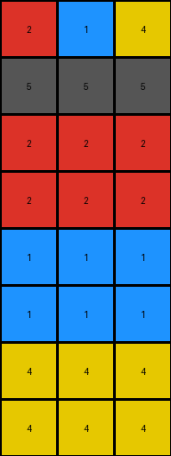

# bd4472b8 • 003 • refine_dreamer

---


Previous Code:
```python
"""
The transformation rule is to replicate each color from the first row of the input grid twice, creating new rows with those colors. The second row of the input is copied unchanged.
"""

import numpy as np

def get_pattern_region(input_grid):
    # Find the last row with a non-zero value to define pattern region height.
    last_non_zero_row = -1
    for i in range(input_grid.shape[0]):
        if np.any(input_grid[i, :] != 0):
            last_non_zero_row = i
        else:
            break # stop looking after a row of zeros

    return input_grid[:last_non_zero_row+1, :]

def transform(input_grid):
    """Transforms the input grid according to the described rule."""

    # Identify the pattern region (rows with non-zero values at the top).
    pattern_region = get_pattern_region(input_grid)
    #print(f"{pattern_region=}")

    # Initialize the output grid with zeros, same dimensions as input.
    output_grid = np.zeros_like(input_grid)

    # Copy the original pattern region to the top of the output grid.
    output_grid[:pattern_region.shape[0], :] = pattern_region

    # Current row index in output grid to start adding replicated rows.
    current_row = pattern_region.shape[0]
    #print(f"{current_row=}")
    # Replicate colors from the first row.

    if pattern_region.shape[0] > 0:
        for color in pattern_region[0, :]:
            for _ in range(2):  # Create two copies of each color.
                output_grid[current_row, :] = color
                current_row += 1

    return output_grid
```

Train Set Results:

## Example 1:

Input:
```
2 1 4
5 5 5
0 0 0
0 0 0
0 0 0
0 0 0
0 0 0
0 0 0
```
Expected Output:
```
2 1 4
5 5 5
2 2 2
1 1 1
4 4 4
2 2 2
1 1 1
4 4 4
```
Transformed Output:
```
2 1 4
5 5 5
2 2 2
2 2 2
1 1 1
1 1 1
4 4 4
4 4 4
```

match: False
pixels_off: 12
size_correct: True
color_palette_correct: True
correct_pixel_counts: True

## Example 2:

Input:
```
3 2 1 4
5 5 5 5
0 0 0 0
0 0 0 0
0 0 0 0
0 0 0 0
0 0 0 0
0 0 0 0
0 0 0 0
0 0 0 0
```
Expected Output:
```
3 2 1 4
5 5 5 5
3 3 3 3
2 2 2 2
1 1 1 1
4 4 4 4
3 3 3 3
2 2 2 2
1 1 1 1
4 4 4 4
```
Transformed Output:
```
3 2 1 4
5 5 5 5
3 3 3 3
3 3 3 3
2 2 2 2
2 2 2 2
1 1 1 1
1 1 1 1
4 4 4 4
4 4 4 4
```

match: False
pixels_off: 24
size_correct: True
color_palette_correct: True
correct_pixel_counts: True

## Example 3:

Input:
```
8 3
5 5
0 0
0 0
0 0
0 0
```
Expected Output:
```
8 3
5 5
8 8
3 3
8 8
3 3
```
Transformed Output:
```
8 3
5 5
8 8
8 8
3 3
3 3
```

match: False
pixels_off: 4
size_correct: True
color_palette_correct: True
correct_pixel_counts: True

**INSTRUCTIONS**

The code above was generated based on observations from the first training
example

we have tested the transform function on each of the task example inputs and
compared with the expected output

review each of the examples provided and the results and consider how the
natural language program should be updated to accommodate this new knowledge

respond with the following deliverables:

- general assessment of the information provided and strategy for resolving the
  errors
- gather metrics about each of the examples and results - use code_execution to
  develop accurate reports on your assumptions
- a YAML block documenting facts - Focus on identifying objects, their properties, and the actions performed on them.
- a natural language program - Be as clear and concise as possible, providing a complete description of the transformation rule.


your responses should be considered as information in a report - not a
conversation
