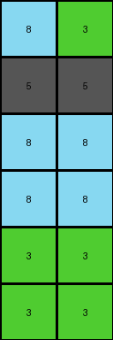

# bd4472b8 • 004 • refine_coder

---

Previous Code:
```python
"""
The transformation rule is to replicate each color from the first row of the input grid twice, creating new rows with those colors. The second row of the input is copied unchanged.
"""

import numpy as np

def get_pattern_region(input_grid):
    # Find the last row with a non-zero value to define pattern region height.
    last_non_zero_row = -1
    for i in range(input_grid.shape[0]):
        if np.any(input_grid[i, :] != 0):
            last_non_zero_row = i
        else:
            break # stop looking after a row of zeros

    return input_grid[:last_non_zero_row+1, :]

def transform(input_grid):
    """Transforms the input grid according to the described rule."""

    # Identify the pattern region (rows with non-zero values at the top).
    pattern_region = get_pattern_region(input_grid)
    #print(f"{pattern_region=}")

    # Initialize the output grid with zeros, same dimensions as input.
    output_grid = np.zeros_like(input_grid)

    # Copy the original pattern region to the top of the output grid.
    output_grid[:pattern_region.shape[0], :] = pattern_region

    # Current row index in output grid to start adding replicated rows.
    current_row = pattern_region.shape[0]
    #print(f"{current_row=}")
    # Replicate colors from the first row.

    if pattern_region.shape[0] > 0:
        for color in pattern_region[0, :]:
            for _ in range(2):  # Create two copies of each color.
                output_grid[current_row, :] = color
                current_row += 1

    return output_grid
```

Train Set Results:

## Example 1:

Input:
```
2 1 4
5 5 5
0 0 0
0 0 0
0 0 0
0 0 0
0 0 0
0 0 0
```
Expected Output:
```
2 1 4
5 5 5
2 2 2
1 1 1
4 4 4
2 2 2
1 1 1
4 4 4
```
Transformed Output:
```
2 1 4
5 5 5
2 2 2
2 2 2
1 1 1
1 1 1
4 4 4
4 4 4
```

match: False
pixels_off: 12
size_correct: True
color_palette_correct: True
correct_pixel_counts: True

## Example 2:

Input:
```
3 2 1 4
5 5 5 5
0 0 0 0
0 0 0 0
0 0 0 0
0 0 0 0
0 0 0 0
0 0 0 0
0 0 0 0
0 0 0 0
```
Expected Output:
```
3 2 1 4
5 5 5 5
3 3 3 3
2 2 2 2
1 1 1 1
4 4 4 4
3 3 3 3
2 2 2 2
1 1 1 1
4 4 4 4
```
Transformed Output:
```
3 2 1 4
5 5 5 5
3 3 3 3
3 3 3 3
2 2 2 2
2 2 2 2
1 1 1 1
1 1 1 1
4 4 4 4
4 4 4 4
```

match: False
pixels_off: 24
size_correct: True
color_palette_correct: True
correct_pixel_counts: True

## Example 3:

Input:
```
8 3
5 5
0 0
0 0
0 0
0 0
```
Expected Output:
```
8 3
5 5
8 8
3 3
8 8
3 3
```
Transformed Output:
```
8 3
5 5
8 8
8 8
3 3
3 3
```

match: False
pixels_off: 4
size_correct: True
color_palette_correct: True
correct_pixel_counts: True
Okay, here's a breakdown of the situation, the results, and a plan to refine the natural language program and, subsequently, the code:

**General Assessment:**

The initial natural language program was on the right track, identifying the replication of colors from the first row. However, it incorrectly assumed *two* replications of *each* color. The test results show that the colors in the first row are replicated, but each color is replicated a variable number of times so that each color in the first row is replicated twice, creating two rows per color. It also missed that the pattern region of the input is copied to the output.

**Strategy:**

1.  **Analyze Results:** Carefully examine the "Transformed Output" vs. "Expected Output" for each example. Note the differences precisely, including:
    *   Which rows are correct/incorrect.
    *   How many times each color is being repeated.
    * any other differences

2.  **Refine Natural Language Program:** Based on the analysis, modify the natural language program to reflect the corrected pattern of replication. Specifically, determine that two rows per color are added to the output.

3. Document facts in yaml, then use the refined program to update code

**Example Analysis and Metrics:**

Here's a breakdown of each example, including observations:

*   **Example 1:**
    *   Input Size: 8x3
    *   Expected Output Size: 8x3
    *   Transformed Output Size: 8x3
    *   Observations:
        *   The first two rows of the input and expected output are the same.
        *   The first row colors (2, 1, 4) are replicated, but each replicated twice
        * we can see that there are two copies of each color

*   **Example 2:**
    *   Input Size: 10x4
    *   Expected Output Size: 10x4
    *   Transformed Output Size: 10 x 4
    *   Observations: Same as Example 1, the first two rows are preserved. Each color in the first row (3, 2, 1, 4) is replicated twice.

*   **Example 3:**
    *   Input Size: 6x2
    *   Expected Output Size: 6x2
    *   Transformed Output Size: 6x2
    *   Observations:
        *   The first two rows of the input and expected output are the same
        * Each color (8, 3) is replicated twice.

**YAML Fact Block:**

```yaml
task_id: 002
facts:
  - object: input_grid
    type: grid
    properties:
      rows: variable
      columns: variable
      colors: [0-9]
    description: The initial grid of pixels.

  - object: output_grid
    type: grid
    properties:
      rows: variable
      columns: variable
      colors: [0-9]
    description: The transformed grid of pixels.

  - object: pattern_region
    type: grid
    properties:
       rows: m #first m rows of the input
    description: the first rows of the input grid, copied to the output grid

  - action: copy
    agent: system
    input: pattern_region
    output: output_grid
    description: copy the pattern region from input to output

  - object: first_row_colors
    type: list
    properties:
      elements: colors
    description: List of colors present in the first row of the input grid.

  - action: replicate_colors
    agent: system
    input: first_row_colors
    parameters:
        copies: 2
    output: output_grid
    description: Each color from the first row is used to create two new rows in the output grid.
```

**Refined Natural Language Program:**

1.  **Identify Pattern Region:** Determine the region of the input grid that defines the transformation, and copy it to the output grid.
2.  **Copy Pattern:** The initial rows with data are copied to top of output.
3.  **Replicate First Row Colors:** For each color in the first row of the input grid:
    *   Create *two* new rows in the output grid filled with that color.
4. **Fill with the background color:** all remaining rows are set to the background color, black (0).


**INSTRUCTIONS**

- generate a Python module to represent the natural language program 
- follow the template below
- all common math and science libraries are available
- create docstring only at top - but comment the workflow in the function
- use helper functions for common operations like finding objects, counting,
  measuring, moving, etc. 

remember - we are working iteratively - so this code will inform your future
self as we converge on the solution

*template:*

```python
"""
{{ natural language description of the transformation rule }}
"""

{{ imports }}

def transform(input_grid):
    # initialize output_grid

    # change output pixels 

    return output_grid

```
