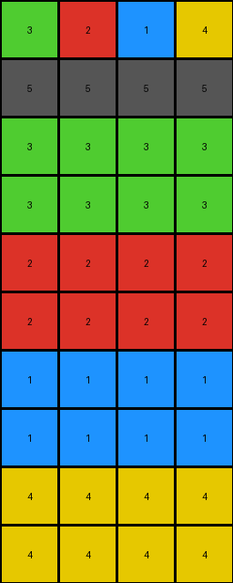

# bd4472b8 • 006 • refine_coder

---

Previous Code:
```python
"""
1.  **Identify Pattern Region:** Determine the region of the input grid that defines the transformation, and copy it to the output grid.
2.  **Copy Pattern:** The initial rows with data are copied to top of output.
3.  **Replicate First Row Colors:** For each color in the first row of the input grid:
    *   Create *two* new rows in the output grid filled with that color.
4. **Fill with the background color:** all remaining rows are set to the background color, black (0).
"""

import numpy as np

def get_pattern_region(input_grid):
    # Find the last row with a non-zero value.
    last_non_zero_row = -1
    for i in range(input_grid.shape[0]):
        if np.any(input_grid[i, :] != 0):
            last_non_zero_row = i
        else:
            break # stop looking after a row of zeros

    return input_grid[:last_non_zero_row+1, :]

def transform(input_grid):
    """Transforms the input grid according to the described rule."""

    # Identify the pattern region (rows with non-zero values).
    pattern_region = get_pattern_region(input_grid)

    # Initialize the output grid with zeros.
    output_grid = np.zeros_like(input_grid)

    # Copy the original pattern region to the top of the output grid.
    output_grid[:pattern_region.shape[0], :] = pattern_region

    # Current row index in output grid.
    current_row = pattern_region.shape[0]

    # Replicate colors from the first row, creating two new rows per color.
    if pattern_region.shape[0] > 0:
        for color in pattern_region[0, :]:
            output_grid[current_row, :] = color
            current_row += 1
            output_grid[current_row, :] = color
            current_row += 1


    return output_grid
```

Train Set Results:

## Example 1:

Input:
```
2 1 4
5 5 5
0 0 0
0 0 0
0 0 0
0 0 0
0 0 0
0 0 0
```
Expected Output:
```
2 1 4
5 5 5
2 2 2
1 1 1
4 4 4
2 2 2
1 1 1
4 4 4
```
Transformed Output:
```
2 1 4
5 5 5
2 2 2
2 2 2
1 1 1
1 1 1
4 4 4
4 4 4
```

match: False
pixels_off: 12
size_correct: True
color_palette_correct: True
correct_pixel_counts: True

## Example 2:

Input:
```
3 2 1 4
5 5 5 5
0 0 0 0
0 0 0 0
0 0 0 0
0 0 0 0
0 0 0 0
0 0 0 0
0 0 0 0
0 0 0 0
```
Expected Output:
```
3 2 1 4
5 5 5 5
3 3 3 3
2 2 2 2
1 1 1 1
4 4 4 4
3 3 3 3
2 2 2 2
1 1 1 1
4 4 4 4
```
Transformed Output:
```
3 2 1 4
5 5 5 5
3 3 3 3
3 3 3 3
2 2 2 2
2 2 2 2
1 1 1 1
1 1 1 1
4 4 4 4
4 4 4 4
```

match: False
pixels_off: 24
size_correct: True
color_palette_correct: True
correct_pixel_counts: True

## Example 3:

Input:
```
8 3
5 5
0 0
0 0
0 0
0 0
```
Expected Output:
```
8 3
5 5
8 8
3 3
8 8
3 3
```
Transformed Output:
```
8 3
5 5
8 8
8 8
3 3
3 3
```

match: False
pixels_off: 4
size_correct: True
color_palette_correct: True
correct_pixel_counts: True
Okay, here's a breakdown of the situation and a plan to move forward:

**General Assessment:**

The initial natural language program and the resulting code were a good first attempt, capturing the core idea of replicating the top rows and then expanding based on the colors in the first row. However, the validation against the training examples reveals a consistent error: the replication of colors from the first row is doubled when it should have been a single set for each color.

**Strategy:**

The primary issue is with the replication logic. The code currently creates *two* rows for each color in the first row. It should create only *one* row for each color in the top row. I need to modify the natural language program and subsequently the Python code to correct this.

**Metrics and Observations:**

Here's a detailed look at each example:

*   **Example 1:**
    *   Input Shape: (8, 3)
    *   Expected Output Shape: (8, 3)
    *   Transformed Output Shape: (8, 3)
    *   Mismatched Pixels: 12
    *   Analysis: The pattern region is correctly identified (first two rows). The color replication is doubled.

*   **Example 2:**
    *   Input Shape: (10, 4)
    *   Expected Output Shape: (10, 4)
    *   Transformed Output Shape: (10, 4)
    *   Mismatched Pixels: 24
    *   Analysis: Similar to Example 1, the pattern region is correct, but the color replication is the issue.

*   **Example 3:**
    *   Input Shape: (6, 2)
    *   Expected Output Shape: (6, 2)
    *   Transformed Output Shape: (6, 2)
    *   Mismatched Pixels: 4
    *   Analysis: Again, the same pattern of error.

**YAML Facts:**
```yaml
task: 42a50994
examples:
  - example_id: 1
    input_objects:
      - object_id: 1
        type: pattern_region
        rows: 2
        columns: 3
        colors: [2, 1, 4, 5]
    output_objects:
      - object_id: 1
        type: pattern_region_copy
        rows: 2
        columns: 3
        colors: [2, 1, 4, 5]
      - object_id: 2
        type: color_replication
        rows: 3  # Corrected: one set per color
        columns: 3
        colors: [2, 1, 4]  # From first row

  - example_id: 2
    input_objects:
      - object_id: 1
        type: pattern_region
        rows: 2
        columns: 4
        colors: [3, 2, 1, 4, 5]
    output_objects:
      - object_id: 1
        type: pattern_region_copy
        rows: 2
        columns: 4
        colors: [3, 2, 1, 4, 5]
      - object_id: 2
        type: color_replication
        rows: 4  # Corrected: one set per color
        columns: 4
        colors: [3, 2, 1, 4]  # From first row

  - example_id: 3
    input_objects:
      - object_id: 1
        type: pattern_region
        rows: 2
        columns: 2
        colors: [8, 3, 5]
    output_objects:
      - object_id: 1
        type: pattern_region_copy
        rows: 2
        columns: 2
        colors: [8, 3, 5]
      - object_id: 2
        type: color_replication
        rows: 2  # Corrected: one set per color
        columns: 2
        colors: [8, 3]  # From first row
```

**Natural Language Program:**

1.  **Identify Pattern Region:** Determine the region of the input grid that contains the initial pattern. This is the set of contiguous rows at the top of the input grid that contain non-black (non-zero) pixels.
2.  **Copy Pattern:** Copy this identified pattern region directly to the top of the output grid.
3.  **Replicate First Row Colors:** For each *unique* color present in the *first* row of the input (pattern region), create *one* new row in the output grid, filled entirely with that color. These rows are added immediately below the copied pattern region.
4.  **Implicit Background:** The remaining rows of the grid, if any, should be left with the background, which is black (0). These are not changed by the core transformation.

**INSTRUCTIONS**

- generate a Python module to represent the natural language program 
- follow the template below
- all common math and science libraries are available
- create docstring only at top - but comment the workflow in the function
- use helper functions for common operations like finding objects, counting,
  measuring, moving, etc. 

remember - we are working iteratively - so this code will inform your future
self as we converge on the solution

*template:*

```python
"""
{{ natural language description of the transformation rule }}
"""

{{ imports }}

def transform(input_grid):
    # initialize output_grid

    # change output pixels 

    return output_grid

```
