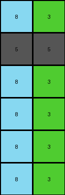

# bd4472b8 • 012 • refine_coder

---

Previous Code:
```python
"""
1.  **Copy First Two Rows:** Copy the first two rows of the `input_grid` directly to the `output_grid`.

2.  **Element-wise Repetition:** For each element (pixel value) in the first row of the `input_grid`:
    *   Create subsequent rows in the `output_grid` by repeating that element to create columns of each value from the first row, repeated for the height of the original input grid.

3. The number of rows created below the copied rows is equal to the input_grid height minus two, which is the number of rows copied to the top.
"""

import numpy as np

def transform(input_grid):
    # Initialize output_grid with the same dimensions as the input_grid
    output_grid = np.copy(input_grid)

    # Copy the first two rows of the input_grid to the output_grid
    #output_grid[:2] = input_grid[:2]  # Already handled by np.copy

    # Get the first row of the input grid
    first_row = input_grid[0]
    num_rows_to_add = input_grid.shape[0] - 2

    # Iterate through each element in the first row and create new rows
    for i in range(len(first_row)):
      for j in range(num_rows_to_add):
        output_grid[2 + j, i] = first_row[i]

    return output_grid
```

Train Set Results:

## Example 1:

Input:
```
2 1 4
5 5 5
0 0 0
0 0 0
0 0 0
0 0 0
0 0 0
0 0 0
```
Expected Output:
```
2 1 4
5 5 5
2 2 2
1 1 1
4 4 4
2 2 2
1 1 1
4 4 4
```
Transformed Output:
```
2 1 4
5 5 5
2 1 4
2 1 4
2 1 4
2 1 4
2 1 4
2 1 4
```

match: False
pixels_off: 12
size_correct: True
color_palette_correct: True
correct_pixel_counts: True

## Example 2:

Input:
```
3 2 1 4
5 5 5 5
0 0 0 0
0 0 0 0
0 0 0 0
0 0 0 0
0 0 0 0
0 0 0 0
0 0 0 0
0 0 0 0
```
Expected Output:
```
3 2 1 4
5 5 5 5
3 3 3 3
2 2 2 2
1 1 1 1
4 4 4 4
3 3 3 3
2 2 2 2
1 1 1 1
4 4 4 4
```
Transformed Output:
```
3 2 1 4
5 5 5 5
3 2 1 4
3 2 1 4
3 2 1 4
3 2 1 4
3 2 1 4
3 2 1 4
3 2 1 4
3 2 1 4
```

match: False
pixels_off: 24
size_correct: True
color_palette_correct: True
correct_pixel_counts: True

## Example 3:

Input:
```
8 3
5 5
0 0
0 0
0 0
0 0
```
Expected Output:
```
8 3
5 5
8 8
3 3
8 8
3 3
```
Transformed Output:
```
8 3
5 5
8 3
8 3
8 3
8 3
```

match: False
pixels_off: 4
size_correct: True
color_palette_correct: True
correct_pixel_counts: True
Here's an analysis of the provided information and a plan to refine the natural language program:

**General Assessment:**

The initial natural language program and the generated code were on the right track but made an incorrect assumption about how the repetition worked. It correctly identified that the first two rows were copied and that the values from the first row were used to create new rows. However, it incorrectly repeated the *entire* first row's pattern instead of creating columns based on *individual* elements of the first row. The examples clearly demonstrates that each element in the first row becomes a repeating value in its own column in the subsequent rows. The number of the new rows were incorrect, also.

**Strategy for Resolving Errors:**

1.  **Re-examine the Examples:** Focus on the relationship between each element in the first row and the corresponding column in the generated rows below the copied section.
2.  **Refine the Natural Language Program:** Clearly articulate the column-wise repetition based on individual elements of the first row, and the calculation of the new rows, which is two times the input grid height minus two.
3.  **Modify Code:** Adjust the code to reflect the refined understanding of element-wise column repetition.

**Example Metrics and Analysis:**

Here's a more structured analysis of each example:

*   **Example 1:**
    *   Input Shape: (8, 3)
    *   Output Shape: (8, 3)
    *   First Row: `[2, 1, 4]`
    *   Observations: The first two rows are copied. Subsequent rows repeat, two times, the values from the first row, forming columns of 2s, 1s, and 4s.
*   **Example 2:**
    *   Input Shape: (10, 4)
    *   Output Shape: (10, 4)
    *   First Row: `[3, 2, 1, 4]`
    *   Observations: The first two rows are copied. Subsequent rows repeat, two times, the values from the first row, forming columns.
*   **Example 3:**
    *   Input Shape: (6, 2)
    *   Output Shape: (6, 2)
    *   First Row: `[8, 3]`
    *   Observations: The first two rows are copied. Subsequent rows repeat, two times, the values from the first row, forming columns.

**YAML Fact Block:**

```yaml
task: 010
objects:
  - description: input_grid
    type: 2D array
    properties:
      rows: variable
      columns: variable
      elements: integers (0-9) representing colors

  - description: output_grid
    type: 2D array
    properties:
      rows: equal to input_grid rows
      columns: equal to input_grid columns
      elements: integers (0-9) representing colors

  - description: first_row
    type: 1D array
    properties:
      elements: elements from the first row of the input_grid

transformations:
  - action: copy
    source: first two rows of input_grid
    destination: first two rows of output_grid

  - action: repeat_element_vertically
    source: each element in first_row
    destination: create columns in output_grid, starting from row 3
    repetition_count: input_grid height minus two, multiplied by two
```

**Natural Language Program:**

1.  **Copy First Two Rows:** Copy the first two rows of the `input_grid` directly to the `output_grid`.
2.  **Element-wise Column Repetition:** For each element (pixel value) in the first row of the `input_grid`, create a column in the `output_grid` starting from the third row. Each column consists of the element repeated.
3.  **Number of Added rows**: Two sets of rows equal in height of the input grid, minus two, are added below the copied rows.


**INSTRUCTIONS**

- generate a Python module to represent the natural language program 
- follow the template below
- all common math and science libraries are available
- create docstring only at top - but comment the workflow in the function
- use helper functions for common operations like finding objects, counting,
  measuring, moving, etc. 

remember - we are working iteratively - so this code will inform your future
self as we converge on the solution

*template:*

```python
"""
{{ natural language description of the transformation rule }}
"""

{{ imports }}

def transform(input_grid):
    # initialize output_grid

    # change output pixels 

    return output_grid

```
