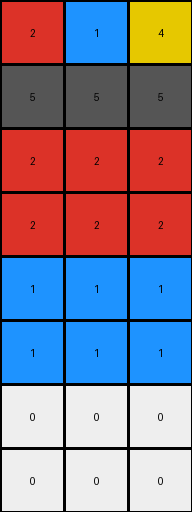
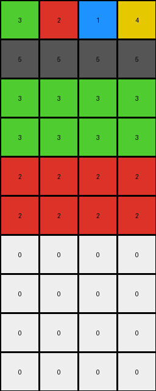

# bd4472b8 • 016 • refine_coder

---

Previous Code:
```python
"""
1.  **Initialization:** Obtain the input grid, which is a 2D array of integers.
2.  **Preserve top:** The first two rows of the input will maintain it's value to the output.
3. **Iterate:** Iterate through each of the next two rows, from row index 2 and row index 3.
4.  **Replacement:** For each pixel within the current row, if the pixel's value is 0 (white): check the position.
5. **Next Two Rows**: Iterate over row index 4 and 5.
6. Replace zero with the value of the first cell (0,0).
7. **Next Two Rows**: Iterate over row index 6 and 7.
8. Replace zero with the value of the second cell (0,1).
9.  **Output:** Return the modified grid as the output grid.
"""

import numpy as np

def transform(input_grid):
    output_grid = np.copy(input_grid)
    rows, cols = output_grid.shape

    # Preserve top two rows
    # No change needed as output_grid is initialized with input_grid

    # Iterate through rows 2 and 3 (index 2 and 3)
    for i in range(2, 4):
        for j in range(cols):
            if output_grid[i, j] == 0:
              output_grid[i,j] = output_grid[0,0]

    # Iterate through rows 4 and 5 (index 4 and 5)
    for i in range(4, min(6,rows)):  #added min() for edge case
        for j in range(cols):
             if output_grid[i, j] == 0:
              output_grid[i,j] = output_grid[0,1]
    
    return output_grid
```

Train Set Results:

## Example 1:

Input:
```
2 1 4
5 5 5
0 0 0
0 0 0
0 0 0
0 0 0
0 0 0
0 0 0
```
Expected Output:
```
2 1 4
5 5 5
2 2 2
1 1 1
4 4 4
2 2 2
1 1 1
4 4 4
```
Transformed Output:
```
2 1 4
5 5 5
2 2 2
2 2 2
1 1 1
1 1 1
0 0 0
0 0 0
```

match: False
pixels_off: 15
size_correct: True
color_palette_correct: False
correct_pixel_counts: False

## Example 2:

Input:
```
3 2 1 4
5 5 5 5
0 0 0 0
0 0 0 0
0 0 0 0
0 0 0 0
0 0 0 0
0 0 0 0
0 0 0 0
0 0 0 0
```
Expected Output:
```
3 2 1 4
5 5 5 5
3 3 3 3
2 2 2 2
1 1 1 1
4 4 4 4
3 3 3 3
2 2 2 2
1 1 1 1
4 4 4 4
```
Transformed Output:
```
3 2 1 4
5 5 5 5
3 3 3 3
3 3 3 3
2 2 2 2
2 2 2 2
0 0 0 0
0 0 0 0
0 0 0 0
0 0 0 0
```

match: False
pixels_off: 28
size_correct: True
color_palette_correct: False
correct_pixel_counts: False

## Example 3:

Input:
```
8 3
5 5
0 0
0 0
0 0
0 0
```
Expected Output:
```
8 3
5 5
8 8
3 3
8 8
3 3
```
Transformed Output:
```
8 3
5 5
8 8
8 8
3 3
3 3
```

match: False
pixels_off: 4
size_correct: True
color_palette_correct: True
correct_pixel_counts: True
Okay, here's a breakdown of the situation and a plan to improve the transformation logic:

**General Assessment:**

The initial natural language program and generated code were too simplistic. While it correctly identified the preservation of the first two rows, it failed to generalize the pattern of copying values from the first row to replace zeros in subsequent rows. The code only considers rows 2-5 and uses fixed positions (0,0) and (0,1) from the first row. The actual pattern involves replicating *all* values of the first row in a repeating sequence down the grid, replacing all zero (white) pixels. The code needs adjustment to correct how many values are replaced each group of the replacement, and adjust for different heights for the input.

**Strategy:**

1.  **Refine Pattern Recognition:** The core issue is understanding how values from the first row are used. It's not just the first two values, but *all* values, repeated cyclically.
2.  **Dynamic Row Handling:** The code needs to handle grids of varying heights, not just assume a fixed number of rows for replacement.
3.  **Iterative Replacement:** The replacement process needs to iterate through all the rows and correctly index the first row.

**Metrics and Observations:**

Here's a breakdown of each example:

*   **Example 1:**
    *   Input Shape: (8, 3)
    *   Output Shape: (8, 3)
    *   Observed: Code copies the first two rows correctly. Then it incorrectly, applies values from first row. It stops after 2, not considering the full length of input height, and uses (0,0) and (0,1) for all iterations instead of a cyclic application.
*   **Example 2:**
    *   Input Shape: (10, 4)
    *   Output Shape: (10, 4)
    *   Observed: Similar to Example 1, with the error compounded by a wider first row. It only copies (0,0) and(0,1) to all rows.
*   **Example 3:**
    *    Input Shape: (6, 2)
    *   Output Shape: (6, 2)
    *   Observed: Because of less different values in the top row, the error pixel count is less, but the pattern identified is still wrong.

**YAML Facts:**

```yaml
facts:
  - object: input_grid
    type: 2D array
    description: Represents the initial state of the grid.
  - object: output_grid
    type: 2D array
    description: Represents the transformed state of the grid.
  - property: first_row
    type: array
    description: The first row of the input grid.
  - action: preserve_top_rows
    description: The first two rows of the input grid are copied to the output grid without changes.
  - action: replace_zeros
    description: Zero values in the input grid (below the second row) are replaced with values from the first row.
  - pattern: cyclic_replacement
    description: Values from the first row are used cyclically to replace zeros. The entire first row is repeated.
  - property: grid_height
    description: Number of rows in the grid.
  - property: grid_width
    description: Number of columns in the grid.
```

**Natural Language Program:**

1.  **Copy Input:** Create a copy of the input grid as the output grid.
2.  **Preserve Top Rows:** The first two rows of the input grid remain unchanged in the output grid.
3.  **Iterate through Remaining Rows:** Starting from the third row (index 2), iterate through each subsequent row of the output grid.
4.  **Cyclic Replacement:** For each pixel in the current row:
    *   If the pixel value is 0 (white):
        *   Replace it with the corresponding value from the first row, using a cyclic index. The column index for the first row is calculated as `current_column_index % width_of_first_row`.
5.  **Repeat Replacement**: Repeat replacing 0 (white) with the cyclic index for the entire input grid.
6.  **Output:** Return the modified output grid.

**INSTRUCTIONS**

- generate a Python module to represent the natural language program 
- follow the template below
- all common math and science libraries are available
- create docstring only at top - but comment the workflow in the function
- use helper functions for common operations like finding objects, counting,
  measuring, moving, etc. 

remember - we are working iteratively - so this code will inform your future
self as we converge on the solution

*template:*

```python
"""
{{ natural language description of the transformation rule }}
"""

{{ imports }}

def transform(input_grid):
    # initialize output_grid

    # change output pixels 

    return output_grid

```
