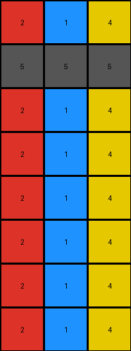

# bd4472b8 • 017 • refine_dreamer

---

Previous Code:
```python
"""
1.  **Copy Input:** Create a copy of the input grid as the output grid.
2.  **Preserve Top Rows:** The first two rows of the input grid remain unchanged in the output grid.
3.  **Iterate through Remaining Rows:** Starting from the third row (index 2), iterate through each subsequent row of the output grid.
4.  **Cyclic Replacement:** For each pixel in the current row:
    *   If the pixel value is 0 (white):
        *   Replace it with the corresponding value from the first row, using a cyclic index. The column index for the first row is calculated as `current_column_index % width_of_first_row`.
5.  **Repeat Replacement**: Repeat replacing 0 (white) with the cyclic index for the entire input grid.
6.  **Output:** Return the modified output grid.
"""

import numpy as np

def transform(input_grid):
    output_grid = np.copy(input_grid)
    rows, cols = output_grid.shape

    # Preserve top two rows (already done by copying)

    # Iterate through remaining rows
    for i in range(2, rows):
        for j in range(cols):
            # Cyclic Replacement
            if output_grid[i, j] == 0:
                first_row_index = j % cols  # Cyclic index for the first row
                output_grid[i, j] = input_grid[0, first_row_index]

    return output_grid
```

Train Set Results:

## Example 1:

Input:
```
2 1 4
5 5 5
0 0 0
0 0 0
0 0 0
0 0 0
0 0 0
0 0 0
```
Expected Output:
```
2 1 4
5 5 5
2 2 2
1 1 1
4 4 4
2 2 2
1 1 1
4 4 4
```
Transformed Output:
```
2 1 4
5 5 5
2 1 4
2 1 4
2 1 4
2 1 4
2 1 4
2 1 4
```

match: False
pixels_off: 12
size_correct: True
color_palette_correct: True
correct_pixel_counts: True

## Example 2:

Input:
```
3 2 1 4
5 5 5 5
0 0 0 0
0 0 0 0
0 0 0 0
0 0 0 0
0 0 0 0
0 0 0 0
0 0 0 0
0 0 0 0
```
Expected Output:
```
3 2 1 4
5 5 5 5
3 3 3 3
2 2 2 2
1 1 1 1
4 4 4 4
3 3 3 3
2 2 2 2
1 1 1 1
4 4 4 4
```
Transformed Output:
```
3 2 1 4
5 5 5 5
3 2 1 4
3 2 1 4
3 2 1 4
3 2 1 4
3 2 1 4
3 2 1 4
3 2 1 4
3 2 1 4
```

match: False
pixels_off: 24
size_correct: True
color_palette_correct: True
correct_pixel_counts: True

## Example 3:

Input:
```
8 3
5 5
0 0
0 0
0 0
0 0
```
Expected Output:
```
8 3
5 5
8 8
3 3
8 8
3 3
```
Transformed Output:
```
8 3
5 5
8 3
8 3
8 3
8 3
```

match: False
pixels_off: 4
size_correct: True
color_palette_correct: True
correct_pixel_counts: True
**INSTRUCTIONS**

The code above was generated based on observations from the first training
example

we have tested the transform function on each of the task example inputs and
compared with the expected output

review each of the examples provided and the results and consider how the
natural language program should be updated to accommodate this new knowledge

respond with the following deliverables:

- general assessment of the information provided and strategy for resolving the
  errors
- gather metrics about each of the examples and results - use code_execution to
  develop accurate reports on your assumptions
- a YAML block documenting facts - Focus on identifying objects, their properties, and the actions performed on them.
- a natural language program - Be as clear and concise as possible, providing a complete description of the transformation rule.


your responses should be considered as information in a report - not a
conversation
